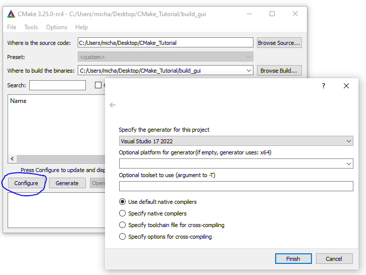

# CMake

With CMake, you no longer need to maintain separate settings specific to your compiler/build environment. You have one configuration and that works for many environments. CMake can generate a Microsoft Visual Studio solution, an Eclipse project or a Makefile from the same files without changing anything in them.

Given a bunch of directories with code in them, CMake manages all the dependencies, build orders and other tasks that your project needs done before it can be compiled. It does **not actually compile anything**. To use CMake, you must tell it (Using a configuration file called CMakeLists.txt) what executeables you need compiled, what libraries they link to, what directories there are in your project and what is inside of them, as well as any details like flags or anything else you need.

If this is correctly setup, you then use CMake to create all of the files that your "native build environment" of choice needs to do its job. In Linux, by default, this means Makefiles. So once you run CMake, it will create a bunch of files for its own use plus some Makefiles. All you need to do thereafter is type "make" in the console from the root folder every time you're done editing your code and then a compiled and linked executeable is made.

# Tutorial

The most basic CMake project is an executeable built from a single source code file. For simple projects, a `CMakeLists.txt` file with three commands is all that is required. 

Any projects top most CMakelists.txt must start by specifying a minimum CMake version using the `cmake_minimum_required()` command. This establishes policy settings and ensures that the following CMake functions are run with a compatible version of CMake.

To start a project, we use the `project()` command to set the project name. This call is required with every project and should be called soon after `cmake_minimum_required()`. As we will see later, this command can also be used to specify other project level information such as the language or version number.

Finally, the `add_executeable()` command tells CMake to create an executeable using the specified source code files.

Let us create an executable using CMake for the following C++ file called `sqrt.cxx`.

```C++
// A simple program that computes the square root of a number
#include <cmath>
#include <cstdlib>
#include <iostream>
#include <string>

int main(int argc, char* argv[])
{
  if (argc < 2) {
    std::cout << "Usage: " << argv[0] << " number" << std::endl;
    return 1;
  }

  // convert input to double
  const double inputValue = atof(argv[1]);

  // calculate square root
  const double outputValue = sqrt(inputValue);
  std::cout << "The square root of " << inputValue << " is " << outputValue
            << std::endl;
  return 0;
}

```

The `CMakeLists.txt` will be very minimal and look like this,

```CMake
cmake_minimum_required(VERSION 3.10)

project(My_Project VERSION 1.0)

add_executable(compute_square_root 
    src/sqrt.cxx)
```

Any CMake build system will invoke the following commands in its root CMakeLists.txt, therefore `src/sqrt.cxx` can be found relative to the root.


The directory structure for example is,
```
C:.
│   CMakeLists.txt
│   TutorialConfig.h.in
│
├───build_cmd
├───build_gui
└───src
        sqrt.cxx
```

# CMake GUI
We need to specify the field "Where is the source code:" as the root location of your project.

The field "Where to build the binaries:" is a directory where it will place the output of the generated build. 


By clicking "Configure" we see the list of options where are going to be building to, with the most common being known as Visual Studio and Makefiles.




Our  `build_gui` directory will now be filled and contains a `My_Project.sln` (Specified by the `project()` command).


Double clicking the `.sln` file will open up Visual Studio. Trying to execute the program immediately may receive a "The system cannot find the file specified" `build_gui/x64/Debug/ALL_BUILD`  error. Usually CMake sets the ALL_BUILD project as the startup project. To resolve this, right click on our project in the solutuoin explorer and set it as a startup project.


Our script takes in a command line argument, therefore to execute our script correctly we need to pass in a number through the command line. This is done in Visual Studio shown below.


Now, execution of our original script can be ran through Visual Studio and output the following.


The executable that is **generated by using Visual Studio (NOT CMake)** is now found inside `build_gui/Debug/computer_square_root.exe`. The name was specified earlier by the CMakeLists.txt field `add_executable(compute_square_root ...)`.
It is important to understand that this was not initially here (See the initial file generation above), it is only generated **after compilating and creating it via Visual Studio**. We can run the executable directly in the shell too, shown below.


# CMake CLI

We can get help anytime with CMake by utilizing the command `cmake --help`. Running the command will output quite a number of options to the terminal, however I will analyze the last few lines here.

```
Generators

The following generators are available on this platform (* marks default):
* Visual Studio 17 2022        = Generates Visual Studio 2022 project files.
                                 Use -A option to specify architecture.
  Visual Studio 16 2019        = Generates Visual Studio 2019 project files.
                                 Use -A option to specify architecture.
  Visual Studio 15 2017 [arch] = Generates Visual Studio 2017 project files.
                                 Optional [arch] can be "Win64" or "ARM".
  Visual Studio 14 2015 [arch] = Generates Visual Studio 2015 project files.
                                 Optional [arch] can be "Win64" or "ARM".
  Visual Studio 12 2013 [arch] = Generates Visual Studio 2013 project files.
                                 Optional [arch] can be "Win64" or "ARM".
  Visual Studio 11 2012 [arch] = Deprecated.  Generates Visual Studio 2012
                                 project files.  Optional [arch] can be
                                 "Win64" or "ARM".
  Visual Studio 9 2008 [arch]  = Generates Visual Studio 2008 project files.
                                 Optional [arch] can be "Win64" or "IA64".
  Borland Makefiles            = Generates Borland makefiles.
  NMake Makefiles              = Generates NMake makefiles.
  NMake Makefiles JOM          = Generates JOM makefiles.
  MSYS Makefiles               = Generates MSYS makefiles.
  MinGW Makefiles              = Generates a make file for use with
  ...
```

In CMake terminology, the native build scripts and build tools are called **generators**. ON any particular platform, the list will show which native build tools can be used through CMake. They can either be plain such as `Makefile` -s, Ninja or IDE-like projects.

The `-S` flag specifies which source directory CMake should scan. This is the folder containing the *root* CMakeLists.txt, i.e. the one containing the `project` command. By default, CMake will allow in-source build artifacts alongside source files. This is **not** good practice, you should always keep build artifacts from sources seperate. The `-B` flag helps with this, as it is used to give where to store build artifacts, including generated build system.

To specify the generator use the `-G` flag.
When inside the directory of our CMakeLists.txt, the following command will output the equivalent files generated from our previous GUI route.

```cmake -S . -B build_cmd -G "Visual Studio 17 2022"```


Notice again, **CMake does not compile the code**, we have generated a solution file only called `MyProject.sln`.