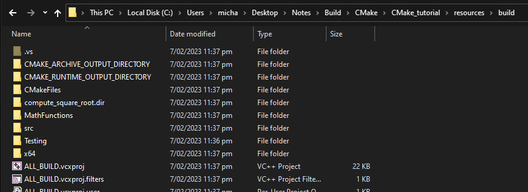
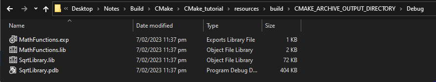
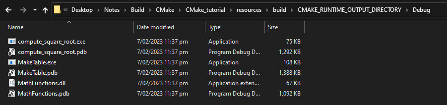
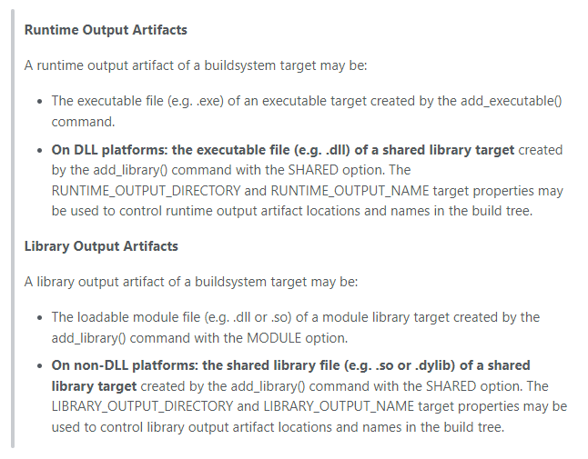

# Selecting Static or Shared Libraries (DLL)

In this section we will show how the `BUILD_SHARED_LIBS` variable can be used to control the default behaviour of `add_library()`, and allow control over how libraries without an explicit type (`STATIC`, `SHARED`, `MODULE` or `OBJECT`) are built.

To accomplish this we need to add `BUILD_SHARED_LIBS` to the top-level `CMakeLists.txt`. We use the `option()` command as it allows users to optionally select if the value should be `ON` or `OFF`.

Next we are going to refactor `MathFunctions` to become a real library that encapsulates using `mysqrt` or `sqrt`, instead of requiring the calling code to do this logic. This will also mean that `USE_MYMATH` will not control building `MathFunctions`, but instead will control the behaviour of this library.

A fair amount of refactoring was done, here I will focus on the key requirements
specific to the DLL changes.


```CMake
# control where the static and shared libraries are built so that on windows
# we don't need to tinker with the path to run the executable
set(CMAKE_ARCHIVE_OUTPUT_DIRECTORY "${PROJECT_BINARY_DIR}")
set(CMAKE_LIBRARY_OUTPUT_DIRECTORY "${PROJECT_BINARY_DIR}")
set(CMAKE_RUNTIME_OUTPUT_DIRECTORY "${PROJECT_BINARY_DIR}")

option(BUILD_SHARED_LIBS "Build using shared libraries" ON)
```

Let us first analyze these four lines.

For the first three, for easier understanding since they all go to the same directory I will be testing it via modification to become,

```CMake
set(CMAKE_ARCHIVE_OUTPUT_DIRECTORY "${PROJECT_BINARY_DIR}/CMAKE_ARCHIVE_OUTPUT_DIRECTORY")
set(CMAKE_LIBRARY_OUTPUT_DIRECTORY "${PROJECT_BINARY_DIR}/CMAKE_LIBRARY_OUTPUT_DIRECTORY")
set(CMAKE_RUNTIME_OUTPUT_DIRECTORY "${PROJECT_BINARY_DIR}/CMAKE_RUNTIME_OUTPUT_DIRECTORY")
```

With these modifications our build directory has two additiaonl directories created. These are the directories specified by there names used to name the directory.



## CMAKE_ARCHIVE_OUTPUT_DIRECTORY

Now, let us first look into `CMAKE_ARCHIVE_OUTPUT_DIRECTORY`.



As we can see this is filled by `.exp`, `.lib` and `.pdb`.
Now, we can view the [documentation](https://cmake.org/cmake/help/latest/variable/CMAKE_ARCHIVE_OUTPUT_DIRECTORY.html) and see the following information. It specifies "Where to put all the ARCHIVE target files when built". Simply, the next question may be, what is an *archieve file*?

An archive output artifact of a buildsystem target may be:

- The static library file (e.g. `.lib` or `.a`) of a static library target created by the `add_library()` command with the `STATIC` option.

- **On DLL platforms**: the import library file (e.g. `.lib`) of a shared library target created by the `add_library()` command with the `SHARED` option. This file is only guaranteed to exist if the library exports at least one unmanaged symbol.

- **On DLL platforms**: the import library file (e.g. `.lib`) of an executable target created by the `add_executable()` command when its `ENABLE_EXPORTS` target property is set.

- **On AIX**: the linker import file (e.g. `.imp`) of an executable target created by the `add_executable()` command when its `ENABLE_EXPORTS` target property is set.

Now, why are each files here?

**MathFunctions.exp** - A `.exp` file is an export file, which is used in Windows to define the symbols that are exported from a dynamic-link library (DLL). The `.exp` file contains a list of all the functions and variables that are part of the DLL's public interface, and it is used by the linker to generate the correct import library for the DLL. Here, the functions are that inside the `.exp` is our public function `sqrt` made public using `DECLSPEC` defined in `MathFunctions.h`.

**MathFunctions.lib** and **SqrtLibrary.lib** - Both static files, are specified by the documentation above.

**SqrtLibrary.pdb** - A `.pdb` file is a Program Database file and is used primarily for debugging and is stored here with its respective `.lib`. 

## CMAKE_RUNTIME_OUTPUT_DIRECTORY

Let us now look at `CMAKE_RUNTIME_OUTPUT_DIRECTORY`.



Via the documentation it states "Where to put all the `RUNTIME` target files when built". Now I ask simply, what is a `RUNTIME` file?

Taken from the [documentation](https://cmake.org/cmake/help/latest/manual/cmake-buildsystem.7.html#runtime-output-artifacts) we can see that a `RUNTIME` file is either,

A runtime output artifact of a buildsystem target may be:

- The executable file (e.g. `.exe`) of an executable target created by the `add_executable()` command.

- On DLL platforms: the executable file (e.g. `.dll`) of a shared library target created by the `add_library()` command with the SHARED option.


As we can see here, all files in this directory are either `.exe`, `.dll` or `.pdb`. Where `.pdb` files here are for the debugging purposes although not immediately listed in the documentation for being here.

## CMAKE_LIBRARY_OUTPUT_DIRECTORY

Now, notice here that their is no `CMAKE_LIBRARY_OUTPUT_DIRECTORY` directory!

The short answer to this is that on Windows, unlike other platforms, you should use `RUNTIME_OUTPUT_DIRECTORY` instead of `LIBRARY_OUTPUT_DIRECTORY` to specify the output directory of a shared library.




## BUILD_SHARED_LIBS

Now we will talk about `option(BUILD_SHARED_LIBS "Build using shared libraries" ON)`.

The `BUILD_SHARED_LIBS` flag in CMake determines whether libraries should be built as shared libraries or as static libraries. When this flag is set to ON, CMake will build libraries as shared libraries. When set to OFF, CMake will build libraries as static libraries.

The `BUILD_SHARED_LIBS` flag allows you to control the type of library that is built, which can be useful if you have different requirements for different parts of your project. For example, you might want to build certain libraries as shared libraries to allow them to be used by multiple programs, while building other libraries as static libraries to improve performance or reduce the number of files that need to be deployed with your program.

In this context Shared Libraries == Dynamic Libraries (i.e. dll).