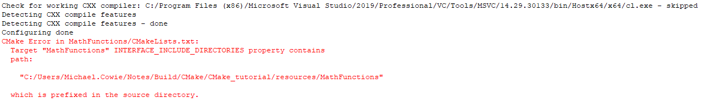

# Adding Export Configuration

During Installing and Testing of the tutorial we added the ability for CMake to install the library and headers of the project. During Packaging an Installer we added the ability to package up this information so it could be distributed to other people.

The next step is to add the necessary information so that other CMake projects can use our project, be it from a build directory, a local install or when packaged.

The first step is to update our `install(TARGETS)` commands to not only specify a `DESTINATION` but also an `EXPORT`. The `EXPORT` keyword generates a CMake file containing code to import all targets listed in the install command from the installation tree. So let's go ahead and explicitly `EXPORT` the `MathFunctions` library by updating the install command in `MathFunctions/CMakeLists.txt`.

This is done by adding `EXPORT MathFunctionsTargets` to make

```CMake
install(TARGETS ${installable_libs}
        EXPORT MathFunctionsTargets
        DESTINATION lib)
```

Now that we have `MathFunctions` being exported, we also need to explicitly install the generated `MathFunctionsTargets.cmake` file. This is done by adding the following to the bottom of the top-level `CMakeLists.txt`:

```CMake
install(EXPORT MathFunctionsTargets
  FILE MathFunctionsTargets.cmake
  DESTINATION lib/cmake/MathFunctions
)
```

Completing these two steps will give us the following error when trying to rebuild



This is from the following lines,

```CMake
target_include_directories(MathFunctions
                           INTERFACE ${CMAKE_CURRENT_SOURCE_DIR}
                           )
```

and via the use of `install`.

What CMake is trying to say is that during generating the export information it will export a path that is intrinsically tied to the current machine and will not be valid on other machines. The solution to this is to update the `MathFunctions` `target_include_directories()` to understand that it needs different `INTERFACE` locations when being used from within the build directory and from an install / package. This means converting the `target_include_directories()` call for `MathFunctions` to look like:

```CMake
target_include_directories(MathFunctions
                           INTERFACE
                            $<BUILD_INTERFACE:${CMAKE_CURRENT_SOURCE_DIR}>
                            $<INSTALL_INTERFACE:include>
                           )
```

At this point, we have CMake properly packaging the target information that is required but we will still need to generate a `MathFunctionsConfig.cmake` so that the CMake `find_package()` command can find our project. So let's go ahead and add a new file to the top-level of the project called `Config.cmake.in` with the following contents:

```CMake

@PACKAGE_INIT@

include ( "${CMAKE_CURRENT_LIST_DIR}/MathFunctionsTargets.cmake" )
```

Then, to properly configure and install that file, add the following to the bottom of the top-level CMakeLists.txt:


```CMake
install(EXPORT MathFunctionsTargets
        FILE MathFunctionsTargets.cmake
        DESTINATION lib/cmake/MathFunctions
)

include(CMakePackageConfigHelpers)
```

Next, we execute the `configure_package_config_file()`. This command will configure a provided file but with a few specific differences from the `standard configure_file()` way. To properly utilize this function, the input file should have a single line with the text `@PACKAGE_INIT@` in addition to the content that is desired. That variable will be replaced with a block of code which turns set values into relative paths. These values which are new can be referenced by the same name but prepended with a `PACKAGE_` prefix. Add,

```CMake
# generate the config file that includes the exports
configure_package_config_file(${CMAKE_CURRENT_SOURCE_DIR}/Config.cmake.in
  "${CMAKE_CURRENT_BINARY_DIR}/MathFunctionsConfig.cmake"
  INSTALL_DESTINATION "lib/cmake/example"
  NO_SET_AND_CHECK_MACRO
  NO_CHECK_REQUIRED_COMPONENTS_MACRO
  )
```

The `write_basic_package_version_file()` is next. This command writes a file which is used by `find_package()`, documenting the version and compatibility of the desired package. Here, we use the `Tutorial_VERSION_*` variables and say that it is compatible with `AnyNewerVersion`, which denotes that this version or any higher one are compatible with the requested version.

Now we can add 

```CMake
write_basic_package_version_file(
  "${CMAKE_CURRENT_BINARY_DIR}/MathFunctionsConfigVersion.cmake"
  VERSION "${Tutorial_VERSION_MAJOR}.${Tutorial_VERSION_MINOR}"
  COMPATIBILITY AnyNewerVersion
)
```

Finally,

```CMake
install(FILES
  ${CMAKE_CURRENT_BINARY_DIR}/MathFunctionsConfig.cmake
  ${CMAKE_CURRENT_BINARY_DIR}/MathFunctionsConfigVersion.cmake
  DESTINATION lib/cmake/MathFunctions
  )
```

At this point, we have generated a relocatable CMake Configuration for our project that can be used after the project has been installed or packaged. If we want our project to also be used from a build directory we only have to add the following to the bottom of the top level `CMakeLists.txt`:

```CMake
export(EXPORT MathFunctionsTargets
  FILE "${CMAKE_CURRENT_BINARY_DIR}/MathFunctionsTargets.cmake"
)
```

With this export call we now generate a MathFunctionsTargets.cmake, allowing the configured `MathFunctionsConfig.cmake` in the build directory to be used by other projects, without needing it to be installed.


## $<BUILD_INTERFACE:...> and $<INSTALL_INTERFACE:...>

These are two generator expressions that can be explained via the [documentation](https://cmake.org/cmake/help/latest/manual/cmake-generator-expressions.7.html#export-and-install-expressions). However, they work like this.

Generator-like expressions `$<BUILD_INTERFACE>` and `$<INSTALL_INTERFACE>` are used by CMake for distinguishing things, different for the **build tree** and for the **install tree**.

`$<BUILD_INTERFACE>` and `$<INSTALL_INTERFACE>` were created to help simplify the process of building and installing libraries and executables in CMake-based projects. They provide a convenient way to specify different include directories for a library or executable during the build and installation phases, respectively.

The use case for `$<BUILD_INTERFACE>` is to specify an include directory that is only needed during the **build phase**. This is useful when you have header files that are only required by the library or executable being built, and not by other projects that depend on it. By using `$<BUILD_INTERFACE>`, you can ensure that the header files are only included during the build phase and not installed along with the library or executable. This helps to keep the installation directory clean and avoid any potential conflicts with other projects that may use the same header file names.

The use case for `$<INSTALL_INTERFACE>` is to specify an include directory that is needed both during the **build phase and the installation phase**. This is useful when you want to install header files along with the library or executable so that other projects that depend on it can use the header files as well. By using `$<INSTALL_INTERFACE>`, you can ensure that the header files are installed along with the library or executable and that **the include directory path is adjusted automatically based on the installation prefix**. This makes it easy to install your library or executable in different locations on different machines without having to modify your CMake code.