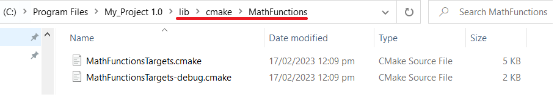
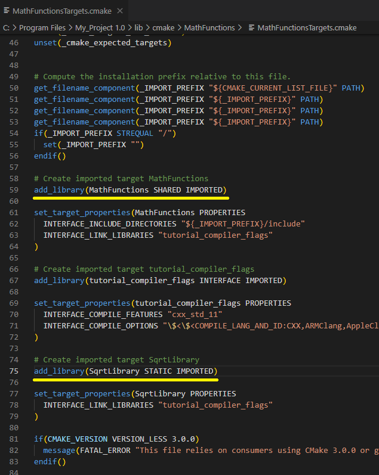

# Adding Export Configuration

During Installing and Testing of the tutorial we added the ability for CMake to install the library and headers of the project. During Packaging an Installer we added the ability to package up this information so it could be distributed to other people.

The next step is to add the necessary information so that other CMake projects can use our project, be it from a build directory, a local install or when packaged.

The first step is to update our `install(TARGETS)` commands to not only specify a `DESTINATION` but also an `EXPORT`. The `EXPORT` keyword generates a CMake file containing code to import all targets listed in the install command from the installation tree. So let's go ahead and explicitly `EXPORT` the `MathFunctions` library by updating the install command in `MathFunctions/CMakeLists.txt`.

This is done by adding `EXPORT MathFunctionsTargets` to make

```CMake
install(TARGETS ${installable_libs}
        EXPORT MathFunctionsTargets
        DESTINATION lib)
```

Now that we have `MathFunctions` being exported, we also need to explicitly install the generated `MathFunctionsTargets.cmake` file. This is done by adding the following to the bottom of the top-level `CMakeLists.txt`:

```CMake
install(EXPORT MathFunctionsTargets
  FILE MathFunctionsTargets.cmake
  DESTINATION lib/cmake/MathFunctions
)
```

Completing these two steps will give us the following error when trying to rebuild


This is from the following lines,

```CMake
target_include_directories(MathFunctions
                           INTERFACE ${CMAKE_CURRENT_SOURCE_DIR}
                           )
```

and via the use of `install`.

What CMake is trying to say is that during generating the export information it will export a path that is intrinsically tied to the current machine and will not be valid on other machines. For example, I cannot create a library that someone else could utilize if they need to find files located at `C://Michaels/own_computer/path/.../MathFunctionTargets.cmake`. The solution to this is to update the `MathFunctions` `target_include_directories()` to understand that it needs different `INTERFACE` locations when being used from within the build directory and from an install / package. This means converting the `target_include_directories()` call for `MathFunctions` to look like:

```CMake
target_include_directories(MathFunctions
                           INTERFACE
                            $<BUILD_INTERFACE:${CMAKE_CURRENT_SOURCE_DIR}>
                            $<INSTALL_INTERFACE:include>
                           )
```

At this point, we have CMake properly packaging the target information that is required but we will still need to generate a `MathFunctionsConfig.cmake` so that the CMake `find_package()` command can find our project. So let's go ahead and add a new file to the top-level of the project called `Config.cmake.in` with the following contents:

```CMake
@PACKAGE_INIT@

include ( "${CMAKE_CURRENT_LIST_DIR}/MathFunctionsTargets.cmake" )
```

Then, to properly configure and install that file, add the following to the bottom of the top-level CMakeLists.txt:


```CMake
install(EXPORT MathFunctionsTargets
        FILE MathFunctionsTargets.cmake
        DESTINATION lib/cmake/MathFunctions
)

include(CMakePackageConfigHelpers)
```

Next, we execute the `configure_package_config_file()`. This command will configure a provided file but with a few specific differences from the `standard configure_file()` way. To properly utilize this function, the input file should have a single line with the text `@PACKAGE_INIT@` in addition to the content that is desired. **That variable will be replaced with a block of code which turns set values into relative paths**. These values which are new can be referenced by the same name but prepended with a `PACKAGE_` prefix. Add,

```CMake
# generate the config file that includes the exports
configure_package_config_file(${CMAKE_CURRENT_SOURCE_DIR}/Config.cmake.in
  "${CMAKE_CURRENT_BINARY_DIR}/MathFunctionsConfig.cmake"
  INSTALL_DESTINATION "lib/cmake/example"
  NO_SET_AND_CHECK_MACRO
  NO_CHECK_REQUIRED_COMPONENTS_MACRO
  )
```

The `write_basic_package_version_file()` is next. This command writes a file which is used by `find_package()`, documenting the version and compatibility of the desired package. Here, we use the `Tutorial_VERSION_*` variables and say that it is compatible with `AnyNewerVersion`, which denotes that this version or any higher one are compatible with the requested version.

Now we can add 

```CMake
write_basic_package_version_file(
  "${CMAKE_CURRENT_BINARY_DIR}/MathFunctionsConfigVersion.cmake"
  VERSION "${Tutorial_VERSION_MAJOR}.${Tutorial_VERSION_MINOR}"
  COMPATIBILITY AnyNewerVersion
)
```

Finally,

```CMake
install(FILES
  ${CMAKE_CURRENT_BINARY_DIR}/MathFunctionsConfig.cmake
  ${CMAKE_CURRENT_BINARY_DIR}/MathFunctionsConfigVersion.cmake
  DESTINATION lib/cmake/MathFunctions
  )
```

At this point, we have generated a relocatable CMake Configuration for our project that can be used after the project has been installed or packaged. If we want our project to also be used from a build directory we only have to add the following to the bottom of the top level `CMakeLists.txt`:

```CMake
export(EXPORT MathFunctionsTargets
  FILE "${CMAKE_CURRENT_BINARY_DIR}/MathFunctionsTargets.cmake"
)
```

With this export call we now generate a MathFunctionsTargets.cmake, allowing the configured `MathFunctionsConfig.cmake` in the build directory to be used by other projects, without needing it to be installed.

# What is a `.cmake` file?

During our added commands such as,

```CMake
install(EXPORT MathFunctionsTargets
        FILE MathFunctionsTargets.cmake
        DESTINATION lib/cmake/MathFunctions
)
```
The `EXPORT` keyword in the `install` command generates a **CMake targets file**, typically with a `.cmake` file extension. This file contains information about the targets being exported, such as their include directories, linker flags, dependencies, and so on. The exported targets can be used by other CMake projects to automatically link against your libraries and to set include directories, compile options, and other build properties.

When you use the `FILE` keyword, you specify a name for the exported target file, in this case `MathFunctionsTargets.cmake`. This file will be installed to the `lib/cmake/MathFunctions` directory of your installation.

To use the exported targets, other CMake projects can include the `MathFunctionsTargets` file using the `find_package` command. The `find_package` command looks for a CMake configuration file with the specified name, in this case `MathFunctionsTargets.cmake`. The configuration file contains the exported targets, along with any associated properties, which can be used to link against the libraries and set build properties.

The main advantage of using an exported targets file is that it makes it easier for other projects to use your libraries. Instead of manually setting include directories, linker flags, and other build properties, other projects can simply include the targets file and use the imported targets.

`add_subdirectory` is not enough, as it only adds the subdirectory to the current project and includes the `CMakeLists.txt` file in that directory. It does not generate an exported targets file, and does not make the targets available to other projects.

For example, let us analyze the output of our installation using `cpack -G NSIS -C Debug`:



Everything is exactly the same, except for the addition of `lib/cmake/MathFunctions` that now stores our `MathFunctionTargets.cmake`. That is, `bin` only stores our `.exe` and `.dll`. `include` only has our `.h`. The contents inside of `lib` is some `.dll` and `.lib`. Notice here that their is no `CMakeLists.txt`! 

This means that anyone who wants to utilize and use our `MathFunctions` library needs to perform `find_package(MathFunctions REQUIRED)`. Notice here that we do not rebuild `MathFunctions` each time, it is a library that we utilize. Similarily if we depended on something such as Qt, we would like to it using CMake and utilize it's `.cmake` file for the setup and linking. Here we are doing the same and allowing others to utilize our `MathFunctions` library without building it themselves or giving them our `CMakeLists.txt`.

# `install(TARGET)` and `install(EXPORT)`

## `install(TARGET)`

It is important to understand that in CMake, although [`install`](https://cmake.org/cmake/help/latest/command/install.html#synopsis) is a single command **the first keyword mostly signifies the behaviour of the function**.

For example in our examples behaviour `install(TARGET ...)` behaves differently to `install(EXPORT ...)` despite both of them offering a `EXPORT` keyword in those method calls.


Here I will iterate how the following works, first let us begin with the following.

```CMake
install(TARGETS ${installable_libs} 
        EXPORT MathFunctionsTargets 
        DESTINATION lib)
```

`install(TARGETS ...)` will install the following targets inside of `${installable_libs}` to the directory `lib`. The keyword `EXPORT` behaves in a specific way, taken directly from the [documentation](https://cmake.org/cmake/help/latest/command/install.html#installing-targets), "This option associates the installed target files with an export called `<export-name>`". In other words, here we are installing the targets (creating the `.dll` and `.lib`) and placing them into the `lib` directory which essentially keeping a reference name called `MathFunctionsTargets`. Keep in mind, **this does not generate a `.cmake` file**.


## `install(EXPORT ...)`

```cmake
install(EXPORT MathFunctionsTargets
        FILE MathFunctionsTargets.cmake
        DESTINATION lib/cmake/MathFunctions
)
```

In this example by using `EXPORT` **first** the beaviour is different and the name after `EXPORT` is the name of anything specified using `install(TARGET ... EXPORT name)`. Taken directly from the [documentation](https://cmake.org/cmake/help/latest/command/install.html#installing-exports) we can see the following quote, "The `EXPORT` form **generates and installs a CMake file** containing code to import targets from the installation tree into another project. **Target installations are associated with the export `<export-name>` using the `EXPORT` option of the `install(TARGETS)` signature documented above.**"

Here, we are finally generating the `.cmake` file that contains information to utilzie the targets specified in `${installable_libs}` which are both `SqrtLibrary` and `MathFunctions`.


Infact, a minor analysis of `MathFunctionsTargets.cmake` we can see that anybody utilizing this `.cmake` file will automatically have the behaviour requirements of importing the libraries as shown,



Keep in mind this generates the `.cmake` file when **installing, not building**. Therefore the `.cmake` will be located at `lib/cmake/MathFunctions`. To generate a `.cmake` **when building**, this is done with the additional lines added afterwards.

```cmake
export(EXPORT MathFunctionsTargets
  FILE "${CMAKE_CURRENT_BINARY_DIR}/MathFunctionsTargets.cmake"
)
```

Keep in mind, again, `MathFunctionTargets` is referring to 

```cmake
install(TARGETS ${installable_libs} 
        EXPORT MathFunctionsTargets   <------
        DESTINATION lib)
```

# `$<BUILD_INTERFACE:...>` and `$<INSTALL_INTERFACE:...>`

These are two generator expressions that can be explained via the [documentation](https://cmake.org/cmake/help/latest/manual/cmake-generator-expressions.7.html#export-and-install-expressions). However, they work like this.

Generator-like expressions `$<BUILD_INTERFACE>` and `$<INSTALL_INTERFACE>` are used by CMake for distinguishing things, different for the **build tree** and for the **install tree**.

`$<BUILD_INTERFACE>` and `$<INSTALL_INTERFACE>` were created to help simplify the process of building and installing libraries and executables in CMake-based projects. They provide a convenient way to specify different include directories for a library or executable during the build and installation phases, respectively.

The use case for `$<BUILD_INTERFACE>` is to specify an include directory that is only needed during the **build phase**. This is useful when you have header files that are only required by the library or executable being built, and not by other projects that depend on it. By using `$<BUILD_INTERFACE>`, you can ensure that the header files are only included during the build phase and not installed along with the library or executable. This helps to keep the installation directory clean and avoid any potential conflicts with other projects that may use the same header file names.

The use case for `$<INSTALL_INTERFACE>` is to specify an include directory that is needed both during the **build phase and the installation phase**. This is useful when you want to install header files along with the library or executable so that other projects that depend on it can use the header files as well. By using `$<INSTALL_INTERFACE>`, you can ensure that the header files are installed along with the library or executable and that **the include directory path is adjusted automatically based on the installation prefix**. This makes it easy to install your library or executable in different locations on different machines without having to modify your CMake code.