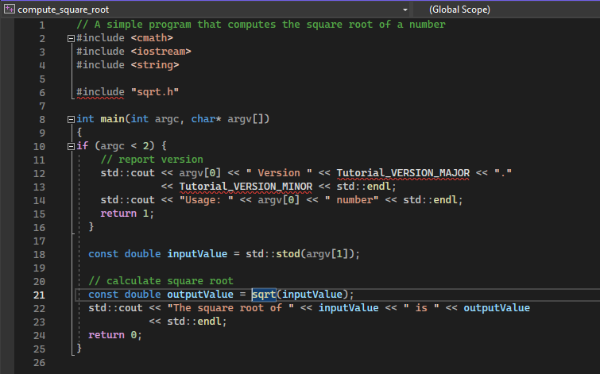

# Complete C++ tutorial (Step 1)

In this page we will walk through compiling the following CPP file called `sqrt.cxx` using CMake.
The complete files are located in the `CMake_tutorial` directory.

```C++
// A simple program that computes the square root of a number
#include <cmath>
#include <cstdlib>
#include <iostream>
#include <string>


int main(int argc, char* argv[])
{
  if (argc < 2) {
    std::cout << "Usage: " << argv[0] << " number" << std::endl;
    return 1;
  }

  const double inputValue = atof(argv[1]);

  const double outputValue = sqrt(inputValue);
  std::cout << "The square root of " << inputValue << " is " << outputValue
            << std::endl;
  return 0;
}

```

# Creating a minimal CMakeLists.txt

The minimal CMakelists.txt will require the following 3 lines,

```CMake
cmake_minimum_required(VERSION 3.10)

project(My_Project)

add_executable(compute_square_root 
    src/sqrt.cxx)
```

To clarify the three function calls;

`cmake_minimum_required` sets the minimum required version of cmake for a project.\
`project` sets the project name.\
`add_executable` sets the configurations that the generator will use to build the final executeable. This means that Make, VS, etc... will perform these steps to produce the executable.

This is the minimal setup to generate a build using a GUI or CLI demonstrated in my file `CMake_introduction.md`.

# Adding C++ 11 specific features

Firstly, let us replace the following line,
``` C++
const double inputValue = atof(argv[1]);
```

to

```C++
const double inputValue = std::stod(argv[1]);
```

`std::stod` simply converts a `string` to a `double` and requires at minimum C++ 11.

Next, we will remove the following line because we no longer will use `atof` 
```C++
#include <cstdlib>
```

Finally, we need to make sure that when we are building our C++ source code we are using the correct, at minimum C++ 11 because this will make sure that we support `std::stod`. This can be achieved by editing CMakeLists.txt to become.

```CMake
cmake_minimum_required(VERSION 3.10)

project(My_Project)

set(CMAKE_CXX_STANDARD 11)
set(CMAKE_CXX_STANDARD_REQUIRED True)


add_executable(compute_square_root 
    src/sqrt.cxx)
```

[CMAKE_CXX_STANDARD](https://cmake.org/cmake/help/latest/prop_tgt/CXX_STANDARD.html#prop_tgt:CXX_STANDARD) is used to set the C++ standard whose features are required to build this target, 11 is the version specified here.

[CMAKE_CXX_STANDARD_REQUIRED](https://cmake.org/cmake/help/latest/prop_tgt/CXX_STANDARD_REQUIRED.html#prop_tgt:CXX_STANDARD_REQUIRED) is set to True because the the value of `CXX_STANDARD`  is a **requirement**.

# Adding a Version Number and Configured Header File

Sometimes it may be useful to have a variable that is defined in our CMakelists.txt file to also be available in our source code. In this example we will print the project version.

One way to accomplish this is by using a configured header file. We create an input file with one or more variables to replace. These variables have special syntax which looks like `@VAR@`. Then, we use the `configure_file()` command to copy the input file to a given output file and replace these variables with the current value of `VAR` in the CMakelists.txt file.

While we could edit the version directly in the source code, using this feature is preferred since it creates a single source of truth and avoids duplication. In this example we have a file `sqrt.h.in`.

First we begin by setting the project version major and minor by updating the `project` command to become

```CMake
project(My_Project VERSION 1.0)
```

To configure the file we need to provide `configure_file` an input file (Suffix `.in`). The second parameter to `configure_file` will be the name of the output file. Using the command below we configure and copy `sqrt.h.in` to `sqrt.h`

```CMake
configure_file(sqrt.h.in sqrt.h)
```

The next thing to note is that CMake needs to know where search for include files so that it will be able to find `sqrt.h`. The command `target_include_directories()` is used for this very reason. The command to add will therefore be,

```CMake
target_include_directories(compute_square_root PUBLIC
                           "${PROJECT_BINARY_DIR}/src"
                           )
```

A few things to note here,

1. The first parameter is the *target*, this was first set using `add_executable`
2. Do not confuse `BINARY_DIR` with typical binaries which would be located at `bin/`, in this context the project **build** and the project **binary directory** mean the same thing.

Because `${PROJECT_BINARY_DIR}` will evaluate to the root directory and our `sqrt.h` is inside `root/src` we need to add a `src/` at the end. From here, we are telling CMake to **include sqrt.h that was produced via the configure_file command**. Without this line our solution file will open up with an error telling up that `#include sqrt.h` cannot be found.



Inside of `sqrt.h.in` we need to set the correct content aswell. Remember this file will later be imported into our C++ code as a `#include sqrt.h`. The contents of `sqrt.h.in` will look like,

```CMake
#define Tutorial_VERSION_MAJOR @My_Project_VERSION_MAJOR@
#define Tutorial_VERSION_MINOR @My_Project_VERSION_MINOR@
```

`@My_Project_VERSION_MAJOR@` will be later changed to 3. They're synced because we have specified out project name as My_Project and by adding _VERSION_MAJOR we are grabbing the major version we specified previously.

The output of `sqrt.h.in` will be `sqrt.h` (Found at `build/src/sqrt.h`) and look like this,

```C++
#define Tutorial_VERSION_MAJOR 1
#define Tutorial_VERSION_MINOR 0
```

Finally we will edit our original C++ code to utilize the two constants and print the version number if no command line arguments are given.


```C++
// A simple program that computes the square root of a number
#include <cmath>
#include <iostream>
#include <string>

#include "sqrt.h"

int main(int argc, char* argv[])
{
if (argc < 2) {
    // report version
    std::cout << argv[0] << " Version " << Tutorial_VERSION_MAJOR << "."
              << Tutorial_VERSION_MINOR << std::endl;
    std::cout << "Usage: " << argv[0] << " number" << std::endl;
    return 1;
  }

  const double inputValue = std::stod(argv[1]);

  // calculate square root
  const double outputValue = sqrt(inputValue);
  std::cout << "The square root of " << inputValue << " is " << outputValue
            << std::endl;
  return 0;
}
```

The CMakelists.txt will now appear as,

```CMake
cmake_minimum_required(VERSION 3.10)

project(My_Project VERSION 1.0)

set(CMAKE_CXX_STANDARD 11)
set(CMAKE_CXX_STANDARD_REQUIRED True)

configure_file(src/sqrt.h.in src/sqrt.h)

add_executable(compute_square_root 
    src/sqrt.cxx)

target_include_directories(compute_square_root PUBLIC
                           "${PROJECT_BINARY_DIR}/src"
                           )

```