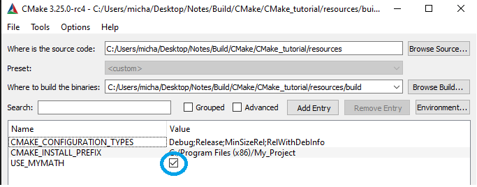

# Creating a library (Step 2)

To add a library in CMake, use the `add_library` command and specify which source files should make up the library.

Rather than placing all of the source files in one directory, we can organize our project with one or more subdirectories. In this case, we will create a subdirectory specifically for our library. Here, we can add a new CMakeLists.txt file and one or more source files. In the top level CMakeLists.txt file, we will use the `add_subdirectory()` command to add the subdirectory to the build.

Once the library is created, it is connected to our executable target with `target_include_directores()` and `target_link_libraries()`

In this exercise, I will add a library to our project that contains our own implementation for computing the square root of a number. The executable can then use this library instead of the standard square root function provided by the compiler.

# Creating MathFunctions

Now, to continue we will create a new directory called MathFunctions and place into this directory it's own CMakeLists.txt, MathFunctions.h and mysqrt.cxx. mysqrt.cxx will contain one function, `mysqrt`.

The CMakeLists.txt will look tiny and simply contain,

```CMake
add_library(MathFunctions mysqrt.cxx)
```

`add_library` adds a library target called MathFunctions to be built from the source files listed in the command invocation. The name (MathFunctions) corresponds to the logical target name and must be globally unique within a project. The actual file name of the library built is constructed based on conventions of the native platform (such as lib*name*.a or *name*.lib).

Now, to make use of the new library we will add a `add_subdirectory()` call in the top-level CMakeLists.txt file so that the library will get built. Here, we add a `add_subdirectory(MathFunctions)` line to the top level CMakeLists.txt.

Because we have added MathFunctions as a library, we now also need to link it. After the call `add_subdirectory` we can therefore add `target_link_libraries(compute_square_root PUBLIC MathFunctions)`.

Finally we need to specify the library's header file location. We now need to modify `target_include_directories()` to add the MathFunctions subdirectory as an include directory so that the MathFunctions.h header file can be found.

```CMake
target_include_directories(compute_square_root PUBLIC
                           "${PROJECT_BINARY_DIR}/src",
                           "${PROJECT_SOURCE_DIR}/MathFunctions"
                           )
```

Finally, we can modify our C++ code to utilize `#include "MathFunctions.h"` and replace `sqrt` with `mysqrt`.

Now a quick note on `PROJECT_BINARY_DIR` and `PROJECT_SOURCE_DIR`.
We can debug the values of these two by the following lines being added to our CMakeLists.txt,

```CMake
message(STATUS "PROJECT_BINARY_DIR = ${PROJECT_BINARY_DIR}")
message(STATUS "PROJECT_SOURCE_DIR = ${PROJECT_SOURCE_DIR}")
```

From this output we can figure out the value of the two variables to be,

```CMake
PROJECT_BINARY_DIR = C:/.../Notes/Build/CMake/CMake_tutorial/resources/build
PROJECT_SOURCE_DIR = C:/.../Notes/Build/CMake/CMake_tutorial/resources
```

Remember that our `sqrt.h` is generated from `configure_file` and places it into `root/build/src`. This means we need to add that path to search for that particular file. However, our MathFunctions header file is located inside of `root/MathFunctions`. Therefore two seperate variables are required.

Therefore the final CMakeLists.txt will look like,
```CMake
cmake_minimum_required(VERSION 3.10)

# set the project name and version
project(My_Project VERSION 1.0)

# specify the C++ standard
set(CMAKE_CXX_STANDARD 11)
set(CMAKE_CXX_STANDARD_REQUIRED True)

# configure a header file to pass some of the CMake settings
# to the source code. Remember the output to this is inside
# build/...
configure_file(src/sqrt.h.in src/sqrt.h)

 # Creates an executable target
add_executable(compute_square_root 
    src/sqrt.cxx)


add_subdirectory(MathFunctions)

target_link_libraries(compute_square_root PUBLIC MathFunctions)

target_include_directories(compute_square_root PUBLIC
                           "${PROJECT_BINARY_DIR}/src", 
                           "${PROJECT_SOURCE_DIR}/MathFunctions"
                           )
```

## Additional important notes

When we call `add_subdirectory(MathFunctions)` it takes the directory `MathFunctions`, i.e. `root/MathFunctions`. Running `add_subdirectory()` will also run the CMakeLists.txt locationed inside this directory. We can debug and confirm this behaviour by adding `message(STATUS "Calling MathFunctions")` into the CMakeLists.txt located into `root/MathFunctions`.

Running `add_library(MathFunctions mysqrt.cxx)` creates the target called `MathFunctions`, this is not referring to the directory. This target is then used by `target_link_libraries(compute_square_root PUBLIC MathFunctions)`. From the [documentation](https://cmake.org/cmake/help/latest/command/target_link_libraries.html) of `target_link_libraries` we can see that the API appears as,

```
target_link_libraries(<target> ... <item>... ...)
```

In this example the `<target>` we are linking is `compute_square_root` which was created at `add_executable(compute_square_root ...)`. Each `<item>` is a named target that must have been created by `add_library` within the project or as an imported library. This was previous done calling `add_library(MathFunctions mysqrt.cxx)`.

Therefore `target_link_libraries(compute_square_root PUBLIC MathFunctions)` is linking the library target called `MathFunctions` to the target `compute_square_root`. 

This is important as we can see when executing the output build without `target_link_libraries` we will receive a linking error.


Notice here that `MathFunctions` has its own project. It is not by default a part of `computer_square_root` and is therefore required to be linked. The command that adds `MathFunctions` to appearing in the solution is `add_subdirectory`.

# Making the library optional

CMake can do this using the `option()` command. This gives users a variable which they can change when configuring their CMake build. This setting will be stored in the cache so that the user does not need to set the value each time they run CMake on a build directory.

To begin we will add a line utilizing `option()` to our CMakeLists.txt,

```option(USE_MYMATH "Use my square root math implementation" ON)```

After we have set the variable `USE_MYMATH` we refactor the CMakeLists.txt to only utilize our `MathFunctions` if we want to.

```CMake
# add the MathFunctions library
if(USE_MYMATH)
  add_subdirectory(MathFunctions)
  list(APPEND EXTRA_LIBS MathFunctions)
  list(APPEND EXTRA_INCLUDES "${PROJECT_SOURCE_DIR}/MathFunctions")
endif()
```

Now we also need to rewrite the other components of the CMakeLists.txt to utilize the newly defined lists.


```CMake
target_link_libraries(compute_square_root PUBLIC ${EXTRA_LIBS})
```

and

```CMake
target_include_directories(compute_square_root PUBLIC
                           "${PROJECT_BINARY_DIR}/src"
                           ${EXTRA_INCLUDES}
                           )
```

Additional note on the `list` [API](https://cmake.org/cmake/help/latest/command/list.html#append). `list` takes several modifiers, one of which is `APPEND`. The format is,

```CMake
list(APPEND <list> [<element> ...])
```

Now, if the variable `<list>` does not exist in the current scope, its value is treated as empty and the elements are appended to that empty list.

Now we plan on using this variable inside our `.h` which will eventually be imported from our `.cxx` file. Therefore modification of our `.h.in` is required.
To use the variable `USE_MYMATH` we need to make modifications to our CMakeLists.txt by adding the following line,

```CMake
#cmakedefine USE_MYMATH
```

`#cmakedefine` is part of a file that is processed by CMakes `configure_file` command. When `configure_file` is called for the file, `#cmakedefine FOO` is replaced by:

1. `#define FOO` - if the CMake variable `FOO` is set to ON or TRUE.
2. `/* #undef FOO */` - otherwise.

And that is one way to pass values from CMake into C or C++ source code. The result of `configure_file` is a C/C++ header file, which is included by the code you want to respect the CMake variable values.

Therefore we need to edit our `.cxx` file to contain both,

```C++
#ifdef USE_MYMATH
  include "MathFunctions.h"
#endif
```

and

```C++
#ifdef USE_MYMATH
  const double outputValue = mysqrt(inputValue);
#else
  const double outputValue = sqrt(inputValue);
#endif
```

It is worth noting that the state of the variable `USE_MYMATH` will be configured using the CMake GUI and will overwrite the variable value that is set programatically.

For example, below I have a ticked box, settting the value of `USE_MYMATH` to True. If I change the code to `option(USE_MYMATH ... False)`, it will still set `USE_MYMATH` when using the GUI.



