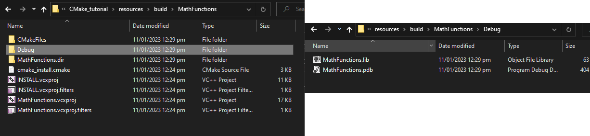
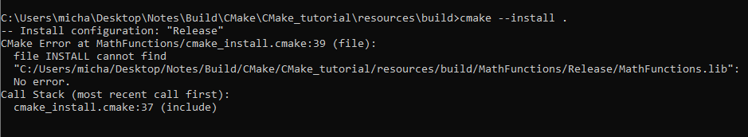
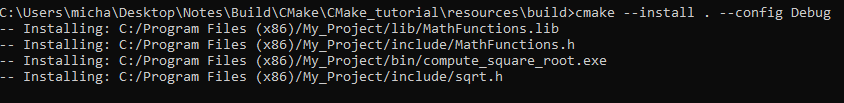
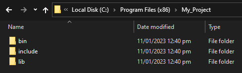
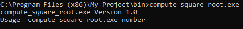
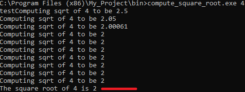
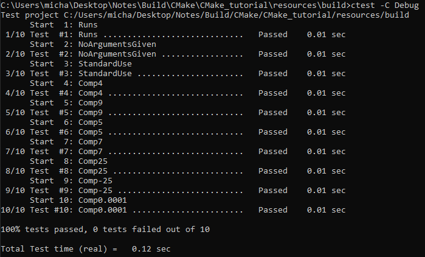
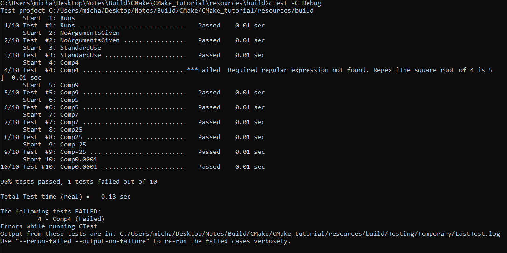

# Installing and Testing

Often, it is not enough to only build an executable, it should be installable. With CMake, we can specify install rules using the `install()` command. Supporting local installations for your builds in CMake is often as simple as specifying an install location and the targets and files to be installed.

The goal of this section is to install the generated executable and the `MathFunctions` library.

First, we need to update `MathFunctions/CMakeLists.txt` to install the `MathFunctions` and `tutorial_compiler_flags` libraries to the `lib` directory. In that same file, we need to specify the install rules needed to install `MathFunctions.h` to the `include` directory.

From here, we will need to update the top level `CMakeLists.txt` to install the `compute_square_root` executable to the `bin` directory. Lastly, any header files should be installed to the `include` directory.

The install rules for our project are fairly simple.

1. For `MathFunctions`, we want to install the libraries and header file to the `lib` and `include` directories respectively.
2. For the `compute_square_root` executable, we want to install the executable and configured header file to the `bin` and `include` directories respectively.

So to the end of `MathFunctions/CMakeLists.txt` we add:

```CMake
set(installable_libs MathFunctions tutorial_compiler_flags)
install(TARGETS ${installable_libs} DESTINATION lib)

install(FILES MathFunctions.h DESTINATION include)
```

Here, the variable `installable_libs` is infact a list.

The install rules for the `compute_square_root` executable and configured header file are similar. To the end of the top-level CMakeLists.txt we add;

```CMake
install(TARGETS compute_square_root DESTINATION bin)
install(FILES "${PROJECT_BINARY_DIR}/src/sqrt.h"
  DESTINATION include
  )
```

That is all that is needed to create a basic local install of the tutorial.


# Installation


The process of installation does not involve any compiling or linking of files. Infact it is primarily just setting up folders, directories, registeries and copying already compiled executeables and other files that it uses to the appropiate location on your computer. Therefore if we run an install by first **switching to the build folder** and immediately run `cmake --install .` we will receive an error like the following; Note: Installation requires administrator privileges and therefore requires to open the command line in administration mode.


This error occurs because `MathFunctions.lib` is created during the compilation process. To create this file we must compile our code, this can be done in Visual Studio by simply running the script using the green triangle. To run the script it will generate the required files.

After exeuting the script once in Visual Studio we will see an additional folder created called `Debug`



Now we we execute `cmake --install . --config Debug` when inside the build folder, then the script will work correctly. An additional note on `--config Debug`. This means it will look for `Debug/MathFunctions.lib`, without this set it will search for `Release/MatbFunctions.lib` and be unable to find the correct files.




Now, when the command has correctly executed the following output will be present;



Notice here that the installation process placed it into `C:/Program Files (x86)/...`.



The files inside these folders were set from our installation commands previously set,

For example inside of `bin` is `compute_square_root.exe`, set from

```CMake
install(TARGETS compute_square_root DESTINATION bin)
```

Inside of `include` is `MathFunctions.h` and `sqrt.h` from the following commands,

```CMake
install(FILES MathFunctions.h DESTINATION include)
```

and 

```CMake
install(FILES "${PROJECT_BINARY_DIR}/src/sqrt.h"
  DESTINATION include
  )
```

Finally, the lib folder contains `MathFunctions.lib` which was set from

```CMake
set(installable_libs MathFunctions tutorial_compiler_flags)
install(TARGETS ${installable_libs} DESTINATION lib)
```

# Testing

To begin testing, we first need to enable testing with the command `enable_testing()` from the top level `CMakeLists.txt`.

With testing enabled, we will add a number of basic tests to verify that the application is working correctly. First, we create a test using add_test() which runs the `compute_square_root` executable with the parameter 25 passed in. For this test, we are not going to check the executable's computed answer. This test will verify that application runs, does not segfault or otherwise crash, and has a zero return value. This is the basic form of a CTest test.

This is done as follows;

```CMake
add_test(NAME Runs COMMAND compute_square_root 25)
```

From the [add_test()](https://cmake.org/cmake/help/latest/command/add_test.html) API, this is calling our test "Runs". What this test will simply do is execute the executeable after `COMMAND` in this case, `compute_square_root` with the provided parameter 25, i.e. `compute_square_root.exe 25`.

Next, let's use the `PASS_REGULAR_EXPRESSION` test property to verify that the output of the test contains certain strings. In this case, verifying that the usage message is printed when an incorrect number of arguments are provided.



This is done as follows,

```CMake
add_test(NAME NoArgumentsGiven COMMAND compute_square_root)
set_tests_properties(NoArgumentsGiven
  PROPERTIES PASS_REGULAR_EXPRESSION "Usage:.*number"
  )
```

The next test we will add verifies the computed values is truly square.



```CMake
add_test(NAME StandardUse COMMAND compute_square_root 4)
set_tests_properties(StandardUse
  PROPERTIES PASS_REGULAR_EXPRESSION "4 is 2"
  )
```

These tests are not enough to give us confidence that it will work for all values passed in. I need to add more tests to verify. To reduce code duplication, we will make a new function called `do_test` that runs the application and verifies that the computed square root is correct for a given input. For each invocation of `do_test`, another test is added to the project with a name, input and expected results based on the passed arguments.

```CMake
function(do_test target arg result)
  add_test(NAME Comp${arg} COMMAND ${target} ${arg})
  set_tests_properties(Comp${arg}
    PROPERTIES PASS_REGULAR_EXPRESSION ${result}
    )
endfunction()

# do a bunch of result based tests
do_test(compute_square_root 4 "The square root of 4 is 2")
do_test(compute_square_root 9 "The square root of 9 is 3")
do_test(compute_square_root 5 "The square root of 5 is 2.236")
do_test(compute_square_root 7 "The square root of 7 is 2.645")
do_test(compute_square_root 25 "The square root of 25 is 5")
do_test(compute_square_root -25 "The square root of -25 is (-nan|nan|0)")
do_test(compute_square_root 0.0001 "The square root of 0.0001 is 0.01")
```

A standard argument passing is being done however, but it is useful to note that `Comp${arg}` is later evaluated as a string name and will be called `Comp4` (string) etc...

Now, to finally execute and test what we have written, **when inside the build directory** the command will be `ctest -C Debug`. To have a more verbose output with more information `ctest -C Debug -vv` or `ctest -C Debug -v` can be used.

The following output will be given,



Now, if we were to make a small adjustment to test that failures work such as changing a test to become `do_test(compute_square_root 4 "The square root of 4 is 5")`, we will see the error.

