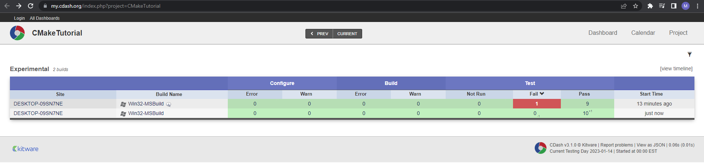

# Adding Support for a Testing Dashboard

Adding support for submitting our test results to a dashboard is simple. We already defined a number of tests for our project in Testing Support. Now we just have to run those tests and submit them to a dashboard. To include support for dashboards we include the `CTest` module in our top-level CMakeLists.txt.

The first thing to do is replace;

```Cmake
enable_testing()
```

with

```CMake
include(CTest)
```

The CTest module will automatically call enable_testing(), so we can remove it from our CMake files.

We will also need to acquire a `CTestConfig.cmake` file to be placed in the top-level directory where we can specify information to CTest about the project. It contains:

- The project name

- The project "Nightly" start time

- The time when a 24 hour "day" starts for this project.

- The URL of the CDash instance where the submission's generated documents will be sent

 It would normally be downloaded from the Settings page of the project on the CDash instance that will host and display the test results. Once downloaded from CDash, the file should not be modified locally.

 The ctest executable will read in this file when it runs. To create a simple dashboard you can run the `cmake` executable or the `cmake-gui` to configure the project, but do not build it yet. Instead, change directory to the binary tree, and then run:

 ```
 ctext [-VV] -D Experimental
 ```

 **Remember**, for multi-config generators (e.g. Visual Studio), the configuration type must be specified:

 ```
 ctest [-VV] -C Debug -D Experimental
 ```

 Or, from an IDE, build the Experimental target.

 The ctest executable will build and test the project and submit the results to Kitware's public dashboard: https://my.cdash.org/index.php?project=CMakeTutorial.

 