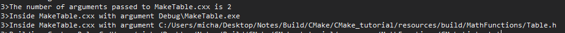

# Adding a Custom Command and Generated File

Suppose, for the purpose of this tutorial, we decide that we never want to use the platform `log` and `exp` functions and instead would like to generate a table of precomputed values to use in the `mysqrt` function. In this section, we will create the table as part of the build process, and then compile the table into our application.

First, let's remove the check for the `log` and `exp` functions in `MathFunctions/CMakeLists.txt`. Then remove the check for `HAVE_LOG` and `HAVE_EXP` from `mysqrt.cxx`. At the same time, we can remove `#remove <cmath>`.

In the `MathFunctions` subdirectory, a new source file named `MakeTable.cxx` has been provided to generate the table. After reviewing the file, we can see that the table is produced as valid C++ code and that the output filename is passed in as an argument.

The next step is to add the appropiate commands to the `MathFunctions/CmakeLists.txt` file to build the MakeTable executable and then run it as part of the build process. A few commands are needed to accomplish this.

First, at the top of `MathFunctions/CMakeLists.txt`, the executable for `MakeTable` is added as any other executable would be added.

`MathFunctions/CMakeLists.txt`
```
add_executable(MakeTable MakeTable.cxx)
```

Then we add a custom command that specifies how to produce `Table.h` by running MakeTable.

`MathFunctions/CMakeLists.txt`
```
add_custom_command(
  OUTPUT ${CMAKE_CURRENT_BINARY_DIR}/Table.h
  COMMAND MakeTable ${CMAKE_CURRENT_BINARY_DIR}/Table.h
  DEPENDS MakeTable
)
```

Next we have to let CMake know that `mysqrt.cxx` depends on the generated `Table.h`. This is done by adding the generated `Table.h` to the list of sources for the library MathFunctions.

```
add_library(MathFunctions
            mysqrt.cxx
            ${CMAKE_CURRENT_BINARY_DIR}/Table.h
)
```

We also have to add the current binary directory to the list of include directories so that `Table.h` can be found and included by `mysqrt.cxx`.

```
target_include_directories(MathFunctions
          INTERFACE ${CMAKE_CURRENT_SOURCE_DIR}
          PRIVATE   ${CMAKE_CURRENT_BINARY_DIR}
)

# link our compiler flags interface library
target_link_libraries(MathFunctions tutorial_compiler_flags)
```

Now, let's use the generated table. First, modify `mysqrt.cxx` to include `Table.h`. Next, we can rewrite the `mysqrt` function to use the table.

When this project is built it will first build the `MakeTable` executable. It will then run `MakeTable` to produce `Table.h`. Finally, it will compile `mysqrt.cxx` which includes `Table.h` to produce the `MathFunctions` library.

# Further Analysis

## add_custom_command

An important addition to this section of the tutorial is,

```
add_custom_command(
  OUTPUT ${CMAKE_CURRENT_BINARY_DIR}/Table.h
  COMMAND MakeTable ${CMAKE_CURRENT_BINARY_DIR}/Table.h
  DEPENDS MakeTable
)
```

[This command](https://cmake.org/cmake/help/latest/command/add_custom_command.html) is to simply add a custom build rule to the generated build system. It is important to note that `add_custom_command` does not immediately result in the command being executed, but rather it will only execute if it needs build the dependency.


The three keywords used in this example are `OUTPUT`, `COMMAND` and `DEPENDS`.

### OUTPUT
The argument `OUTPUT` specifies the output files the command is expected to produce. Each output file will be marked with the `GENERATED` source file property automatically. It is important to note that this CMake command itself does not generate the file, it is stating that after performing `COMMAND` a new file should be generated with the provided name, it will then find this file and mark it with a property `GENERATED`. Files marked with the property `GENERATED` are useful because any target that dependes on a file marked with `GENERATED` will result in a dependency and cause the command to be ran.

### COMMAND

The argument `COMMAND` specifies the command-line(s) to execute at build time. If more than one `COMMAND` is specified they will be executed in order. Due to the `.exe` being created prior from `add_executable(MakeTable MakeTable.cxx)`, what this command is doing it executing the `MakeTable.exe` with one command line argument, the header file location.

This means it will execute the `main` inside `MakeTable.cxx` because it is executing it argument. The one argument will be the header file, which is where we are writing the data to.

Remember that `argc` will be the number of strings pointed to by `argv`. This will (in practice) be 1 plus the number of arguments, as virtually all implementations will prepend the name of the program to the array.



Therefore, this command is used to execute the `MakeTable.exe` while passing the header file location to write to. Because we are executing the file directly, it will enter the `main`. It will then write the first 1000 square roots into a header file, which outputs this into `Table.h`.

### DEPENDS

The argument `DEPENDS` specifies files on which the command depends. Each argument is converted to a dependency. However in our example it is the name of a target (Created from `add_executable(MakeTable MakeTable.cxx)`). Because it is a target-level dependency CMake will make sure the dependency is built before any target using this custom command.


## target_include_directories

The next important command we have used was `target_include_directories`.

```
target_include_directories(MathFunctions
          INTERFACE ${CMAKE_CURRENT_SOURCE_DIR}
          PRIVATE   ${CMAKE_CURRENT_BINARY_DIR}
)
```

Fist let us recap the output here,  
`${CMAKE_CURRENT_SOURCE_DIR}` has the value of `.../Build/CMake/CMake_tutorial/resources/MathFunctions`, i.e. the location of the `CMakeLists.txt`.

Whereas, `${CMAKE_CURRENT_BINARY_DIR}` has the value of `.../Build/CMake/CMake_tutorial/resources/build/MathFunctions`. 

The key difference here is that the binary directory is the directory where output files were placed after building. This means, `${CMAKE_CURRENT_BINARY_DIR}` is looking to include `Table.h`, whereas ``${CMAKE_CURRENT_SOURCE_DIR}`` is looking to include `MathFunctions.h`. Remember that `Table.h` is generated later on but `MathFunctions.h` is available directly, therefore they have different include directories. It important to note that include directories tells CMake **where to search, it does not important them**, but rather they are included still with `#include`.


## How add_custom_command is executed

It is important to note that `add_custom_command` does not immediately result in the command being executed, but rather it will only execute if it needs build the dependency.

Let us look at,

```
add_custom_command(
  OUTPUT ${CMAKE_CURRENT_BINARY_DIR}/Table.h
  COMMAND MakeTable ${CMAKE_CURRENT_BINARY_DIR}/Table.h
  DEPENDS MakeTable
  )

add_library(MathFunctions
            mysqrt.cxx
            ${CMAKE_CURRENT_BINARY_DIR}/Table.h
)
```

Specified in the `[add_custom_command`](https://cmake.org/cmake/help/latest/command/add_custom_command.html) documentation, it states for `OUTPUT` "Each output file will be marked with the `GENERATED` source file property automatically". In additional to this the documentation for [`GENERATED`](https://cmake.org/cmake/help/latest/prop_sf/GENERATED.html#prop_sf:GENERATED) states, "When a generated file created as the `OUTPUT` of an `add_custom_command()` command is **explicitly listed as a source file for any target in the same directory scope** (which usually means the same CMakeLists.txt file), CMake will automatically **create a dependency** to make sure the file is generated before building that target."

In this example, the target which explicitly states the file listed as a dependency is

```
add_library(MathFunctions                       <--- Our Target
            mysqrt.cxx
            ${CMAKE_CURRENT_BINARY_DIR}/Table.h <-- Specifying a file dependency from `OUTPUT`
)
```

For CMake (or in general, make files), we specify a list of commands to create other files/dependencies and these commands are only executed when required (i.e. my target depends on them). We need to specify which files we want to generate/depend on and CMake will search for the depencies and create them. The ordering of definitions in the `CMakeLists.txt` does not matter too much, the definitions are not executed in order, they're later used to create the build system.

By changing my `add_library` to,


```
add_library(MathFunctions
            mysqrt.cxx
)
```

this states that our library `MathFunctions` does not depend on `${CMAKE_CURRENT_BINARY_DIR}/Table.h`, therefore our custom command has no reason to run and will no longer generate `Table.h`.
