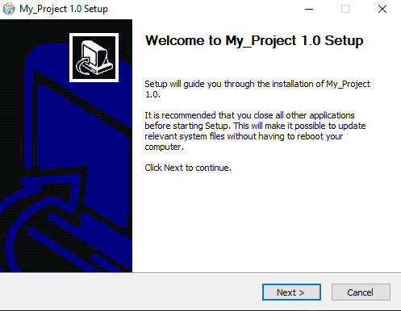

# Packaging an Installer

Next, suppose that we want to distribute our project to other people so that they can use it. We want to provide both binary and source distributions on a variety of platforms. This is a little different from the install we did previously in [part5](https://github.com/Michael-Cowie/Notes/blob/main/Build/CMake/CMake_tutorial/5_installing_and_testing.md), where we were installing the binaries that we had built from the source code. In this example we will be building installation packages that support binary installations and package management features. To accomplish this we will use CPack to create platform specific installers. Specifically we need to add a few lines to the bottom of our top-level `CMakeLists.txt` file.

```CMake
include(InstallRequiredSystemLibraries)
set(CPACK_RESOURCE_FILE_LICENSE "${CMAKE_CURRENT_SOURCE_DIR}/License.txt")
set(CPACK_PACKAGE_VERSION_MAJOR "${My_Project_VERSION_MAJOR}")
set(CPACK_PACKAGE_VERSION_MINOR "${My_Project_VERSION_MINOR}")
set(CPACK_SOURCE_GENERATOR "TGZ")
include(CPack)
```

That is all there is to it! We start by including `InstallRequiredSystemLibraries`. This module will include any runtime libraries that are needed by the project for the current platform. 

Next we set some CPack variables to where we have stored the license and version information for this project. This version information was set earlier in this tutorial and the `License.txt` has been included in the top-level source directory. The `CPACK_SOURCE_GENERATOR` variable selects a file format for the source package.

Finally we include the `CPack` module which will use these variables and some other properties of the current system to setup an installer.

The next step is to build the project in the usual manner and then run `cpack` executable. To build a binary distribution, **from the binary directory** run:

If an error occurs about NSIS, it can be [downloaded from here](https://sourceforge.net/projects/nsis/files/latest/download)

```
cpack
```

To specify the generator, use the `-G` option. For multi-config builds, use `-C` to specify the configuration, e.g.

```
cpack -G ZIP -C Debug
```

The output from `cpack` will be an executable called `My_Project-1.0-win64.exe` located inside the build directory.


For a list of all the generators, see [`cpack-generators`](https://cmake.org/cmake/help/latest/manual/cpack-generators.7.html#manual:cpack-generators(7)), or call `cpack --help`. An [`archive generator`](https://cmake.org/cmake/help/latest/cpack_gen/archive.html#cpack_gen:CPack%20Archive%20Generator) like ZIP creates a compressed archive of all *installed* files.

To create an archive of the full source tree you would type,

```
cpack --config CPackSourceConfig.cmake
```

Alternatively, run `make package` or right click the `Package` target and `Build project` from an IDE.

## User usage

Executing `My_Project-1.0-win64.exe` will prompt the user for installation,



The text inside the `License.txt` will also be displayed,


Next we choose the install location,


After completion of the installation we will see our project inside of `C://Program Files/My_Project 1.0`.


The difference between these two is the user convenience of running the executable, however this additionally has a `Uninstall.exe` unlike when we ran `cmake --install . --config Debug`. It is important to note that `cpack` will use the previously set `install` commands to perform the file location installments.