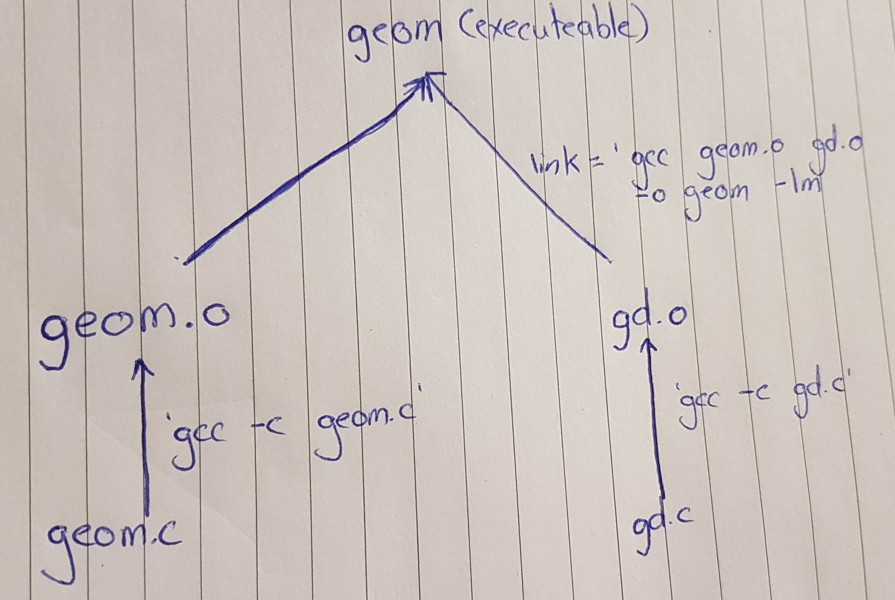

# Make

Make is a build automation tool that automatically builds executable programs and libraries from source code by reading files called Makefiles which specify how to derive the target program. Though integrated development environments and language-specific compiler features can also be used to manage a build process, Make remains widely used, especially in Unix and Unix-like operating systems.

Make is intended for people primarily programming in C/C++, typically on a Linux environment. The goal is to be able to type one single command and it will build your entire project from scratch every time.

## What a Rule Looks Like

A simple makefile consists of ["rules"](https://www.gnu.org/software/make/manual/make.html#Rule-Introduction) with the following shape:

```make
target ... : prerequisites ...
        recipe
        ...
        ...
```

A **target** is usually the name of a file that is generated by a program; examples of targets are executable or objects files. A target can also be the name of an action to carry out, such as `clean`.

A **prerequisite** is a file that is used as input to create the target. A target often depends on several files.

A **recipe** is an action that `make` carries out. A recipe may have more than one command, either on the same line or each on its own line. Please note you need to use a **tab** only at the beginning of a recipe, spaces are not accepted.

A **rule**, then, explains how and when to remake certain files which are the targets of the particular rule. `make` carries out the recipe on the prerequisites to create or update the target. A rule can also explain how and when to carry out an action.


## Example

Through this discussion we will be referencing this C code that will be inside `geom.c`;

```C
#include <stdio.h>
#include <math.h>

// Prompt user to enter a double.
// Re-prompt if the input is out of bounds
// Given: prompt (print), min (double) and max (double)
// Returns: the inputted double

double get_double(char *prompt, double min, double max) {
    double input;

    do {
        printf("%s", prompt);
        scanf("%lf", &input);
        if (input < min) printf("Must be at least %lf\n", min);
        if (input > max) printf("Must be at most %lf\n", max);
    }
    while (input < min || input > max);

    return input;
}

// Calculate the distance to an x-y point.
int main() {
    double x = get_double("Enter the x value: ", -100, 100);
    double y = get_double("Enter the y value: ", -100, 100);

    double d = sqrt(pow(x, 2) + pow(y, 2));

    printf("Distance is %lf meters\n", d);
}
```


# What happens when invoking the C compiler.

Here we are using GCC as our compiler (Many others exist, such as Clang). Here we need to understand the process of what is occurring when we compile our C code to understand what Make is doing. A more indepth description is done inside of this repository found inside [another tutorial](https://github.com/Michael-Cowie/Notes/blob/main/Build/C_CPP_Build.md)

Referencing all of the steps from above, when we type `gcc geom.c -lm` it is executing all of the steps and producing the executeable.

# Workflow example

Procedding from the example source code above, let's first try to compile it using the command `gcc geom.c`.

This will produce the following error;

```
/tmp/cczCQgqi.o: in function `main':
geom.c:(.text+0x196): undefined reference to `pow'
geom.c:(.text+0x1ae): undefined reference to `sqrt'
error: ld returned 1 exit status
```

Caused by the line, `sqrt(pow(x, 2) + pow(y, 2));`. You may wonder why `#include <math.h>` is not sufficient. This is because `math.h` **does not** actually contain the code for doing the `pow` function it just contains the function prototypes. All the `.h` file does is provide enough information so that the compiler knows about the existence of these functions, but does not actually have the code for it itself, therefore you need to link it in with the math library to get the actual code.


To get this to work correctly we need to instead use `gcc geom.c -l m`. Here, we are linking it to the math library by using `-l m`. `math.h` is not automatically linked by default, so we have to link it! By passing `m` it will attempt to link to the `m` library, i.e. `libm.(so|dll)`. Doing this will now successfully compile the code.

## Utilizing other files

In addition to the previous file we now want to have another file called `tip.c`, that simply calculates the "tip" of a meal.

```C
#include <stdio.h>

int main(){
    double price, tip;
    printf("Enter price of meal: ");
    scanf("%lf", &price);

    printf("Enter tip amount (percent): ");
    scanf("%lf", &tip);

    double tipAmount = price * tip / 100.0;
    double total = price + tipAmount;
    printf("Tip amount: %lf\n", tipAmount);
    printf("Total amount: %lf\n", total);
}
```

Notice in this code that we could utilize the `get_double` function written inside of `geom.c`! The naieve approach would be to copy and paste the code into this file, but this becomes problematic when the project grows and is not reuseable or easily shared.

Now, what we want to do is instead take `get_double` and place it inside its own file and have both `geom.c` and `tip.c` refer to do.

Now, lets create `gd.c` and have the contents be;
```C
#include <stdio.h>

// Prompt user to enter a double.
// Re-prompt if the input is out of bounds
// Given: prompt (print), min (double) and max (double)
// Returns: the inputted double

double get_double(char *prompt, double min, double max) {
    double input;

    do {
        printf("%s", prompt);
        scanf("%lf", &input);
        if (input < min) printf("Must be at least %lf\n", min);
        if (input > max) printf("Must be at most %lf\n", max);
    }
    while (input < min || input > max);

    return input;
}
```

We now want to create an object file of `gc.d`. To create `gd.o`, we need to run the command `gcc -c gd.c`. Remember the flag `-c` creates object files without linking. Remember, this is not a complete executeable and it therefore cannot be ran, but it is the compiled version of `gd.c`.

Now, after deleting `get_double` from `geom.c` if we then try to perform `gcc -c geom.c` when will receive the following here;
```
geom.c:11:16: warning: implicit declaration of function ‘get_double’ 
   11 |     double x = get_double("Enter the x value: ", -100, 100);
```

Now, to fix this we could type `#include "gd.c"`. Remember that the preprocessor grabs the contents of `gd.c` and places it into this file. The double `"` mean search in the current directory. This will actually compile and execute fine, but what you will find is that is more than one file does this, you will get errors because you have defined a function with the same name more than once.

What we want to do is compile each one of the files seperately and now recompile the contents of `"gd.c"` again, this is so that if we change one of the files we can just recompile that one small file and then link them together again to create a new executeable. Hence, we want to compile `geom.c` completely independently from `gd.c` rather than including it.

`geom.c` needs to know the existence of `get_double`, but it does not need to know the code at this exact point. This means that all it needs is a function prototype for it. This can be accomplished by typing `double get_double(char *prompt, double min, double max);` at the top of `geom.c`. Rerunning `gcc -c geom.c` to produce the `geom.o` we can then link it via `gcc geom.o gd.o -o geom -lm`.
This will output the file `geom` that will successfully create an executeable. A visual diagram is shown below.



Remember that it takes 3 commands to compile this program, when done seperately. This would eventually contain `tip.c` to be inside the tree aswell, which would utilize `gd.o`. This means `gd.o` is used in two places.

## Header files

Proceeding forward, we need to recognize that it is a pain to manually type function prototypes, in this example it is `get_double`, especially for growing files. Instead what we want to do is have `geom.c` and `tip.c` simply *know* what the function prototype for `get_double` is. To accomplish this we create **Header files**.

A header file has the suffix `.h` and contains function prototypes. We will then create a file called `gd.h` with the following contents;

```
double get_double(char *prompt, double min, double max);
```

Now because the pre-processor copies the contents from `gd.h` inside where it was `#include`d, it means all of the function prototypes will be placed correctly into our files. Now we place `#include gd.h` into our `geom.c`. Now, `gcc -c geom.c` will work correctly because the function prototype is correctly set.

## Constructing Make files

The purpose of Make files are to essentially automate the picture above, not requiring us to continually type out all of these commands. To do this we begin by creating a file called `Makefile`.

The first line of our Makefile should be `# -*- MakeFile -*-`. This is actually a comment. However this comment tells the editor to format this file as a Makefile. The formatting for a Makefile is very specific and it is broken up into a series of chunks where each chunk is called a *recipe*. Each recipe will have the format;

```
target: dependencies
    action
```

The gap before the action has to be a tab, and **not four spaces**.

The diagram prior is also called a dependency tree, which lays out the requirements to creating the final executeable, e.g. for `geom.o` to build it depends upon `geom.c` and so forth. The goal here is to embed this entire diagram inside the Makefile.

For the `action` field, we type the command as if you were typing on a command line to build the target.

The Makefile will therefore look like,

```
# -*- MakeFile -*-

geom: geom.o gd.o
	gcc geom.o gd.o -o geom -l m

geom.o: geom.c
	gcc -c geom.c

gd.o: gd.c
	gcc -c gd.c
```

Now, this means if we simply type `make`, it will run all of these commands to construct the executeable `geom`. It will run all three commands to automatically build `geom`.

In the console output, the commands that were run are shown. Here we can see,

```
gcc -c geom.c
gcc -c gd.c
gcc geom.o gd.o -o geom -l m
```

This means it ran down the left side of the tree to produce `geom.o` first, then the right side of the tree to produce `gd.o` and then finally create `geom` when all of its dependencies were created.

This can also be extended to create `tip` by adding the recipes.

```
tip: tip.o gd.o
    gcc tip.o gd.o -o tip

tip.o: tip.c
    gcc -c tip.c
```

Interestingly enough, when we add this command at the bottom and execute the Makefile again we will receive the message `make: 'geom' is up to date.`. This is because Make traverses down to execute the first receipe it finds (geom), successfully executes it and ends the script. To build `tip` we need to edit the command to become `make tip`, to run the `tip` recipe directly. We should now see the output `cc     tip.c   -o tip`. Notice here we did not see `gcc -c gd.c`, this is because it did not need to rebuild `gd.o`. 

To list all of the target builds we want to build by default we can add `all: geom tip` at the top of the Makefile which allows `make` or `make all` to run everything.

Makefiles only rebuild what is needed to be rebuilt, for example if I change any contents inside of `geom.c` and rerun `make` the output will be;

```
gcc -c geom.c
gcc geom.o gd.o -o geom -l m
```

Notice here it is not rebuilding `tip` or `gd.o` despite running `make all`, it will only rebuild, what **needs** to be rebuilt. Now, the final Makefile is not complete just yet, we need to include header files too! `geom.o` depends not only on `geom.c` but also `gd.h`! If we were to ever change the Header file to contain new prototypes or have changed function parameter types, we need to correctly tell the compiler that they exist. 

Therefore the final Makefile becomes

```
# -*- MakeFile -*-

all: geom tip

geom: geom.o gd.o
	gcc geom.o gd.o -o geom -l m

geom.o: geom.c gd.h
	gcc -c geom.c

gd.o: gd.c
	gcc -c gd.c

tip: tip.o gd.o
	gcc tip.o gd.o -o tip

tip.o: tip.c gd.h
	gcc -c tip.c
```

**Tip:** When using the Ubuntu shell on Windows or the CLI on Linux, to quickly retest test, clear all of the object files and the executeables by using `rm *.o tip geom`. We can also automate this process by adding it to the Makefile as `clean`. This is done by adding;

```
clean:
    rm -f *.o tip geom
```
 
and is ran as `make clean`. The `-f` prevents error throwing if you run it twice when the files don't exist.
