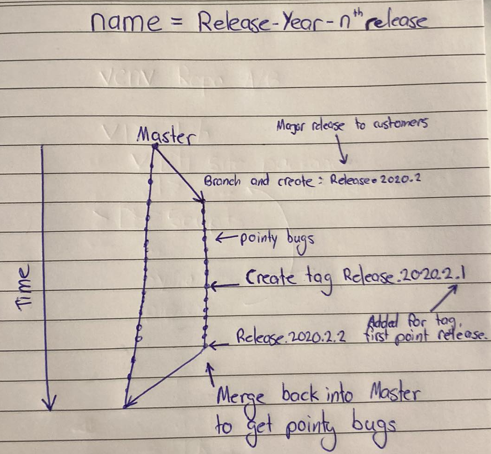

# Product Release Naming

Traditionally, each company could have their own release protocol and naming convention. However the most common are `Major.Minor.Patch`. Within the example below we create a single branch for releases with the name format being `Release-Year-nᵗʰ release`, where the pointy/patchs are tags within the branch. For example, the branch `Release.2020.2` would be made for a release, meaning it will be sent to a customer. Further fixes would be done on the branch, however another branch would not be made. The fixes would be committed on that branch and when a another release is to be made, it would be tagged with an addition number, this number is typically referred to as a patch or point, e.g. `Release-2020.2.1`.

