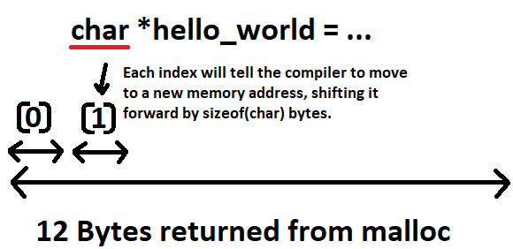

# Pointer Arithmatic

The only difference between pointer arithmatic and regular arithmatic is that the number you are adding to the pointer will be multiplied by the size of the type that the pointer is pointing to. For example, if you have a pointer to an `int` and an `int` size is `4` bytes, `pointer_to_int + 4` will evaluate to a memory address `16` bytes `(4 ints)` ahead.

So when you write,

```C
a_pointer + a_number
```

in pointer arithmatic, what's really happening is,

```C
a_pointer + (a_number * sizeof(*a_pointer))
```

# Pointer Arithmatic and `malloc`

Pointer arithmatic can play an important role in `malloc`. For example if we use `malloc` to store "Hello World",

```C
#include <stdio.h>
#include <stdlib.h>
#include <string.h>

int main() {
    char *hello_world = malloc(strlen("Hello World") + 1); // +1 for the null terminator

    // Copy the strings into the allocated memory
    strcpy(hello_world, "Hello World");

    // Print the first string character by character
    for (int i = 0; hello_world[i] != '\0'; i++) {
        printf("%c", hello_world[i]);
    }

    // Don't forget to free the allocated memory when you're done using it
    free(hello_world);

    return 0;
}
```

The indexing has nothing to do with malloc. It is not malloc that is doing the indexing. It is the compiler. When the code does indexing the compiler will generate the right offsets based on the type of the pointer. All malloc does is allocate the size of memory that you tell it to (well possibly a bit more for book keeping and alignment).

In the example above `malloc` returns a pointer which points to a memory address space of `12` bytes. Now, we have assignment a pointer type to it being `char *`, which tells the compiler, each index should be of size `char`. This means `hello_world[0]` will be the memory address returned to by `malloc`, but `hello_world[1]` will be the memory address location of `hello_world[0]` with the offset of the pointer type `char`.


