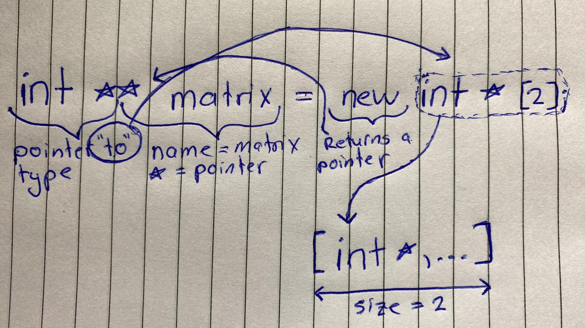

# Arrays

An array in C++ is a collection of elements of the same type placed in contiguous memory locations that can be individually referenced by using an index to a unique identifier. A typical declaration for an array in C++ is,

```c++
type name [elements];
```

Where `type` is a valid type, such as `int`, `char`, ... <br>
`name` is a valid identifier <br>
`elements` (which is always enclosed in square brackets []), specifies the length of the array in terms of number of elements.

There, the `foo` array, with five elements of type `int` can be declared as;

```C++
int foo[5];
```

Likewise, an array int integer pointers can be declared as,

```C++
int* intarray[10];
```

**Note:** The `elements` field within the square brackets [], representing the number of elements in the array, must be a constant expression, since array are blocks of static memory whose size must be determined at compile time, before the program runs.

## Initializing arrays

By default, regular arrays of **local scape** (for example, those defined within a function) are left uninitialized. This means that none of its elements are set to any particular value; their contents are undetermined at the point the array is declared.

The elements in an array can be explicitly initialized to specific values when it is declared, by enclosing those initial values in braces `{}`, e.g.

```C++
int foo[5] = {16, 2, 77, 40, 12071};
```

This statement declares an array that can be represented like this;


The number of values between `{}` shall not be greater than the number of elements in the array. For example, in the example above, `foo` was declared having 5 elements (As specified by the number enclosed in the square brackets, []), and the braces `{}` contained exactly 5 values, one for each element. If declared with less, the remaining elements are set to their default values, which for fundamenal types, means they are filled with zeroes, e.g.

```C++
int bar[5] = {10, 20, 30};
```

Will create an array like this;


The initializer can even have no values, just the braces.

```C++
int baz[5] = { };
```

This creates an array of five `int` values, each initialized with a value of 0.


When an initialization of values is provided for an array, C++ allows the possibility of leaving the square brackets empty. In this case, the compiler will assume automatically a size for the array that matches the number of values included between the braces `{}`.

```C++
int foo[] = {1, 2, 3, 4, 5}
```

After this declaration, array `foo` would be 5 `int` long, because we have provided 5 initialization values.

Finally, the evolution of C++ has led to the adoption of *universal initialization* also for arrays. Therefore, there is no longer need for the equal sign between the declaration and the initializer. Both these statements are equivalent;

```
int foo[] = {1, 2, 3};
int foo[] {1, 2, 3};
```

Static arrays, and those declared directly in a namespace (outside any function) are always initialized. If no explicit initializer is specified, all the elements are default-initialized (with zeroes, for fundamental types).

## Using `new`

It is possible to create a new Array using the `new` keyword.

```C++
 int* array = new int[n];
```

Keep in mind with the following syntax.

It declares a pointer to a dynamic array of type `int` and size `n`. `new` allocates memory of size equal to `sizeof(int) * n` bytes and return the memory which is stored by the variable array. Also, since the memory is dynamically allocated using `new`, you should deallocate it manually.

```C++
delete []array;
```

Otherwise, your program will leak memory of at least `sizeof(int) * n` bytes (possibly more, depending on the allocation strategy used by the implementation).

## Character arrays

A string is a collection of characters. There are two types of strings commonly used in C++.

### C-strings

In C programming, the collection of characters is stored in the form of arrays. This is also supported in C++ programming. C-strings are arrays of type `char` terminated with null character, that is, `\0` (ASCII value of null character is 0).

```C++
char a_str[] = "C++";
```

In the above code, `a_str` is a string and it holds 4 characters. Although, "C++" has 3 characters, the null character is added to the end of the string automatically. Alternative ways of defining a C-style string are,

```C++
char a_str[4] = "C++";
char a_str[] = {'C','+','+','\0'};
char a_str[4] = {'C','+','+','\0'};
```

Like arrays, it is not necessary to use all the space allocated for a string, e.g.

```C++
char a_str[100] = "C++";
```

### string Object

The standard C++ library `std` provides us with the string class, `std::string`. Unlike using `char` arrays, `std::string` objects have no fixed length and can be extended as per your requirement.

```C++
#include <iostream>

int main()
{
    
    std::string my_string = "My string object";
    
    std::cout << my_string << "\n";
    
    my_string += " - appended";
    
    std::cout << my_string << "\n";
    std::cout << my_string[0] << "\n";
    std::cout << my_string.at(0) << "\n";
    return 0;
}
```

Will output, 

```C++
My string object
My string object - appended
M
y
```

## Multidimensional arrays

Multidimensional arrays can be described as an *array of arrays*. For example, a bidimensional array can be imagined as a two-dimensional table made of elements, all of them of the same uniform data type.


`jimmy` represents a bidimensional array of 3 rows and 5 columns of type `int`. The C++ syntax for this is,

```C++
int jimmy[3][5];
```

To index the elements, for example row 1 column 3 would be;


Multidimensional arrays are not limited to two indicies (i.e. two dimensions). They can contain as many indicies as needed, although the amount of memory needed for an array increases exponentially with each dimension. For example,

```C++
char century [100][365][24][60][60];
```

declares an array with an element of type `char` for each second in a century. Therefore the total amount of elements being $100 * 365 * 24 * 60 * 60 = 3153600000$ `char` elements. This means 3153600000 * 1 byte is required, i.e. 3.1536 Gigabytes!

## Multidimensional Array Example

In C++ a multidimensional array can be created with mutliple ways, the following are different ways to accomplish it.

```C++
data_type array_name[size1][size2]....[sizeN];

datatype array_name[size1][size2] = {{1, ..., size2}, ...}
```

```C++
#include <iostream>

using namespace std;

class Matrix
{
    int d1;
    int d2;
    int** matrix;
    
    public:
            Matrix(int d1, int d2): d1(d1), d2(d2) {
                cout << "Creating a matrix of size " << d1 << " by " << d2 << endl;
                matrix = new int* [d1];
                for(int i=0; i < d1; i++){
                    matrix[i] = new int[d2];
                }
            }
            
            ~Matrix(){
                cout << "Destructor called" << endl;
                for(int i = 0; i < d1; i++){
                    delete matrix[i];
                }
                delete matrix;
            }
};

int main(void)
{
    Matrix m = Matrix(5, 10);
    
    int a[5][10];
    int d[3][4] = {{0,1,2,3}, {4,5,6,7}, {8,9,10,11}};
}
```

A visualization of `int ** matrix = new int * [d1]`.



# Are Arrays Pointers?

Firstly, I will demonstrate a code snippet demonstrating the error.

```C++
int main()
{
    int a[] = {1, 2, 3, 4, 5, 6, 7, 8, 9, 10};
    int *p = a;
    cout << *p;
}
```

Prior to the implicit conversion introduced in C++ 11, this will throw the error `cannot convert 'int (*)[10]' to 'int*' in initialization`.

Let's get the important stuff out of the way first: **arrays are not pointers**. Array types and pointer types are completely different things and are treated differently by the compiler.

At runtime, a pointer is a "just a pointer" regardless of what it points to, the difference is a semantic one; pointer-to-array conveys a different meaning (to the compiler) compared with pointer-to-element.

When dealing with a pointer-to-array, **you are pointing to an array of a specified size** - and the compiler will ensure that you can only point-to an array of that size.

i.e. this code will compile

```C++
int theArray[5];
int (*ptrToArray)[5];
ptrToArray = &theArray;    // OK
```

because we have created a pointer to point an `int` array containing 5 elements. It will then point to `intArray`, which is an Array of 5 `int` elements.

But this will break,

```C++
int anotherArray[10];
int (*ptrToArray)[5];
ptrToArray = &anotherArray;    // ERROR!
```

as the pointer `ptrToArray` will only successfully point to an `int` array **that contains 5 elements**. Whereas, `anotherArray` holds 10.

When dealing with a pointer-to-element, you may point to any object in memory with a matching type. (It doesn't necessarily even need to be in an array; the compiler will not make any assumptions or restrict you in any way), e.g.

```C++
int theArray[5];
int* ptrToElement = &theArray[0];  // OK - Pointer-to element 0
```

It is important to note that `int* ptrToElement = theArray;` will still work, **but it is not pointing to the Array**, instead an implicit conversion is performed. `int* ptrToElement = theArray;` is just shorthand for `int* ptrToElement = &theArray[0];` They both do exactly the same thing.

In summary, the data type `int*` does not imply any knowledge of an array, however the data type `int (*)[5]` implies an array, which must contain exactly 5 elements. An array is a section of memory, whereas a pointer is something that points to a memory address.