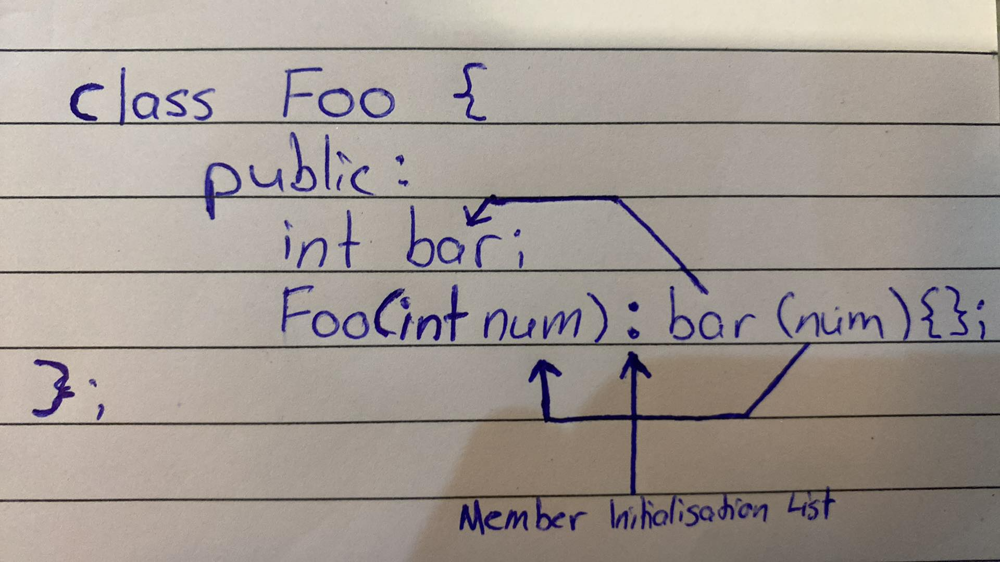
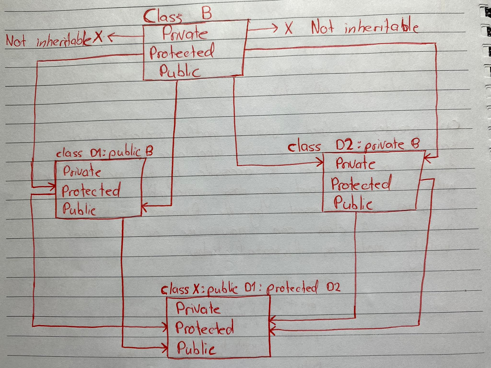
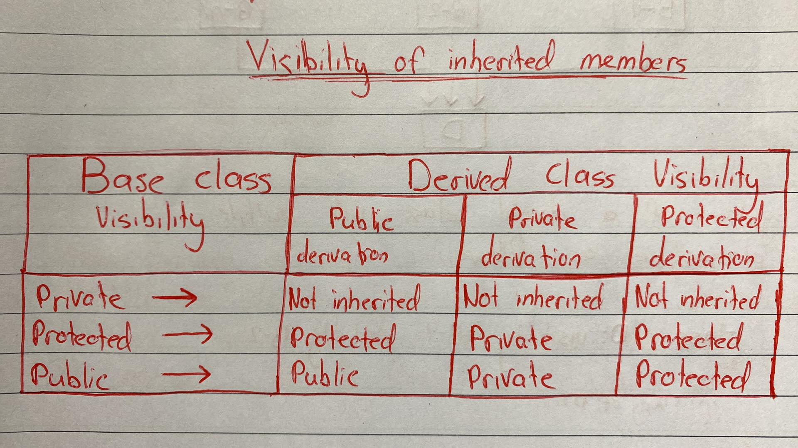
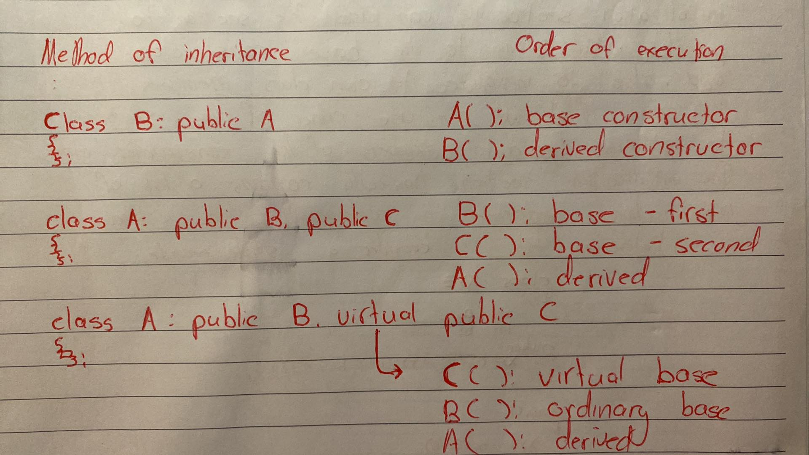

# C++ Classes

## Outside the Class Function Definitions

Member functions that are **declared** inside a class have to be **defined** seperately outside the class. Their definitions are very much like normal functions they should have a function header and a function body.

An important difference between a member function and a normal function is that a member function incorporates a membership identity label in the header. This 'label' tells the compiler which class the function belongs to. The general form of a member function definition is,

```C++
return-type class-name::function_name(argument declaration){
    function body
}
```

The membership label `class-name::` tells the compiler that the function `function-name` belongs to the class `class-name`. That is, the scope of the function is restricted to the `class-name` specified in the header line. The symbol `::` is called the **scope resolution operator**.

## Inside the Class Function Definitions

Another method of defining a member function is to replace the function declaration by the actual function definition inside the class, e.g.

```C++
class item 
{
    int number;
    float cost;

    public:
            void getdata(int a, float b); //declaration

            void putdata(void) // definition inside class
            {
                cout << number << "\n";
                cout << cost << "\n":
            }
}
```

When a function is defined inside a class, it is treated as an inline function. Therefore, all the restrictions and limitations that apply to an inline function are also applicable here. **Normally only small functions are defined inside the class definition**.

## Example Class

```C++
#include <iostream>

using namespace std;

class item
{
    int number; // Private by default
    float cost; //Private by default

public:
    void getdata(int a, in b): //Prototype declaration, to be defined.

    // Function defined inside class
    void putdata(void)
    {
        cout << "number :" << number << "\n";
        cout << "cost :" << cost << "\n";
    }

}

// ----------- Member Function Definition -----------

void item::getdata(int a, float b) // Use membership label
{
    number = a; // Private variables directly used
    cost = b;
}

// ----------- Main Program -----------
int main()
{
    item x; // Create object 'x'

    x.getdata(100, 299.95);
    x.putdata();

    item y;
    y.getdata(200, 175.50);
    y.putdata();
    return 0;
}
```

# Static Data Members

A data member of a class can be qualified as `static`. The properties of a static member variable are similar to that of a `C` static variable. A static member variable has certain special characteristics.

- It is initialized to zero when the first object of it's class is created. No other initialization is permitted.
- Only one copy of that member is created for the entire class and is **shared by all the objects of that class**, no matter how many objects are created.
- It is visible only within the class, but it's lifetime is the entire program.

Static variables are normally used to maintain values common to the entire class. For example, a static data member can be used as a counter that records the occurences of all of objects.

```C++
#include <iostream>

using namespace std;

class Item
{
    static int count;

    public:
            Item() {
                count++;
            }
            
            void getcount(void) {
                cout << "count: " << count << "\n";
            }
};

int Item::count; // <-- Note this line 

int main() {
    Item a;
    Item b;
    b.getcount(); // 2
    return 0;
}

```

**Note:** The following statement in the program; `int Item::count`.

The type and scope of each static member variable must be defined outside the class definition. This is necessary because the static data members are stored separetely rather than as part of an object. Since they are associated with the class itself, rather than with any class object, they are also known as class variable.

# Static Member Functions

Like static member variable, we can also have static member functions. A member function that is declared static has the following properties.

- A static function can have access to any other static members (function or variable) declared in the same class.
- A static member function can be called using the class name (instead of its objects) as follows:

```C++
class-name::function-name;
```

e.g.

```C++
class Test
{
    static int count;
    ...
    static void showcount(void);
    {
        cout << "count: " << count << "\n";
    }
}

Test::showcount();
```

# Static Functions

At namespace scope, `static` gives a name internal linkage, meaning that **it only accessible within the translation unit that contains the definition**. Without `static`, it has external linkage and it accessible in any translation unit.

So you use `static` (or, alternatively, an unnamed namespace) when writing a function that is intended for use within this unit. The internal linkage means that other units can define different functions within the same name without causing naming conflicts.

Non-static functions (and global names in general) are better declared in a header, to make sure that every translation unit that uses them gets the same declaration.

# Making Objects

```C++
#include <iostream>

using namespace std;

class Entity
{
    private:
            string my_name;
    public:
            // Zero parameter constructor
            // Entity(): my_name("Default") is the initialization member list
            // {} is the function body
            Entity(): my_name("Default"){}
            
            // const string & constructor
            // my_name(name) will set "my_name" to "name"
            Entity(const string& name): my_name(name){}
            
            // Function declaration
            const string & getName() const;
};

// Function definition
const string & Entity::getName() const {
    return my_name;
}

int main()
{
    // These 3 are on the stack, they will be automatically free
    // when leaving the function
    Entity a;
    cout << a.getName() << endl; // "Default"
    
    Entity b("b");
    cout << b.getName() << endl; // "b"
    
    Entity c = Entity("c");
    cout << c.getName() << endl; // "c"
    
    // Needs to be manually freed because it is on the heap, not the stack
    Entity* d = new Entity("d");
    cout << d->getName() << endl; // "d"
    delete d;
    return 0;
}

```

# Member Initialization List



`Foo(int num) : bar(num);` is the construct called the Member Initialization List, it happens afterwards the `:`. Simply said, it initializes the member `bar` to the value `num`.

#### Member Initialization List

```C++
Foo(int num) : bar(num)
{

};
```

#### Member Assignment

```C++
Foo(int num)
{
    bar = num;
}
```

#### Difference

There is a significant difference between the two styles.

When you initialize fields via the Member Initialization List, the constructors will be called once and the object will be constructed and initialized in one operation.

`Cost of Member Initialization = Object Construction`

If you use assignment, then the fields will be first initialized with default constructors and then reassigned (via assignment operator) with actual values.

`Cost of Member Assignment = Object Construction + Assignment`

There is an additional overhead of creation and assignment in the latter, which might be considerable for user defined classes.

An additional important note is that class member variables are always **initialized in the order in which they are declared in the class, they are not initialized in the order specified in the Member Initialization List**.


# Friendly Functions

We have been emphasizing throughout that private members cannot be accessed from outside the class. That is, a non-member function cannot have an access to the private data of a class. However, there could be a situation where two classes want to share a particular function that operates on both classes. In such situations, C++ allows the common function to be made *friendly* with both classes, thereby allowing the function to have **access to private data of these classes**. Such a function need not be a member of any of these classes.

To make an outside function "friendly" to a class, we have to simply declare this function as a "friend" of the class as shown,

```C++
class Example
{
    ...

    public:
            friend void xyz(void); // Declaration
}
```

The function declaration should be preceded by the keyword `friend`. The function is defined elsewhere in the program like a normal C++ function. The **function definition does not use either the keyword friend or the scope operator ::**. The functions that are declared with the keyword `friend` are known as friend functions. A friend function, although not a member function, **has full access rights to the private members of the class**.

A friend function posses certain special characteristics

- It is not in the scope of the class to which it has been declared as a friend
- Since it is not in the scope of the class, it cannot be called using the object of that class
- It can be called/invoked like a normal function without the help of any object
- Unlike member functions, it cannot access the member names directly and has to use an object name and a dot membership operator with each member name.
- It can be declared either in the public or the private part of a class without affecting its meaning.
- Usually, it has the objects as arguments.

```C++
#include <iostream>

using namespace std;

class Sample
{
    int a; // Private by default
    int b;
    
    public:
            void setValue(int a, int b);
            friend float mean(Sample s); // friend the function "mean"
};

void Sample::setValue(int a, int b)
{
    this->a = a;
    this->b = b;
}

float mean(Sample s)
{
    return float(s.a + s.b) / 2;
}

int main()
{
    Sample s;
    s.setValue(100, 200);
    cout << "Mean value = " << mean(s) << endl;
    return 0;
}
```

The friend function accesses the variable `a` and `b` which are **private members**.

# `const` Member Functions

If a member function **does not alter any data in the class**, then we may declare it as a `const` member function as follows.

```C++
void mul(int, int) const;
double get_balance() const;
```

The qualifier `const` is appended to the function prototypes (in both declaration and definition). The compiler will generate an error message if such functions try to alter the data values.

# `const` Objects

We may create and use constant objects, using `const` keyword before object declaration.

```C++
const Matrix m(m, n); // Object m is constant
```

Any attempt to modify the values of `m` and `n` will generate compile-time errors. Further a constant object can call only `const` member functions. As we know, a `const` member is a function prototype or function definition where the keyword `const` appears after the functions signature.

Whenever `const` objects try to invokve non-const member functions, the compiler generates errors.  

# Copy Constructor

The copy constructor is a constructor which **creates an object by initializing it with an object of the same class**, which has been created previously. The copy constructor is used to −

- Initialize one object from another of the same type.
- Copy an object to pass it as an argument to a function.
- Copy an object to return it from a function.

Here is a full example,

```C++
#include <iostream>

using namespace std;

class Point
{
    int x;
    int y;
    
    public:
        Point(int x, int y): x(x), y(y){}
    
        Point(Point & obj) 
        {
            cout << "Copy constructor called" << endl;
            // Create the new "Point" from double the previous x and y values
            x = obj.x * 2;
            y = obj.y * 2;
        }
        
        int getX() const
        {
            return x;
        }
        
        int getY() const
        {
            return y;
        }
};


void print_point(const Point & point){
    cout << "X: " << point.getX() << endl;
    cout << "Y: " << point.getY() << endl;
}

int main(void)
{
    Point p1(1, 2);   //normal constructor
    print_point(p1); // 1, 2
    
    Point p2 = p1;   // copy constructor
    print_point(p2); // 2, 4
    
    Point p3(p2);    // copy constructor
    print_point(p3); // 4, 8
}
```

# Destructors

A destructor is used to destroy the objects that have been created by a constructor. Like a constructor, the destructor is a member function whose name is the same as the class but is precedded by a tilde, e.g. the destructor for the class Point can be defined as,

```C++
~Point(){}
```

A destructor **never takes any arguments nor does it return any value**. It will be invoked implicitly by the compiler upon exit from the program (or block, function, as the case may be) to clean up storage that is no longer accessible. It is good practice to declare destructors in a program since it releases memory space for future use.

Whenever `new` is used to allocate memory in the constructors, we should use `delete` to free that memory.


Constructor and Destructor example

```C++
#include <iostream>

using namespace std;

class Matrix
{
    int d1;
    int d2;
    int** matrix;
    
    public:
            Matrix(int d1, int d2): d1(d1), d2(d2) {
                cout << "Creating a matrix of size " << d1 << " by " << d2 << endl;
                matrix = new int* [d1];
                for(int i=0; i < d1; i++){
                    matrix[i] = new int[d2];
                }
            }
            
            ~Matrix(){
                cout << "Destructor called" << endl;
                for(int i = 0; i < d1; i++){
                    delete matrix[i];
                }
                delete matrix;
            }
};

int main(void)
{
    Matrix m = Matrix(5, 10);
}
```

# Operator Overloading

To define an additional task to an operator, we must specify what it means in relation to the class to which the operator is applied. This is done with the help of a special function, called operator function, which describes the task. The general form of an operator function is,

```C++
return_type classname::operator op(args)
{
    function body
}
```

where `return_type` is the type of the value returned by the specified operation and `op` is the operator being overloaded. The `op` is preceded by the keyword `operator`. `operator op` is the function name.

Operator functions must be either member functions (non-static) or `friend` functions. For member functions, the object used to invoke the member function is passed implicitly and therefore available for the member function. This is not the case with `friend` functions, arguments may be passed either by value or by reference. Operator functions are declared in the class using prototypes, such as;

```C++
vector operator +(vector);   // vector addition
vector operato -();         // unary minus
friend vector operator +(vector, vector);
friend vector operator -(vector, vector);
vector operator -(vector &a) //subtraction
int operator ==(vector);     // comparison
friend int operator ==(vector, vector) // comparison
```

## Overloading Unary Operators

Unary operators are operators which are used to calculate the result on only one operand, examples include `-`, `+`, `++`, `--`, `!`, and `&`. An example usage is `-x`.

Let us consider the unary minus operator. A minus operator when used as a unary takes just one operand. We know that this operator changes the sign of an operand when applied to a basic data item. We will see here how to overload this operator so that it can be applied to an object in much the same way as is applied to an `int` or `float`. The unary minus when applied to an object should change the sign of each of it's data items.

```C++
#include <iostream>

using namespace std;

class Point
{
    int x;
    int y;
    int z;
    
    public:
            Point(int x, int y, int z): x(x), y(y), z(z){}
            
            void operator -(); // Overload unary minus
            
            void print()
            {
                cout << x << ", " << y << ", " << z << endl;
            }
};

void Point::operator -()
{
    x = -x;
    y = -y;
    z = -z;
}

int main()
{
    Point p(1, 2, 3);
    p.print();    // 1, 2, 3
    -p;           // Invokes operator -();
    p.print();    // -1, -2, -3
    return 0;
}
```

The function `operation -()` takes no arguments. It changes the sign of data members of the object `s`. Since this function is a member function of the same class, it can directly access the members of the object when activiated.

Remember a statement like,

```C++
s2 = -s1;
```
will **not work** because the function `operator -()` does not return any value. It can work if the function is modified to return an object.

It is possible to overload a unary minus operator using a `friend` function as follows.

```C++
#include <iostream>

using namespace std;

class Point
{
    int x;
    int y;
    int z;
    
    public:
            Point(int x, int y, int z): x(x), y(y), z(z){}
            
            friend void operator -(Point &); // Declaration
            
            void print()
            {
                cout << x << ", " << y << ", " << z << endl;
            }
};

void operator -(Point &p)
{
    p.x = -p.x; // - is invoked on the `int`, not causing a recursive problem.
    p.y = -p.y;
    p.z = -p.z;
}

int main()
{
    Point p(1, 2, 3);
    p.print();    // 1, 2, 3
    -p;           // Invokes operator -();
    p.print();    // -1, -2, -3
    return 0;
}
```

The above invocation statement is equivalent to 

```C++
p.operator -();
```

because in the end, it is still a function that is called a different way via syntax sugar.

**Note:** The argument is passed by **reference**. It will not work if we pass the argument by value because only the copy of the object that activied the call is passed to `operator -()`, therefore the changes made inside the operator function will not reflect in the called object

# Defining Derived Classes

A derived class can be defined by specifying its relationship with the base class in addition to its own details. The general form of defining a derived class is,

```C++
class DerivedClassName: visibility-mode BaseClassName
{
    // Normal Class description
    ...
    ...
    ...
}
```

The colon indicates that the `DerivedClassName` is derived from the `BaseClassName`. The `visibility-mode` is optional and if present may be either `private` or `public`. The default `visibility-mode` is private. Visibility mode specifies whether the features of the base class are privately derived or publicly derived.

Examples include,

```C++
class ABC: private XYZ // private derivation
{
    ...
};
```

```C++
class ABC: public XYZ // public derivation
{
    ...
};
```

```C++
class ABC: XYZ // private derivation by default
{
    ...
};
```

When a base class is privately inherited by a derived class, `public` and `protected` members of the base class become `private` members of the derived class and therefore the `public` members of the base class can only be the member functions of the derived class. They are inaccessible to the objects of the derived class. Remember, a public member of a class can be accessed by its own object using the `.` operator.

On the other hand, when the base is publicly inherited, `public` and `protected` members of the base class become `public` members of the derived class and therefore they are accessible to the objects of the derived class. 

In both cases, the `private` members are not inherited and therefore, the `private` members of a base class will never become the members of its derived class.

# Making a `private` Member Inheritable (`protected`)

We have just seen how to increase the capabilities of an existing class without modifying it. We have also seen that a `private` member of a base class cannot be inherited and therefore it is not available for the derived class directly. What do we do if the private data needs to be inherited by a derived class? This can be accomplished by modifying the visibility limit of the `private` member by making it `public`. This would make it accessible to all the other functions of the program, thus taking away the advantage of data hiding.

C++ provides a third visibiity modifier, `protected`, which serve a limited purpose in inheritance. A member declared as `protected` is accessible by the member functions within its class and any class **immediately derived** from it. It cannot be accessed by the functions outside these two classes. A class can now use all the three visibility modes as illustrated below:

```C++
class Alpha
{
    private:   // Optional text
        ...    // Visible to member functions
        ...    // within its class
    protected:
        ...    // Visible to member functions of
        ...    // its own and immediately derived class
    public:
        ...   // Visible to all functions
        ...   // in the program
}
```

When a `protected` member is inherited in `public` mode, it comes `protected` in the derived class too and therefore is accessible by the member functions of the derived class. It is also ready for further inheritance.

A `protected` member inherited in `private` derivation becomes `private` in the derived class. Although it is available to the members functions of the derived class, it is not available for further inheritance since `private` members cannot be inherited.



The keywords `private`, `protected` and `public` may appear in any order and any number of times in the declaration of a class, e.g.

```C++
class Beta
{
    protected:
        ...
    public:
        ...
    private:
        ...
    public:
        ...
}
```

is a valid class definition. However, the normal practice is to use them as follows,

```C++
class Beta
{
    ... // private by default
    ...
    protected:
        ...
    public:
        ...
}
```

It is also possible to inherit  a base class in `protected` mode (known as `protected` derivation). In `protected` derivation, both the `public` and `protected` members of of the base class become `protected` members of the derived class.



# Multiple Inheritance

The syntax of a derived class with multiple base classes is as follows,

```C++
class D: visibility Base1, visibility Base2, ...
{
    ...
    ...
    ...
}
    
```

where, `visibility` may either be `private`, `public` or `protected`.

# Ambiguity Resolution in Inheritance

Occassionally, we may force a problem in using multiple inheritance, when a function with the same name appears in more than one base class, e.g.

```C++
#include <iostream>

using namespace std;

class A
{
    public:
        void display()
        {
            cout << "Inside Class A" << endl;
        }
};

class B
{
    public:
        void display()
        {
            cout << "Inside Class B" << endl;
        }
};

class C: public A, public B
{
    public:
        void display()
        {
            A::display();
            B::display();
            cout << "Inside Class C" << endl;
        }
};

int main()
{
    C c;
    c.display();
    c.A::display();
    return 0;
}

```

We may ask, which `display` function is used by the derived class `C` when we inherit both `A` and `B`?

We can solve this problem by defining a named instance within the derived class, using the resolution operator with the function as shown below.

```C++
        void display()
        {
            A::display();
            B::display();
            cout << "Inside Class C" << endl;
        }
```

When calling the function on the object, the syntax will instead become `c.A::display();`.

**Note:** Adding only `display()` inside the `display()` function for the class `C` will recursive call itself and cause an infinite loop.

# Object Types Affecting Property Retrieval

When we create objects, we need to specify the object type on the left hand, but the object creation on the right.

The following code below demonstrates a small class called `Animal` and another class `Cat`, where `Cat` is the derived class and `Animal` is the base class. This means that all objects of `Cat` are `Animal`, but not every `Animal` is a `Cat`.

```C++
#include <iostream>

using namespace std;

class Animal
{
    public:
        int animal_property = 20;
};

class Cat: public Animal
{
    public:
        int cat_property = 10;
};

int main()
{
    Animal animal = Animal();
    cout << "animal_property = " << animal.animal_property << endl;
    
    Cat cat = Cat();
    cout << "cat_property = " << cat.cat_property << endl;
    cout << "animal_property = " << cat.animal_property << endl;
    
    Animal hybrid = Cat();
    /*
    The following line will not work and cause a compilation error.
    
    cout << "Cat object with Animal type, retrieving cat property" << hybrid.cat_property << endl;
    */
    return 0;
}
```

There are three types of object construction here,

The first being,

```C++
Animal animal = Animal();
```

In this example, the object itself is of type `Animal` and it set to being type `Animal` from the lefthand side. This means the object can only access attributes from the class `Animal`, for example, it can only access the member property `animal_property`.

The second object creation is the following,

```C++
Cat cat = Cat();
```

This object is a `Cat()` with the specified type `Cat`. This means it can access all properties of the `Cat` class and the `Animal` class, meaning it can freely access `cat_property` and `animal_property`.

The third object creation is a bit more interesting,

```C++
Animal hybrid = Cat();
```

This example is referred to as **object slicing**. [Object slicing](https://stackoverflow.com/questions/274626/what-is-object-slicing) is used to describe the situation when you assign an object of a derived class to an instance of a base class. This causes a loss of methods and member variables for the derived class object. This is termed as information being sliced away.

The following line will not work, as every `Animal()` cannot be a `Cat`.

```C++
Cat error = Animal();
```

# `virtual` Functions

A `virtual` function is a member function which is **declared within a base class and is re-defined `overriden` by a derived class**. When you refer to a derived class object using a pointer or a reference to the base class, you can call a `virtual` function for that object and execute the derived class's version of the function, e.g.

```C++
#include <iostream>

using namespace std;

class Animal
{
    public:
        virtual void eat()
        {
            cout << "I am eating generic food" << endl;
        }
};

class Cat: public Animal
{
    public:
        void eat()
        {
            cout << "I am eating cat food" << endl;
        }
};

int main()
{
    Animal animal;
    animal.eat();  // I am eating generic food
    
    Cat cat;
    cat.eat();     // I am eating cat food
    
    Animal hybrid = Cat();
    hybrid.eat();  // I am eating generic food
    return 0;
}
```

# Constructors in Derived Class

As long as no base class constructor takes any arguements, the derived class does not need to have a constructor. However, if any base class contains a constructor with one or more arguments, then it is mandatory for the derived class to have a constructor and pass the arguments to the base class constructor. Remember, while applying inheritance we usually create objects using the derived class, thus it makes sense for the derived class to pass arguments to the base class constructor. When both the derived and base classes contain construcotrs, **the base class is executed first** and then the constructor in the derived class is executed.

In the case of multiple inheritance, the base classes are constructed in the order in which they appear in the declaration of the derived class. Similarily, in a multilevel inheritance, the constructors will be executed in the order of inheritance.

The constructor of the derived class receives the entire list of values as its arguments and passes them on to the base constructors **in the order in which they are declared in the derived class**. The base constructor are called and executed before executing the statements in the body of the derived constructor.

The general form is,

```C++
DerivedConstructor:
        base1(arg_list1);
        base2(arglist2);
        ...
        baseN(arglistN);
        {
            Body of Derived Constructor;
        }
```

The following is a working code example, where `Derived` inherits from `B1` and `B2`. `Derived` will call the constructor for `B1` prior to `B2` because it is declared first during the inheritance structure.

```C++
#include <iostream>

using namespace std;

class B1
{
    public:
        B1(int a, int b)
        {
            cout << "Calling B1 constructor with parameters " << a << " and " << b << endl;      
        }
};

class B2
{
    public:
        B2(float c, float d)
        {
            cout << "Calling B2 constructor with parameters " << c << " and  " << d << endl;
        }
};

class Derived: public B1, public B2
{
    public:
        //                                       Calls B1 constructor, then B2.
        Derived(int a, int b, float c, float d): B1(a, b), B2(c, d){
            cout << "Calling Derived constructor" << endl;
        }
};

int main() {
    Derived(1, 2, 3.14, 5.5);
    
    /*
    Calling B1 constructor with parameters 1 and 2
    Calling B2 constructor with parameters 3.14 and  5.5
    Calling Derived constructor
    */
}
```

The constructors for `virtual` base classes are invoked before any non-virtual base classes. If there are multiple `virtual` base classes, they are invoked in the order in which they are declared. Any non-virtual bases are then constructed before the derived class constructor is executed.



# Initialization List

C++ supports another method of initializing the class objects. This method uses what is known as an initialization list in the constructor function. It takes the following form,

```C++
Constructor(arglist): initialization-section
{
    assignment-section
}
```

The `assignment-section` is nothing but the body of the constructor function and is used to assign initial values to its data members. The part immediately following the colon is known as the initialization section. We can use this section to provide initial values to the base constructors and also to initialize its own class members. This means that we can use either of the sections to initialize the data members of the constructors class. The initialization section basically contains a list of initializations seperated by commas. This list is known as initialization list, e.g.

```C++
#include <iostream>

using namespace std;

class Example
{
    int a;
    int b;

    public:
            Example(int a, int b): a(a), b(2 * b){} 
            
            void display()
            {
                cout << "a = " << a << endl;
                cout << "b = " << b << endl;
            }
    
};

int main() {
    Example e(1, 2);
    e.display();
    /*
    a = 1
    b = 4
    */
}
```

The initialization list in this example will set the `private` members `a` to the given argument `a`, i.e

```C++
Example(int a, int b): a(a), b(2 * b){}
```

is equivalent to,

```C++
Example(int a, int b): a(a), b(2 * b){
    this->a = a;
    this->b = 2 * b;
} 
```

However, member initialization list should always be used for performance reasoning. Remember, the **data members  are initialized in the order of declaration, independent of the order in the initialization list**.

# `this` Pointer

C++ uses a unique keyword called `this` to represent an object that invokes a member function. `this` is a pointer that points to the object for which `this` function was called, similiar to `self` in Python. For example, the function called `A.max()` will set the pointer `this` to the address of the object `A`.

The unique pointer is automatically passed to a member function when it is called. The pointer `this` acts as an implicit argument to all member functions. Consider the following example,

```C++
class Example
{
    int a;
    ...
}
```

The `private` variable `a` can be used directly inside a member function like,

```C++
a = 123;
```

We can also use the following statement to do the same job,

```C++
this->a = 123;
```

# Making a Class `final`

When the keyword `final` is used, it is to prevent a class from being inherited.

```C++
struct Base1 final { };

struct Derived : Base1{ }; // ill formed, compiler error
```

It is also used to mark a virtual function so as to prevent it from being overridden in the derived class.

```C++
struct Base2 {
    virtual void f() final;
}

struct Derived2 : Base2 {
    void f(); // ill formed, compiler error
}
```

Note that neither `override` and `final` are language keywords. They are technically identifiers. They only gain special meaning when used in those specific contexts. In any other location, they can be valid identifiers. This means the following is allowed,

```C++
int const final = 0;
int const override = 1;
cout << final << " " << override << endl;
```

# The Rule of [0/3/5](https://stackoverflow.com/questions/4172722/what-is-the-rule-of-three#:~:text=The%20rule%20of%203%2F5,functions%20when%20creating%20your%20class.)

## Introduction

C++ treats variables of user-defined types with *value* semantics. This means that objects are implicitly copied in various contexts, we need to understand what "copying an object" actually means.

Let us consider an example,

```C++
class Person
{
    std::string name;
    int age;

public:

    Person(const std::string& name, int age) : name(name), age(age)
    {

    }
};

int main()
{
    Person a("Bjarne Stroustrup", 60);
    Person b(a);   // What happens here?
    b = a;         // And here?
}
```

## Special Member Functions

What does it mean to copy a `Person` object? The `main` function shows two distinct copying scenarios. The initialization `Person b(a);` is performed by the **copy constructor**. Its job is to construct a fresh object based on the state of an existing object. The assignment `b = a;` is performed by the **copy assignment operator**. Its job is generally a little more complicated because the target object is already in some valid state that needs to be dealt with.

In this example, we did not declare either the copy constructor or the assignment operator. These are therefore implicitly defined for us. Here is a quote from the standard,


> The [...] copy constructor and copy assignment operator, [...] and destructor are special member functions. [ Note: The implementation will implicitly declare these member functions for some class types when the program does not explicitly declare them. The implementation will implicitly define them if they are used. [...] end note ] [n3126.pdf section 12 §1]

By default, copying an object means copying its members:

> The implicitly-defined copy constructor for a non-union class X performs a memberwise copy of its subobjects. [n3126.pdf section 12.8 §16]


> The implicitly-defined copy assignment operator for a non-union class X performs memberwise copy assignment of its subobjects. [n3126.pdf section 12.8 §30]


## Implicit Definitions

The implicitly-defined special member functions for `Person` look like this:

```C++
// 1. copy constructor
Person(const Person& that) : name(that.name), age(that.age)
{

}

// 2. copy assignment operator
Person& operator=(const Person& that)
{
    name = that.name;
    age = that.age;
    return *this;
}

// 3. destructor
~Person()
{

}
```

Memberwise copying is exactly what we want in this case, `name` and `age` are copied, so we get a self-contained, independent `Person` object. 

For example if I were to print the memory address of the objects when created,

```C++
int main()
{
    Person a("Bjarne Stroustrup", 60);
    cout << &a << endl;  // 0x7fff9166fb60
    
    Person b(a);         // Copy constructor
    cout << &b << endl;  // 0x7fff9166fb90
    
    b = a;               // Copy assignment operator 
    cout << &b << endl;  // 0x7fff9166fb90
}
```

We can see that `Person a("Bjarne Stroustrup", 60);` and `Person b(a); ` which call the constructor and copy-constructor, both return **new objects**. Whereas the copy assignment operator `Person b(a);` performs the action of copying over the members, but does not change the memory address location of `b` to point to a new object.

The implicitly defined destructor is always empty. This is also fine in this case since we did not acquire any resources in the constructor. The members destructors are implicitly called after the `Person` destructor is finished.

> After executing the body of the destructor and destroying any automatic objects allocated within the body, a destructor for class X calls the destructors for X's direct [...] members [n3126.pdf 12.4 §6]


## Managing Resources

So when should we declare those special member functions explicitly? When our class *manages a resource*, that is, when an object of the class is *responsible* for that resource. That usually means the resource is acquired in the constructor (or passed into the constructor) and *released* in the destructor.

Let us go back in time to pre-standard C++. There was no such thing as `std::string` and programmers were in love with pointers. The `Person` class might have looked like this.

```C++
class Person
{
    char* name;
    int age;

public:

    // The constructor acquires a resource,
    // in this case, dynamic memory obtained via new[]
    Person(const char* the_name, int the_age)
    {
        name = new char[strlen(the_name) + 1];
        strcpy(name, the_name);
        age = the_age;
    }

    // The destructor must release this resource via delete[]
    ~Person()
    {
        delete[] name;
    }
};
```

Even today, people still write classes in this style and get in trouble: "I pushed a `Person` into a `Vector` and now I am getting crazy memory errors!". Remember that by default, copying an object means copying its members, but copying the `name` merely **copies a pointer, not the character array it points to!** This has several unpleasant effects,

- Changes via `a` can be observed in `b`
- Once `b` is destroyed, `a.name` is a dangling pointer
- If `a` is destroyed, deleting the dangling pointer yields undefined behaviour.
- Since the assignent does not into account what `name` pointed to before the assignment, sooner or later you will get memory leaks all over the place.

## Explicit definitions

Since memberwise copying does not have the desired effect, we must define the copy constructor and the copy assignment operator explicitly to make deep copies of the character array.

```C++
// 1. copy constructor
Person(const Person& that)
{
    name = new char[strlen(that.name) + 1];
    strcpy(name, that.name);
    age = that.age;
}

// 2. copy assignment operator
Person& operator=(const Person& that)
{
    if (this != &that)
    {
        delete[] name;
        // This is a dangerous point in the flow of execution!
        // We have temporarily invalidated the class invariants,
        // and the next statement might throw an exception,
        // leaving the object in an invalid state :(
        name = new char[strlen(that.name) + 1];
        strcpy(name, that.name);
        age = that.age;
    }
    return *this;
}
```

Note the difference between initialization and assignment, we must tear down the old state before assigning it to `name` to prevent memory leaks. Also, we have to protect against the self-assignment form of `x = x;`. Without that check, `delete[] name` would delete the array containing the *source* string, because when you write `x = x`, both `this->name` and `that.name` contain the same pointer.

## Exception safety

Unfortunately the previous solution  will fail if `new char[...]` throws an exception due to memory exhaustion. One possible solution is to introduce a local variable and reorder the statements:

```C++
// 2. copy assignment operator
Person& operator=(const Person& that)
{
    char* local_name = new char[strlen(that.name) + 1];
    // If the above statement throws,
    // the object is still in the same state as before.
    // None of the following statements will throw an exception :)
    strcpy(local_name, that.name);
    delete[] name;
    name = local_name;
    age = that.age;
    return *this;
}
```

This also takes care of self-assignment without an explicit check. An even more robust solution to this problem is the [copy-and-swap idiom](https://stackoverflow.com/questions/3279543/what-is-the-copy-and-swap-idiom), but I will not go into the details of exception safety here. I only mentioned exceptions to make the following point: **Writing classes that manage resources is hard**.

## Noncopyable resources

Some resources cannot or should not be copied, such as file handles or mutexes. In that case, simply declare the copy constructor and copy assignment operator as `private` without giving a definition:

```C++
private:

    Person(const Person& that);
    Person& operator=(const Person& that);
```

Alternatively, you can inherit from `boost::noncopyable` or declare them as deleted (in C++11 and above):

```C++
Person(const Person& that) = delete;
Person& operator=(const Person& that) = delete;
```

## The Rule of Three

Sometimes you need to implement a class that manages a resource. (Never manage multiple resources in a single class, this will only lead to pain.) In that case, remember the **rule of three**:

> If you need to explicitly declare either the destructor, copy constructor or copy assignment operator yourself, you probably need to explicitly declare all three of them.

Unfortunately, this "rule" is not enforced by the C++ standard or any compiler I am aware of.

## The Rule of Five

From C++11 on, an object has 2 extra special member functions: the move constructor and move assignment. The rule of five states to implement these functions as well.

An example with the signatures,

```C++
class Person
{
    std::string name;
    int age;

public:
    Person(const std::string& name, int age);        // Constructor
    Person(const Person &) = default;                // 1/5: Copy Constructor
    Person(Person &&) noexcept = default;            // 4/5: Move Constructor
    Person& operator=(const Person &) = default;     // 2/5: Copy Assignment
    Person& operator=(Person &&) noexcept = default; // 5/5: Move Assignment
    ~Person() noexcept = default;                    // 3/5: Destructor
};
```

## The Rule of Zero

The rule of 3/5 is also referred to as the rule of 0/3/5. The zero part of the rule states that you are allowed to not write any of the special member functions when creating your class.

# `explicit`

The `explicit` keyword is used to declare class constructors to be `explicit` constructors. Any constructor called with one argument performs an implicit conversion, in which the type received by the constructor is converted to an object of the class in which the constructor is defined.

Since conversion is automatic, we do not need to apply any casting. In case, we do not want such automatic conversion to take place, we may do so by declaring the one-argument constructor as explicit.


```C++
class Example
{
    int m;

    public:
            explicit Example(int i) // Constructor
            {
                m = i;
            }
}
```

Here, objects of `Example` can be created using only the following form,

```C++
Example e(100);
```

The automatic conversion from,

```C++
Example e = 100;
```

is not allowed and illegal. Remember, this form is permitted when the keyword `explicit` is not applied to the conversion.
