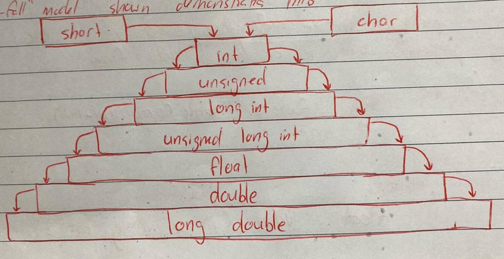

# Implicit Conversions

We can mix data types in expressions,

```C++
r = 5 + 2.75;
```

is a valid statement. Whenever data types are mixed in an expression, C++ performs the conversions automatically. This process is known as implicit or automatic conversion.

When the compiler encounters an expresson, it divides the expressions into subexpressions consisting of one operator and one or two operands. For a binary operator, if the operands type differ, the compilers converts one of them to match with the other, using the rule that **the "smaller" is converted to the "wider" type**.

For example, if one of the operand is an `int` and the other is a `float`, the `int` is converted into a `float` because a `float` is wider than an `int`. The "waterfall" model shown demonstrates this,



```C++
    int a = 5;
    float b = 10.5;
    cout << a + b;
```
 Will output `15.5` because the result will be the larger type, i.e. `float`.

 Also, an `unsigned` it deemed `wider`, e.g.

 ```C++
     unsigned int four_billion = 4000000000;
    int negative_int = -1000;
    cout << four_billion + negative_int;
 ```

 Will output `3999999000`, a number that is beyond the maximum `signed int` type (2,147,483,647).

