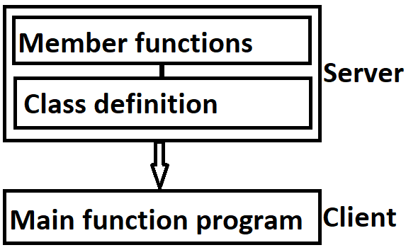

# Introduction

## A simple C++ Program

```C++
#include <iostream> // Include header  file

using namespace std;

int main()
{
    cout << "Hello World\n"; // C++ statement
}
```

## Program Featrues

Like C, the C++ program is a collection of functions. The above example contains only one function, `main()`. As usual, execution begins at `main()`. Every C++ program must have a `main()`. C++ is a free-form, with a few exceptions. The compiler ignores carriage returns and white spaces. Like C, C++ statements terminate with semicolons.

## Output Operator <<

The statement `cout << "...";` causes the string in quotation marks to be displayed to the screen. This statement introduces two new C++ features, `cout` and `<<`. The identifier `cout` (pronounced as 'C' out) is a predefined object that represents the standard output stream in C++. Here, the standard output stream represents the screen. It is also possible to redirect the output to other output devices or files.

The operator `<<` is called the insertion or put to operator. It inserts (or sends) the contents of the variable on the right to the object on it's left.

You may recall that the operator `<<` is the bit-wise left-shift operator and it can still be used for this purpose. This is an example of how one operator can be used for different purposes, depending on the context. This concept is known as **operator overloading**, an important aspect of polymorphism. It is important to note that we can still use `printf` for displaying an output as C++ is a superset of C.

## Including \<iostream\>

We have used the following `#include` directive in the program, `#include <iostream>`.

This directive causes the preprocessor to add the contents of the iostream file to the program, it is essentially copy pasting the contents from the *.h* into the file where the *#include* was utilized. It contains declerations for the identifier `cout` and the operator `<<`. Some old versions of C++ use a header file called *iostream.h*. This is one of the changes introduced by ANSI C++ (We should use *iostream.h* if the compiler does not support ANSI C++ features).

## Namespace

Namespace is a new concept introduced by the ANSI C++ standards committee. This defines a scope for the identifiers that are used in a program. For using the identifiers defined in the namespace scope we must include the `using` directive, e.g. `using namespace std;`

Here, `std` is the namespace where ANSI C++ standard class libraries are defined. All ANSI C++ programs must include this directive. This will bring all of the identifiers defined in the `std` to the current **global scope**. `using` and `namespace` are the new keywords of C++.

## Return type of main

In C++, `main()` returns an integer type value to the operating system. Therefore, every `main()` in C++ should end with a `return 0;` statement, otherwise a warning or an error might occur. Since `main()` returns an integer type value, return type for `main()` is explicitly specified as `int`. Note that the default return type for all functions in C++ is `int`. The following main without type and return will run with a warning,

```C++
main()
{
    ...
}
```

## Input Operator >>

The statement `cin >> number1` is an input statement and causes the program to wait for the user to type in a number. The number keyed in is placed in the variable `number1`. The identifier `cin` (pronounced 'C in') is a predefined object in C++ that corresponds to the standard input stream. Here, this stream represents the keyboard.

The operator `>>` is known as extraction or get from operator. It extracts (or takes) the value from the keyboards and assigns it to the variable on its right. This corresponds to the familiar `scanf()` operation. Like `<<`, the operator `>>` can also be overloaded.

## Cascading of I/O operators

We have used the insertion operator `<<` repeatadly in this example,

```C++
cout << "Sum = " << sum << "\n";
```

first sends the string `Sum = ` to `cout` and then send the value of `sum`. Finally, it sends the newline character so that the next output will be in the new line. The multiple use of `<<` in one statement is called cascading. When cascading an output operator, we should ensure necessary blank spaces between different items.

We can also cascade the input operator `>>`, 

```C++
cin >> number1 >> number2;
```

The values are assigned from left to right. That is, if we key in two values, say 10 and 20, then 10 is assigned to `number1` and 20 to `number2`.

## Structure of a C++ program

A typical C++ program would contain four sections, `Include files`, `Class definition`, `Member functions definitions` and `Main functions program`. These sections may be placed in seperate code files and then compiled independently or jointly.

It is common practice to organize a program into three seperate files. The class declerations are placed into a header file and the definitions of member functions go into another file. This approach enables the programmer to seperate the abstract specifications of the interface (class definition) from the implementation details (member functions definition). Finally, the main program that uses the class is placed into a third file which *includes* the previous two files as well as any other files required.

This approach is based on the concept of client-server model as shown below. The class definition including the member functions constitute the server that provides services to the main program known as the client. The client uses the server through the public interface of the class.



## Operators

C++ has a rich set of operators. All C operators are valid in C++. In addition, C++ introduces some new operators. We have already seen two such operators, namely `<<` and `>>`. The other operators are,

`::` Scope resolution operator <br>
`::*` Pointer-to-member declarator <br>
`->*` Pointer-to-member operator <br>
`.*` Pointer-to-member operator <br>
`delete` Memory release operator <br>
`endl` Line feed operator <br>
`new` Memory allocation operator <br>
`setw` Field width operator

In addition, C++ also allows us to provide new definitions to some of the built-in operators. That is, we can give several meanings to an operator, depending upon the types of arguments used. This process is known as operator overloading.

 