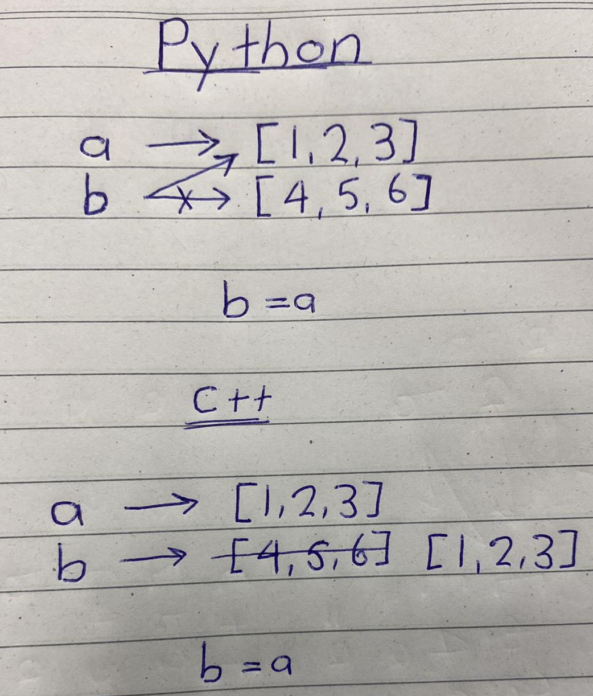

# Assignment operator for objects

One key concept of C++ that differs from others is that the `=` operator for assigning objects **never changes the memory address**. This is unlike languages such as Python where the `=` operator can change the memory address of objects. Take the following as an example, 

```Python
a = [1, 2, 3]
b = [4, 5, 6]

print("Memory address of a", hex(id(a)))
print("Memory address of b", hex(id(b)))

b = a
print("New memory address of b", hex(id(a)))
```

Here, the output will be

```
Memory address of a 0x12287d65a40
Memory address of b 0x12287d64ec0
New memory address of b 0x12287d65a40
```

We can see that the operation of `b = a` will make the variable `b` now point to the same list that `a` is pointing to and now the previous list that `b` was pointing to will now need to be garbage collected as nothing is 
pointing to it. In C++ this is not the behaviour to expect. An assignment operator is no different from any other method, normally it just goes over all member variables and assigns new values to them, copied from the corresponding members of the other object.

Here I will demonstrate,

```C++
#include <iostream>

class Point {
    public:
        int x;
        int y;
        
        Point(int x, int y) : x(x), y(y) {
            
        };
        
        // copy assignment operator
        Point& operator=(const Point& that)
        {
            x = that.x;
            y = that.y;
            return *this;
        }
        
        void print_point() {
            std::cout << "X: " << x << " Y: " << y << std::endl;
        }
        
        void print_memory_address() {
            std::cout << this << std::endl;
        };
};

int main() {
    Point a(1, 2);
    a.print_memory_address();
    
    Point b(50, 60);
    b.print_point();
    b.print_memory_address();
    
    b = a;                        // Assigns the value of a to b
    b.print_point();              // Verify the values of x and y have changed
    b.print_memory_address();     // Verify that the memory address has not changed
    return 0;
}
```

The crucial part of this code to understand is that the operation `b = a` **does NOT make the variable `b` point to `a`**. Instead it copies the state of `a` onto `b`. This can be verified from the given output,

```
0x7ffd07e321d8       // a memory address
X: 50 Y: 60          // b values
0x7ffd07e321d0       // b memory address
X: 1 Y: 2            // Change the state of b to become a, via b = a
0x7ffd07e321d0       // Verify the memory address of b has not changed, after b = a
```

A visual difference can be shown as,


