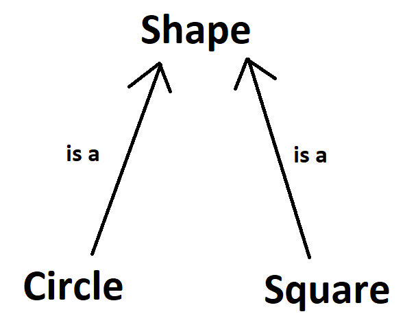

# Polymorphism

Polymorphism is one of the fundamental concepts in object-oriented programming. It allows objects of different types to be treated as objects of a common base type, enabling code to be written that can work with various derived classes through a common interface. Polymorphism is achieved in C++ through the use of virtual functions and dynamic binding.

When a derived class inherits from a base class, it extends the base class and adds its own unique functionality. Polymorphism allows objects of different derived classes to be treated as objects of the base class, enabling generic code that can work with different types of objects.

Let's begin by a small code demonstration,

```C++
#include <iostream>

using namespace std;

class Base {
public:
    virtual void doSomething() {
        cout << "Base class" << endl;
    }
};

class Derived : public Base {
public:
    void doSomething() override {
        cout << "Derived class" << endl;
    }
};

int main() {
    Base* ptr = new Derived();
    ptr->doSomething();  // Prints "Derived class"
    delete ptr;
    return 0;
}
```

In this example, the `Base` class has a virtual function `doSomething()`, and the `Derived` class overrides that function. By using a pointer of type `Base*`, we can point it to an object of type `Derived`, and when we call the `doSomething()` function through that pointer, the derived class's implementation is executed.

# Why are references/pointers required for polymorphism?

To utilize polymorphism in C++ we need to use points or references to types, this is to avoid slicing. "Slicing" is where you assign an object of a derived class to an instance of a base class, thereby losing part of the information - some of it is "sliced" away. If we were to modify the above code to instead be,

```C++
int main() {
    Base baseObj = Derived();
    baseObj.doSomething();  // Prints "Base class"
    return 0;
}
```

We do not have the previous behaviour of printing "Derived class". What is happening here is that we are creating an object of type `Derived` and then implicitly converting the type of the object to `Base` via slicing. The end result is that `baseObj` is now a `Base` object and **not a** `Derived` object. All of the attributes on the `Derived` object will also be lost.

To further demonstrate, I will provide an example here a function will person the implicit conversions of types.

```C++
#include <iostream>

using namespace std;

class Base {
public:
   virtual void f() {
       cout << "Base class" << endl;
   };
};

class Derived : public Base {
public:
   virtual void f() {
       cout << "Derived class" << endl;
   }
};

void value_call(Base b) {
   b.f();       // Base::f
}

void reference_call(Base &b) {
   b.f();      // Derived::f
}
int main() {
   Derived d;
   
   value_call(d);
   reference_call(d);
}
```

In this example, `value_call` is using pass-by-value because it is not utilizing points or references. When you use pass-by-value semantics (or store derived elements in a base container) you are creating copies of type `Base` of the elements of type `Derived`. Similarily to the example above we would be doing the same here,

```C++
Base baseObj = d;
```

C++ will be creating a new object of type `Base` and pass this to the function `value_call`, this is because pass-by-value will create a new object. **This is called slicing**, as it resembles the fact that you have a derived object and you slice/cut the derived information away and only having the remaining `Base` methods and attributes remaining.

In `reference_call` we are not using pass-by-value and instead we simply pass a pointer type and no implicit conversions are performed, keeping the information intact.

# Properly Utilizing Polymorphism

Polymorphism is an object-oriented programming concept that refers to the ability of a variable, function or object to take on multiple forms. To achieve this we need the pointer to point to the base class, which allows us to change the pointer to point to any object that derives from the base class. Keep in mind, **which function to be called is determined based on the actual type of the object, not the pointer type**.

To demonstrate this further we will analyze the following,

```C++
#include <iostream>

using namespace std;

class Shape {
public:
    virtual void draw() {
        cout << "Drawing a shape." << endl;
    }
};

class Circle : public Shape {
public:
    void draw() override {
        cout << "Drawing a circle." << endl;
    }
};

class Square : public Shape {
public:
    void draw() override {
        cout << "Drawing a square." << endl;
    }
};

int main() {
    Shape* shapePtr = new Circle();
    shapePtr->draw();  // Calls the draw() function of the Circle class

    shapePtr = new Square();
    shapePtr->draw();  // Calls the draw() function of the Square class
    delete shapePtr;
    return 0;
}
```

In this example I create a `Shape*`. This means the pointer `shapePtr` can point to anything that is of type `Shape`. Keep in mind, `Circle` and `Square` are both of type `Shape` as they both inherit from it. The end result is that the `shapePtr` now has the flexibility to essentially change `Shape`. In this example we demonstrate this by initially pointing to a `Circle` and drawing it, then pointing to a `Square` and drawing it. 

This type of behaviour is not possible if we were instead to be more strict on the type. If we were more strict on the type such as,

```C++
int main() {
    Circle* shapePtr = new Circle();
    shapePtr->draw();  // Calls the draw() function of the Circle class

    shapePtr = new Square(); // Error, because a Circle is not a Square
    shapePtr->draw();
    delete shapePtr;
    return 0;
}
```

We would be thrown an error because a `Circle` **is not a** `Square`. Hence, the pointer is typically pointing to the base class which then allows for polymorphism. Keep in mind **which function to be called is determined based on the actual type of the object, not the pointer type**



Polymorphism therefore allows us to pass different types of `Shape` objects to function calls, no matter the type of object, as long as it is a class that inherits from `Shape`. For example, we could instead write

```C++
void draw_shape(Shape* shape) {
    shape->draw();
}

int main() {
    Shape* circle = new Circle();  // Drawing a circle.
    draw_shape(circle);
    delete circle;

    Shape* square = new Square();  // Drawing a square.
    draw_shape(square);
    delete square;
    return 0;
}
```