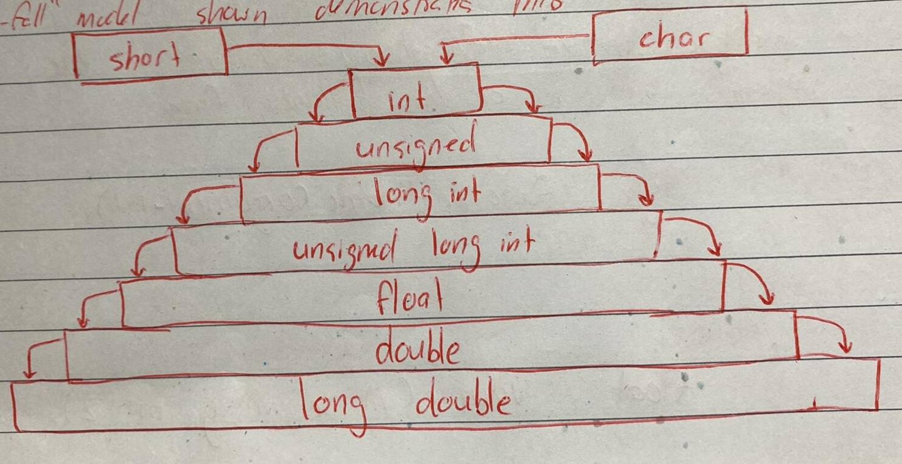

# Implicit Type Conversions

We can mix data types in expressions,

```C++
r = 5 + 2.75;
```

is a valid statement. Whenever data types are mixed in an expression, C++ performs the conversions automatically. This process is known as implicit or automatic conversion.

When the compiler encounters an expresson, it divides the expressions into subexpressions consisting of one operator and one or two operands. For a binary operator, if the operands type differ, the compilers converts one of them to match with the other, using the rule that **the "smaller" is converted to the "wider" type**.

For example, if one of the operand is an `int` and the other is a `float`, the `int` is converted into a `float` because a `float` is wider than an `int`. The "waterfall" model shown demonstrates this,



```C++
    int a = 5;
    float b = 10.5;
    cout << a + b;
```
 Will output `15.5` because the result will be the larger type, i.e. `float`.

 Also, an `unsigned` it deemed `wider`, e.g.

 ```C++
     unsigned int four_billion = 4000000000;
    int negative_int = -1000;
    cout << four_billion + negative_int;
 ```

 Will output `3999999000`, a number that is beyond the maximum `signed int` type (2,147,483,647).

# User-defined Data Types

Since user-defined data types are designed by us to suit our requirements, the compiler does not support automatic type conversions for such data types. We must, therefore, design the conversion routines by ourselves. If such operations are required, three types of situations might arise in the data conversion between incompatible types.

- Conversion from basic type to class type
- Conversion from class type to basic type
- Conversion from one class type to another class type

## Basic (Built-in) to Class Type

The conversion type from basic type to class type is easy to accomplish. It may be recalled that the use of constructors was illustrated in a number of examples to initialize objects. Such as using the constructor to build a string object from a `char *` type variable. These are all examples where constructors perform a defacto type conversion from the arguments type to the constructors class type.

Consider the following constructor from my [previous notes](https://github.com/Michael-Cowie/Notes/blob/main/Cpp/Code/string/string/Source.cpp#L33).

```C++
String::String(const char * s) 
{
    len = strlen(s);
    p = new char[len + 1];
    strcpy_s(p, len + 1,  s);
}
```

This constructor builds a string type object from a `char *` type variable `a`. The variable `len` and `p` are data members of the class `String`. Once this constructor has been defined in the `String` class, it can used for conversion from `char *` type to `String` type, e.g.

```C++
String s1, s2;
char * name1 = "IBM PC";
char * name2 = "Apple Computer";
s1 = String(name1);
s2 = name2;
```

The statement,

```C++
s1 = String(name1);
```

first converts `name1` from `char*` type to `String` type and then assigns the `String` type values to the object `s1`. The statement `S2 = name2;` also does the same job by invoking the constructir implicitly.

Letus now give a full practical example by creating a `Time` class that that can created from an `int`.

```C++
#include <iostream>

using namespace std;

class Time
{
    public:
        int hours;
        int minutes;
    
        Time(int t) // Construtor that is invoked when given an `int`
        {
            hours = t / 60;
            minutes = t % 60;
        }
};

int main()
{
    Time t = 85; // Implicit conversion, `int` constructor is called.
    cout << "Hours: " << t.hours << endl;
    cout << "Minutes: " << t.minutes << endl;
    return 0;
}

```

After this conversion, `t` will have `hours` set to 1 and `minutes` set to `25`, denoting 1 hour and 25 minutes, from the original given 85 minutes.

**Note:** The constuctors use for the type conversion take a single argument whose type is to be converted.

## Class to Basic Type

The constructor functions do not support this operation. C++ allows us to define an overloaded casting operator that could be used to convert a class type data to a basic type. The general form of an overloaded casting operator function usually referred to as a conversion function is:

```C++
class-type::operator typename()
{
    function body
}
```

This function converts a `class-type` data to `typename`. For example, the `operator double()` converts a class object to type `double`, the operator `int()` converts a class type object to `int` and so on.

```C++
Vector::operator double()
{
    double sum = 0;
    for (int i = 0; i < size; i++)
    {
        sum = sum + v[i] * v[i];
    }
    return sqrt(sum);
}
```

This function converts a vector to the corresponding scalar magnitude. Recall that the magnitude of a vector is given by the square root of the sum of the squares of its components.

The operator `double` can be used as follows:

```C++
double length_1 = double(v1);
double length_2 = v2;
```

The casting operator function should satisfy the following conditions:

- It must be a class member
- It must not specify a return type
- It must not have any arguments

Since it is a member function, it is invoked by the object and therefore the the values used for conversion inside the function belong to the object that invoked the function. This means the function does not need an argument.

## User Defined Type to User Defined Type

Two common ways to covert data types is through implicit conversion and also casting. Implicit conversion is when we perform a conversion via the copy contructor and an assignment could look like this,

```C++
Float f = 5.0;
Integer i = f;
```

Will perform an implicit conversion from `Float` to `Integer` and use the copy constructor defined on the `Integer` class, that would look like this.

```C++
Integer(Float & f) // Copy constructor
        {
            cout << "Copy constructor called" << endl;
            i = (int) f.f;
        }
```

A cast is performed by changing the type using `(type)` notation. Changing a `Integer` to a `Float` using a cast would require the following method.

```C++
operator Float() // Cast operator
        {
            cout << "Casting called" << endl;
            Float f((float) i * 1.25);
            return f;
        }
```

This would be called via,

```C++
Integer i = Integer(10);
Float cast_converted = (Float) i; 
```

A full example of both cases is illustrated below.

```C++
#include <iostream>

using namespace std;

class Float
{
    public:
        float f;
        
        Float(float f): f(f){}
};

class Integer
{
    public:
        int i;
        
        Integer(int i): i(i){}
        
        Integer(Float & f) // Copy constructor
        {
            cout << "Copy constructor called" << endl;
            i = (int) f.f;
        }
        
        operator Float() // Cast operator
        {
            cout << "Casting called" << endl;
            Float f((float) i * 1.25);
            return f;
        }
};

int main()
{
    Float f = Float(123.123);
    Integer copy_constructor_converted = f; // Calls the copy constructor
    cout << "Converted value is: " << copy_constructor_converted.i << endl;
    
    Integer i = Integer(10);
    Float cast_converted = (Float) i;      // Calls "operator Float()""
    cout << "Converted value is: " << cast_converted.f << endl;
    return 0;
}
```

