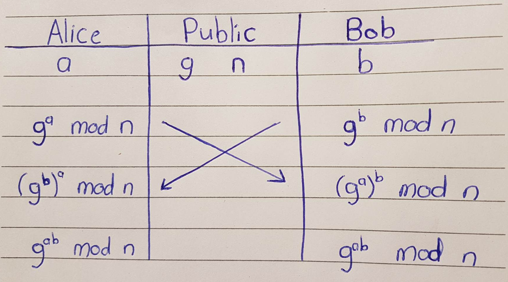

# Diffie–Hellman key exchange

Diffie-Hellman key exchange is a method of securely exchanging cryptographic keys over a public channel.  

Traditionally, secure encrypted communication between two parties required that they first exchange keys by some secure physical means, such as paper key lists transported by a trusted courier. The Diffie-Hellman key exchange method allows two parties that have no prior knowledge of each other to jointly establish a shared secret key over an insecure channel. This key can then be used to encrypt subsequent  communications using a symmetric-key cipher.  

To begin Diffie-Hellman we have our public numbers $g$ and $n$, $g$ is often a very small prime number whereas $n$ is often very big and needs to be big for the security of this to work (Often 2000bits or longer). $n$ is large primarily due to the part where is it used as the modulo, if $n$ is small it could be brute forced easier to find $a$ or $b$.  

The security for Diffie Hellman relies on the fact that if we have $g^a \ mod \ n$, if given $g$ and $n$ it is very difficult to calculate $a$ because we essentially have no idea how many times $n$ was removed from $g^a$ to calculate the result, i.e. how many times it has gone around the "clock" to calculate the result of the modulus calculation. The difficulty of this is called solving the discrete log problem, practically very very difficult even for a super computer right now.

Alice and Bob need to pick their private numbers $a$ and $b$ where $1 \le a \le n$ and $1 \le b \le n$.  

1. Alice first calculates her public component $g^a \ mod \ n$
2. Bob then calculates his public component $g^b \ mod \ n$
3. Alice and Bob then trade their public components
4. Alice takes Bob's public component and calculates $(g^b)^a \ mod \ n$
5. Bob takes Alice's public component and calculates $(g^a)^b \ mod \ n$
6. Alice and Bob now have the same number $g^{a \ * \ b} \ mod \ n$

Alice and Bob now have transferred a secret key despite not knowing about each other's private keys, this is what is crucial about Diffie Hellman. From here a symmetric key cipher can be used to quickly encrypt and decrypt messages between the two parties.

