# Euclidean algorithm
The Euclidean Algorithm is an efficient method for computing the greatest common divisor (GCD) of two integers. The GCD is the largest number that divides them both without a remainder.

## The Algorithm
The Euclidean Algorithm for finding the $GCD(A, B)$ is as follows:

1. If $A = 0$ then $GCD(A, B) = B$, since the $GCD(0, B) = B$ and we can stop.
2. If $B = 0$ then $GCD(A, B) = A$, since the $GCD(A, 0) = A$ and we can stop.
3. Else, write $A$ in quotient remainder form $A = B * Q + R$
4. Find $GCD(B, R)$, using the Euclidean Algorithm since $GCD(A, B) = GCD(B, R)$

## Example
Find the $GCD(270, 192)$

1. $270 = 192 * 1 + 78 \rightarrow GCD(192, 78)$
2. $192 = 78 * 2 + 36 \rightarrow GCD(78, 36)$
3. $78 = 36 * 2 + 6 \rightarrow GCD(36, 6)$
4. $36 = 6 * 6 + 0 \rightarrow GCD(6, 0)$
5. $B = 0 \therefore GCD(6, 0) = 6$

From here we have shown $GCD(270,192) = GCD(192,78) = GCD(78,36) = GCD(36,6) = GCD(6,0) = 6$ and can therefore say that the $GCD(270, 192) = 6$

# Understanding the Euclidean Algorithm

The core concept of this is best explained by number theory. Recall that every integer can be broken down to a product of prime numbers, e.g. $70 = 2 * 5 * 7$ where $2, 5 \ and \ 7$ are all primes. Providing we do not care about the order, their is only one unique expression for each number.

Let us take a small visualized example here where we have    
$15 = 3 * 5$  
$12 = 2^2 * 3$  
$60 = 2^2 * 3 * 5$  

To figure out the $GCD$ of two numbers we need to analyze the architecture of the number, i.e. how it is constructed and what is in common between them. From this example we can say that $GCD(15, 12)$ is $3$ but the $GCD(12,60)$ is $12$. The $GCD(12,60)$  is $12$ because when comparing the prime factorization of both numbers, what they have in common is $2^2$ and $3$ $\therefore$ the $GCD$ is $2^2 * 3 = 12$.  

One more example would be finding the $GCD(280, 30)$,  

$280 = 2^3 * 5 * 7$  
$30 = 2 * 3 * 5$  

The common factor here between them both is $2$ and $5$ $\therefore GCD(280,30 ) = 10$.   
To provide a mathematical formalism of this approach, it can be written as    
$n = p_1^{e_1} \ p_2^{e_2} \ p_3^{e_3} \ ... \ p_n^{e_n}$  
$m = p_1^{f_1} \ p_2^{f_2} \ p_3^{f_3} \ ... \ p_n^{f_n}$  
$gcd(n, m) = p_1^{min(e_1, f_1)} \ p_2^{min(e_2, f_2)} \ p_3^{min(e_3, f_3)} \ ... \ p_n^{min(e_n, f_n)}$  

This is just a nice mathematical formalism for what we had before. There is a lot of value in the simplicity of this approach, but don't take it for granted. The price of the simplicity is that you need to be able to factor your number to take both of your numbers to take the $GCD$, if we can't see the factors then we're at a loss. For example, what is the $GCD(1 \ 678 \ 932 \ 066, 239 \ 847 \ 438)$? Factorising large numbers is notoriously difficult and time expensive, infact this difficulty lies at the core of moden public key cryptography (RSA). This is where the Euclidean Algorithm is utilized, to be able to compute the $GCD$ without the factor requirement.  

Although the definition above  is correct and more intuitive, it does require background knowlege of primes and such. Formally, it is ideal for us to understand the definition with as little background knowledge as possible, this is where a formal definition of the $GCD$ can be written as,  

### Definition

Let $a, b \ \in \ \mathbb{Z}$. The greatest common divisor of $a$ and $b$, demonted $gcd(a, b)$, is the largest integer $g$ such that $g$ divides both $a$ and $b$.   

# Formulation

Let us begin by defining $GCD(x, y) = g$ == $GCD(270, 192) = 6$ . Therefore, there must be some integer $a$ and $b$ which means,  

$g * a = x$ == $6 * 45 = 270$ 
$g * b = y$ == $6 * 32 = 192$ 
$g * a = g * (b + c)$ == $6 * 45 = 6 * (32 + 13)$  
$g * a = g * b + g * c$ == $6 * 45 = 6 * 32 + 6 * 13$  

Now, repeat until $b$ or $c$ is $0$ and then we can find $g$. Recursively do the same thing but treat $g * b$ as the original $x$ and $g * c$ as the original $y$ i.e. $GCD(6 * 32, 6 * 13)$

# Visualization

Let us begin by trying to visualize the Euclidiean Algorithm. Firstly, we have two piles of stones, pile $A$ and pile $B$ (Always take the smaller into the larger). We want to take the $GCD$ but we don't even want to count all of the stones nevermind factor the result. Therefore, we are going to compute the $GCD$ of these two numbers like I am playing a children's game.

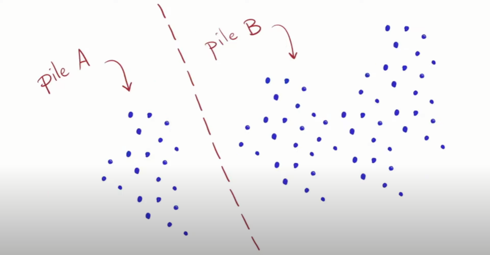

Firstly, we are going to look for copies of pile $A$ that are in pile $B$. Initially, we can see two copies. Remember there is nothing special about the positioning of the stones, we are just going to count enough stones to call it a copy of pile $A$, I can see we can actually do it twice without running out of stones. Hence, there are two copies of $A$ inside of $B$. 

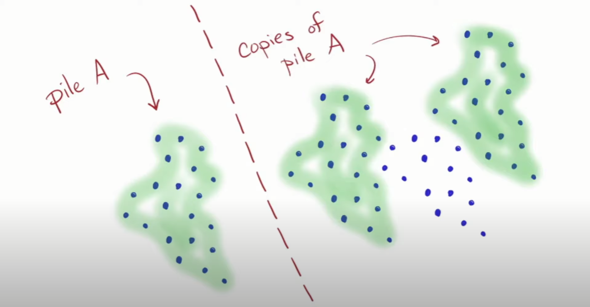

Then, the rules of the game are that once I have found a copy of the smaller pile in
the bigger one I can subtract it off (i.e remove the stones). What is left we will call the new pile $B$.

Now that $B$ is the smaller one, looks for copies of $B$ inside of $A$ and subtract it off to create a new pile $A$

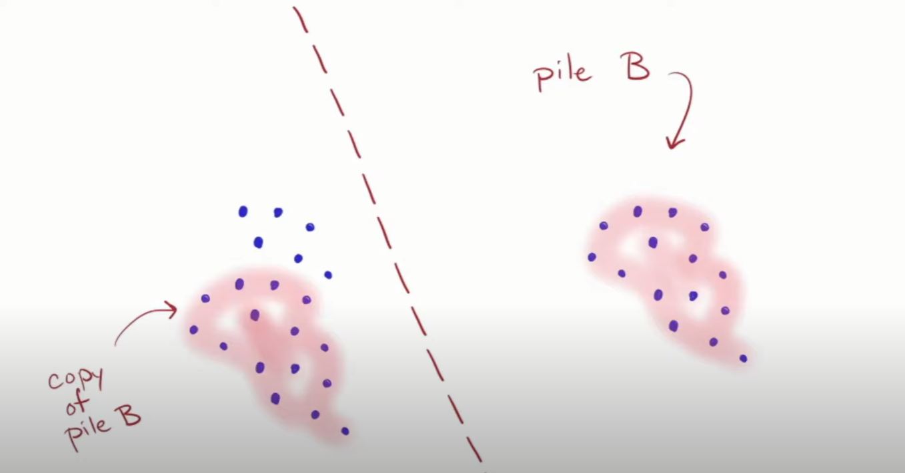
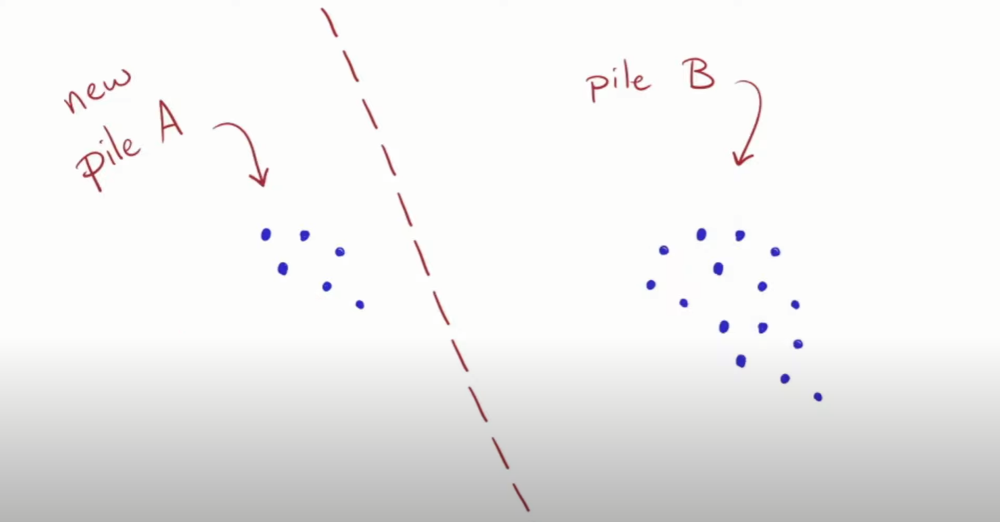

Now $A$ is smaller. Repeat this again, 

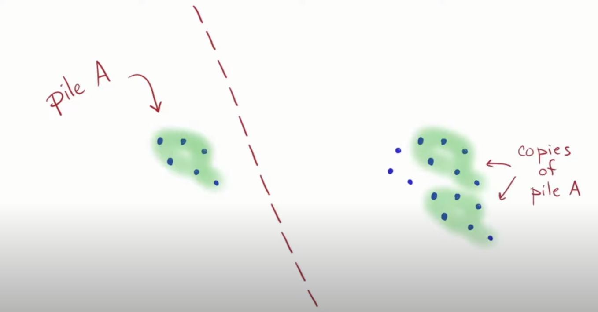

Repeat this until we can no longer continue.

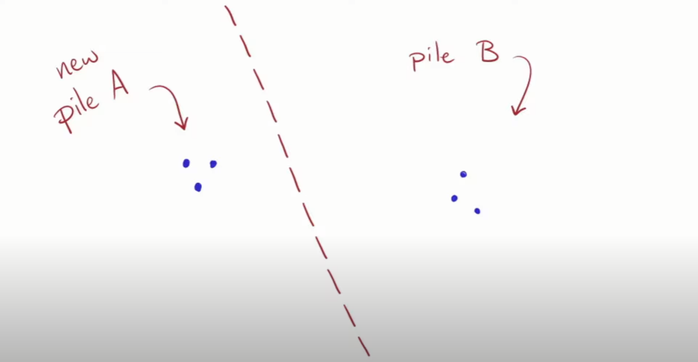

Now here is the claim, that the $GCD$ of the original two pile sizes is the same as the $GCD$ of the diminished pair of the pile sizes. Therefore, the $GCD(3, 3)$ is the the same as the $GCD$ of the original amount, which is $3$.

This is a very useful paradigm in mathematics. If you have a tough problem, replace it with an easier problem that has the same answer.

Let us visualize it slightly differently, this time we draw little triangles into threes that represents the fact that the number is divisible by $3$. Given that the $GCD$ was $3$ it meaning this is possible given that both piles are made up of an integer number of groups of 3.

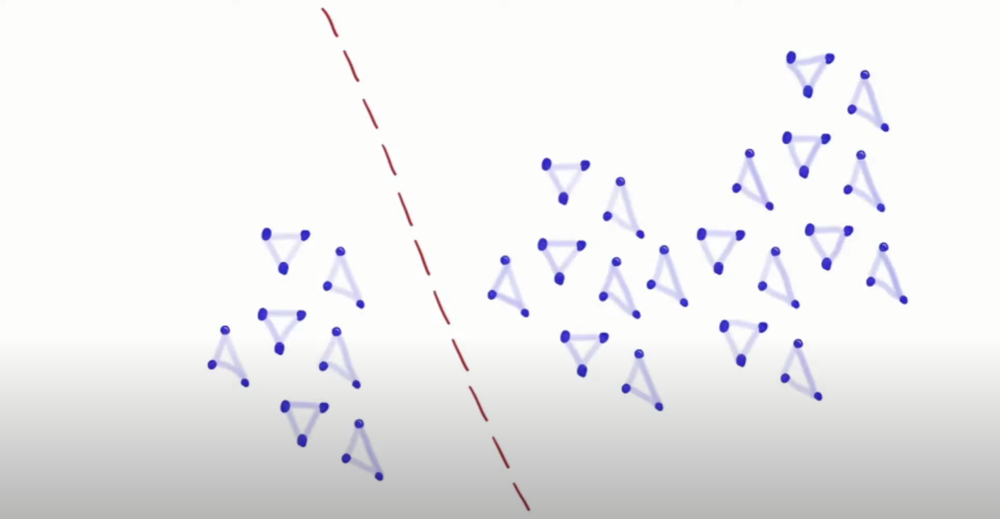
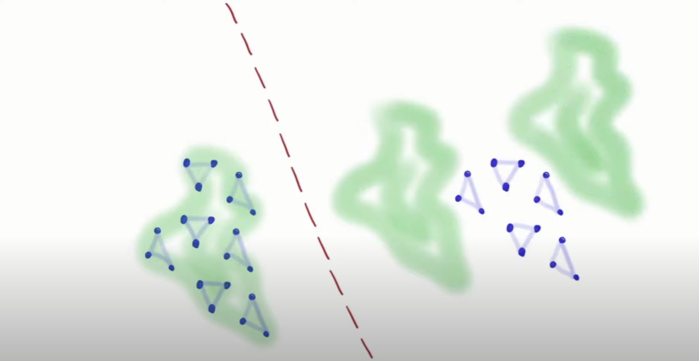
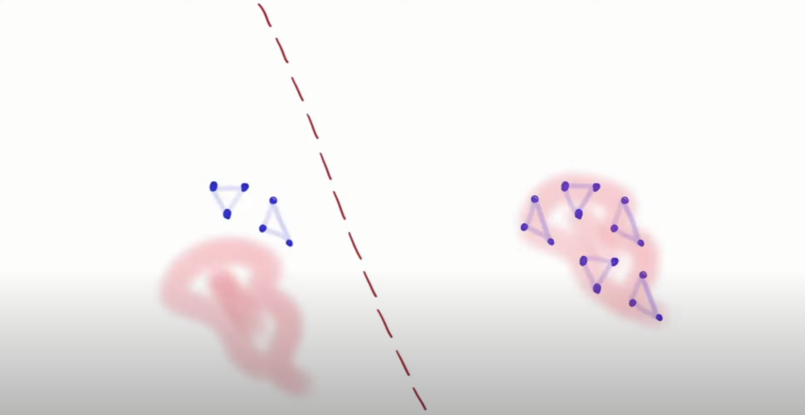
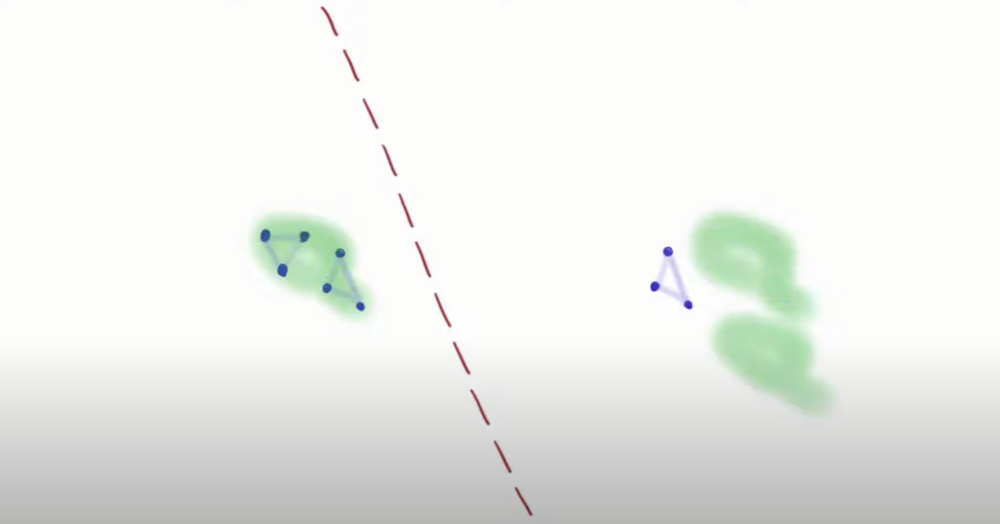
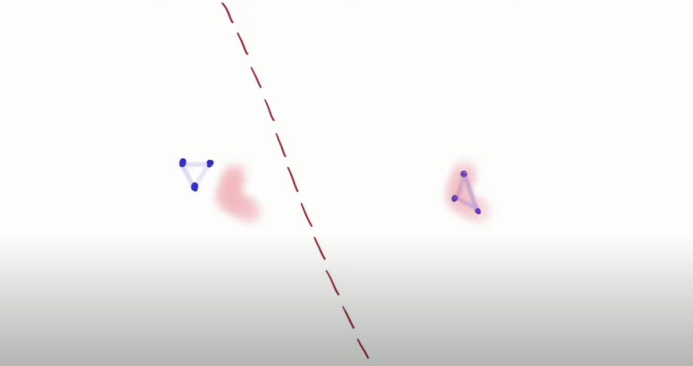
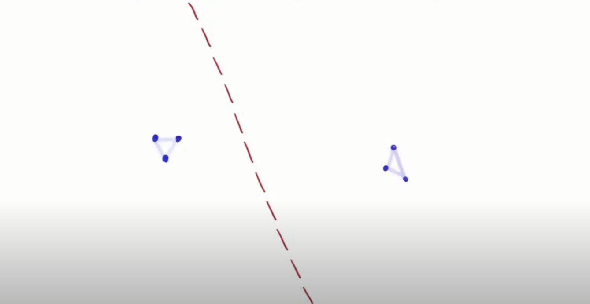
