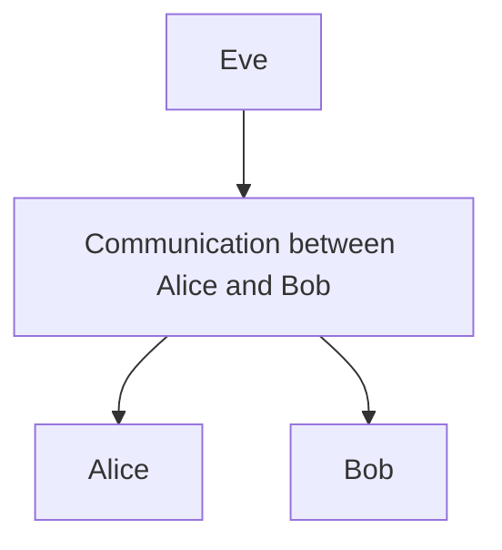

# RSA Cipher

## Introduction

RSA (Rivest–Shamir–Adleman) is a public-key cryptosystem that is widely used for secure data transmission. It is also one of the oldest. The acronym "RSA" comes from the surnames of Ron Rivest, Adi Shamir and Leonard Adleman, who publicly described the algorithm in 1977.

In a public-key cryptosystem, **the encryption key is public and distinct from the decryption key, which is kept secret** (private). An RSA user creates and publishes a public key based on two large prime numbers, along with an auxiliary value. The prime numbers are kept secret. **Messages can be encrypted by anyone, via the public key, but can only be decoded by someone who knows the prime numbers**.

**The security of RSA relies on the practical difficulty of factoring the product of two large prime numbers**, the "factoring problem". **RSA is a relatively slow algorithm**. Because of this, it is not commonly used to directly encrypt user data. **More often, RSA is used to transmit shared keys for symmetric-key cryptography**, which are then used for bulk encryption–decryption.

## Example
We have three main characters, Alice, Bob and Eve. Alice and Bob are trying to communicate between each other by sending crucial and secret information that they cannot let anybody else know about. Finally we have Eve, a hacker trying to intercept and listen to the communication between Alice and Bob.



## Alice creating the Public Key pair
1. We begin by Alice choosing $p = 37$ and $q = 41$ so that $n = 37 * 41 = 1517$. 
    - $p$ and $q$ are both prime numbers. RSA relies on the fact that finding the prime factorization of $n$, thus finding $φ(n)$ is a very expensive task.

2. Calculate $φ(n)$ <br>
   $φ(n) = (p - 1) * (q - 1)$ <br>
   $φ(n) = (37 - 1) * (41 - 1)$ <br>
   $φ(n) = 1440$ <br>

3. $φ(n)$ tells us the number of positive integers up to $n$ that are coprime to $n$. Recall that integers $a$ and $b$ are coprime, relatively prime or mutually prime if the only positive integer that is a divisor of both of them is 1. It can be defined as $\  k, 1 \le k \le n$ for which $\  gcd(k, n) = 1$. RSA is built on Euler's theorem which states $a^{ φ(n)} \equiv  \ 1 \ ,mod  \ n$.
4. Next, choose $e$, to which $\gcd(e, φ(n)) = 1$. Let $e = 11$. Without this requirement it would be impossible to decrypt uniquely.
5. The public key pair is now $(n, e), (1517, 11)$

## Bob sending his message
1. Bob wants to send the message *"Hello"*. This is first changed into numeric format, $\ i.e  \ \ \ a \rightarrow  01, b \rightarrow 02, ...$ Bob sends one letter at a time, so ${m_1} = 8, {m_2} = 5, ...$ 
<br> Consider the message $\  m$, using fast exponentiation, this is encrypted as <br> 
$\ {c_1\equiv m^{e}  \ mod  \ n }$ <br>
$\ {c_1\equiv 8^{11}  \ mod  \ 1517 }$ <br>
$\ {c_1\equiv 976  \ mod  \ 1517 }$ <br>
So, Bob sends ${c_1} = 976$ <br>
 
 ## Alice decrypting the received message
Alice deciphers the message as follows <br>
1. First she must calculate the inverse of $e \ (d)$ in $\mathbb{Z}\_{1440}$. Recall that $e$ has an inverse in $\mathbb{Z}{n}$ if $e$ * $e^{-1} \equiv 1 \ mod \ n$. This is easily done using Euclidian's algorithm. <br>
$1440 = 130 * 11 + 10$ <br>
$11 = 1 * 10 + 1$ <br> <br>
Verifying that $gcd(1440, 1) = 1$. Then working backwards, <br> <br>
$1 = 11 - 10$ <br>
$1 = 11 - (1440 - 130 * 11)$ <br>
$1 = 131 * 11 - 1440$ <br>
$\therefore d = 131$

1. Next Alice deciphers each message $C$. First Alice receives $C = 976$ <br>
   $m^{1} = c^{d}  \ mod  \ n$ <br>
   $m^{1} = (976^{131} \equiv 8 \ mod  \ 1517$) <br>
   $m^{1} = 8$ <br>
   
   Recall that $d$ is the inverse of $e$ in $mod \ n$ and $c$ was assigned from $\ {c \equiv m^{e}  \ mod  \ n }  \ \therefore$  <br>
   $c \equiv m^{e}  \ mod  \ n$ <br>
   $c \equiv m^{e^{d}}  \ mod  \ n$ <br>
   $c \equiv m^{e \ *  \ d}  \ mod  \ n$ <br>
   $c \equiv m^{1}  \ mod  \ n$ <br>
   $c = m  \ mod  \ n$ <br>


2. Alice receives $m = 8$, Bob will further encrypt his messages with Alice's public keys and send them to receive the full message *"Hello"*

# RSA Cipher core usage proofs 
## Proof: $φ(n) = (p - 1) * (q - 1)$ 

   Recall by definition, $φ(n)$ tells us the number of positive integers up to $n$ that are coprime to $n$, where $n =pq$. <br> 
   
   The positive integers less than $pq$ that are not relatively prime to $pq$ are the positive multiples of $p$ less than $pq$ and the positive multiples of $q$ less than $pq$. The positive multiples of $p$ less than $pq$ are the numbers $k$ for $k = 1, 2, ..., q- 1$. Therefore, $q - 1$ of them. The same logic applies to find all multiples of $q$ less than $pq$, therefore $q - 1$ of them. <br> <br>
   For example, let us take $p = 3$, $q = 11$, $n = 33$ and $φ(n) = 20$

   ```python
from math import gcd

p = 3
q = 11
n = p * q 

for k in range(1, q):
    print(gcd(p * k, n))  # Always prints p (3), therefore not coprime to n.
   ``` 
The example Python code above demonstrates that the multiples of $pk$, for $k = 1, 2, ..., q - 1$ have the $gcd(pk, n) = p$. By definition, these are not coprime. To be coprime $gcd(pk, n)$ must be $1$. <br> <br>
Altogether this means that we have $(p - 1) + (q - 1) = p + q - 2$ number of values that are **not** coprime to $n$. <br>
There are altogether $pq - 1$ positive integers less than $pq$, so there must be <br>
$(pq - 1) - (p + q - 2) = pq - p - q + 1 = (p - 1) * (q - 1)$ <br>
<br>
Thus, $φ(n) = (p - 1) * (q - 1)$

## Why $gcd(φ(n), e) = 1$
Without $gcd(φ(n), e) = 1$, it becomes impossible to decrypt uniquely.
1. Let us take for example $p =5$, $q = 13$, $n = 65$, $φ(n) = 48$ and $e = 3$
2. Then we try to encrypt the plain text $2$, $2^3 \equiv 8 \ mod \ 65$ <br>
3. However, if we encrypt $57$, $57^3 \equiv 8 \ mod \ 65$
4. Hence, if we get the ciphertext 8 there is no way to determine if the plain text was either $2, 57$ or even $32$.

RSA encryption and decryption is built upon Euler's theorem which says $a^{φ(n)} \equiv 1 \mod n$. If we have a message $m$, modulus $n$, private exponent $d$ and public exponent $e$, RSA encryption works like this. <br> <br>
Encryption = $c = m^e \ mod \ n$ <br>
Decryption = $m\_1 = c^d \ mod \ n$ <br> <br>
Now, combining the above we we get: <br> <br>
$m\_1 = c^d \equiv (m^e)^d \equiv m^{ed} \ mod \ n$ <br> <br>
Remember that we chose the value of $e$ such that $gcd(e, φ(n)) = 1$ and we also chose $d$ to be the inverse of $e$ in $mod φ(n) \ \therefore \ ed \equiv 1 \ mod \ φ(n)$. Having this requirement it then allows us to instead write $ed$ as $ed = k * φ(n) + 1$ <br> <br>
$\therefore m\_1 = m^{ed} = m^{k \ * \ φ(n) + 1} = m * m^{k \ * \ φ(n)} \ mod \ n$ <br>
Because, $m^{k  \ * \ φ(n)} = (m^{φ(n)})^k \equiv 1^k = 1 \ mod \ n$ <br>
The decryption result $m\_1 \equiv m * m^{k \ * \ φ(n)} \equiv m * 1 = m \ mod \ n$, this therefore equals the original message. <br>
All of this depends on the fact that $ed \equiv 1 \ mod \ φ(n)$, which only has an inverse $d$ if $gcd(e, φ(n)) = 1$. Without it, we won't get $m\_1$ back when we decrypt it.


