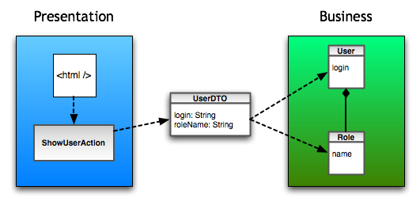

# Data Transfer Object (DTO)

In the field of programming, a data transfer object (DTO) is an object that carries data between processes. The motivation for its use is that communication between processes is usually done resorting to remote interfacts (e.g. web services), where each call is an expensive operation. Because the majority of the cost of each call is related to the round-trip time between the client and the server, one way of reducing the number of calls is to use an object (DTO) that aggregate the data that would have been transferred by the server calls, but is served by one call only.

The difference between data transfer objects and business objects or data access objects is that a DTO does **not have any behaviour** except for storage, retrieval, serialization and deserialization of its own data. In other words, DTO's are simple objects that should not contain any business logic but may contain serialization and deserialization mechanisms for transferring data over the wire.

