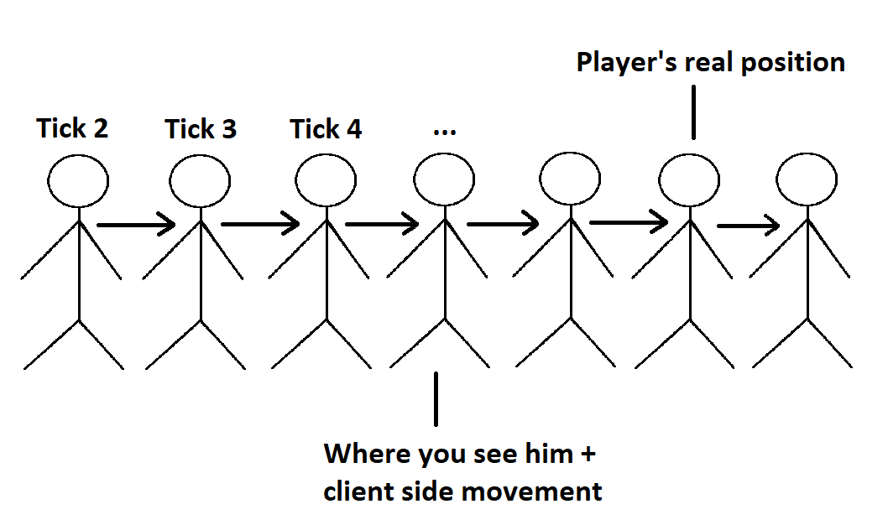

# Gaming Rates

In almost all modern FPS games the server maintains the game state. This is important to prevent cheating, but leads to some of the issues people experience. In a client-server game design, there is always to be the problem of a difference in game state between the client and server, i.e. The client sees a delayed version of the "True" game state on the server. This will always exist, but there are some things we can do to make it less noticable.

Before the begin their is certain terminology that needs to be understood,

#### Netcode

A blanket term used to describe the network programming of a game.

#### Latency

Also commonly (and incorrectly) referred to as "Ping". This is the time it takes for a packet to travel from your client computer to the server and back. The reason people often call it "Ping" is that there is a protocol built in the 80s called ping that was used to test for latency using something called an ICMP echo to measure latency. Note that the one-way travel time of a packet is not always equal to 1/2 of the round trip time, but for simplicity sake we will assume that.

#### Tick Rate

Tick Rate is the frequency with which the server updates the game state. This is measured in Hertz. When a server has a tick rate of 64, it means that it is capable of sending packets to clients at most 64 times per second. These packets contain updates to the game state, including things like player and object locations. The length of a tick is just its duration in milliseconds. For example, the 64 tick would be (1000/64) = `15.6ms`, 

#### Client Update Rate

The rate at which the client is willing to receive updates from the server. For example, if the client update rate is 20 and the server tick rate is 64, the client might aswell be played on a 20 tick rate. This is often configured locally, but in some games cannot be changed.

#### Refresh Rate

The number of times per second your monitor updates what your video card rendered to your monitor. Measured in Hertz. If you have a FPS of 30, your monitor will show each frame twice on a 60Hz monitor. If I had a FPS of 120 on a 60Hz monitor, the monitor can realistically only display 60 frames per second.

#### Interpolation

Interpolation is a technology which smooths movements of objects in the game (e.g. players). Essentially what interpolation is doing is smoothing out the movement of an object moving between two known points. The interpolation delay is typically equal to 2 ticks, but can vary.



For example, if a player is running in a straight line and at the time of tick 1 they were 0.5m and at tick 2 they were at 1m, the interpolation feature would make it appear on the client as if they moved smoothly from 0.5m to 1m away from their starting location. The server however, only ever "sees" the player at these two locations, never inbetween them. Without interpolation, games would appear very choppy, as the client would only see objects in the game move whenever they received an update from the server. Interpolation occurs exclusively on the client side.

Interpolation essentially slows the rate at which the entire game is being rendered to your computer, by a value of time typically equal to 2 ticks, however some games allow you to tweak this like CSGO. This is what people are talking about when they refer to their "rates". They mean update rate and interpolation delay.

#### Extrapolation

This is another client-side technique that can be used to compensate for lag. Essentially the client extrapolates the position of objects rather than delay the client render.

Extrapolation is done when you have a start value, but do not yet have data for the end. You extrapolate what you guess what's going to be the future value, based on what you already know. You interpolate, when you know the 'before' and 'after' values. Extrapolation is used mainly for movement prediction. It is not needed by the game server, but the games clients need it to display a somewhat realistic and current version of the state of the game in order to give a smooth visual experience to the players.

This method is generally inferior to interpolation, especially for FPS games since player movements are not predictable.

#### Lag Compensation

Lag compensation is a function on the server which attempts to reduce the perception of client delay. Without lag compensation (or with poor lag compensation), you would have to lead your target in order to hit them, since your client computer is seeing a delayed version of the game world. Essentially what lag compensation is doing, is interpreting the actions it receives from the client, such as firing a shot, as if the action occurred in the past.

The difference between the server game state and the client game state or "Client Delay" as we will call it can be summarized as,

```
Client Delay = 1/2 * latency + Interpolation Delay
```

An example of lag compensation in action,

1. Player A sees Player B approaching a corner
2. Player A fires a shot, the client sends the action to the server
3. Server receives the action `X ms` later, where `X` is half of Player A's latency
4. The server then looks into the past (into a memory buffer), of where Player B was at the time when Player A took the shot. In a basic example, the server would go back (`X ms` + Player A Interpolation Delay) to match what Player A was seeing at the time, but other values are possible depending on how the programmer wants the lag compensation to behave.
5. The server decides whether the shot was a hit. For a shot to be considered a hit, it must align with a hitbox on the player model. In this example, the server considers it a hit. Eventhough on Player B screen, it might look like he is already behind the wall, but the time difference between what Player B see's and the time at which the server considers the shot to be taken place is equal to,

```
1/2 * PlayerALatency + 1/2 * PlayerBLatency + TimeSinceLastTick
```

In the next tick the server updates both clients as to the outcome. Player A sees the hit indicator on their crosshair, Player B sees their life decrease.

#### Extrapolation vs Interpolation

- Extrapolation is to infer something that is not explicitly stated from existing information
- Interpolation is an estimation of a value within two known values in a sequence of values

Note: In an example where two players shoot each other, and both shoots are hits, the game may behave differently. In some games, e.g. CSGO if the first shot arriving at the server kills the target, any subsequent shots by that player that arrive to the server later will be ignored. In this case there cannot be any "mutual kills", where both players shoot within 1 tick and both die, in Overwatch, mutual kills are possible. There is a tradeoff here.

If you use the CSGO model, people with better latency have a significant advantage and it may seem like "Oh I shot that guy before I died, but he didn't die!" in some cases. You may even hear your gun go "bang" before you die and still not do any damage.

If you use the current Overwatch model, tiny differences in reaction time matters, i.e. if the server tick rate is 64, Player A shoots `15ms` faster than player B, but they both do so within `15.6ms`, they both will die.

- If lag compensation is overtuned, it will result in "I shot behind the target and still hit them"
- If it is undertuned, it results in "I need to lead the target to hit them"
