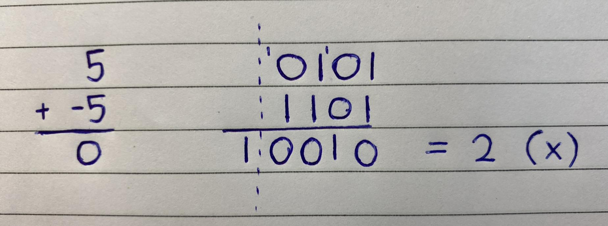
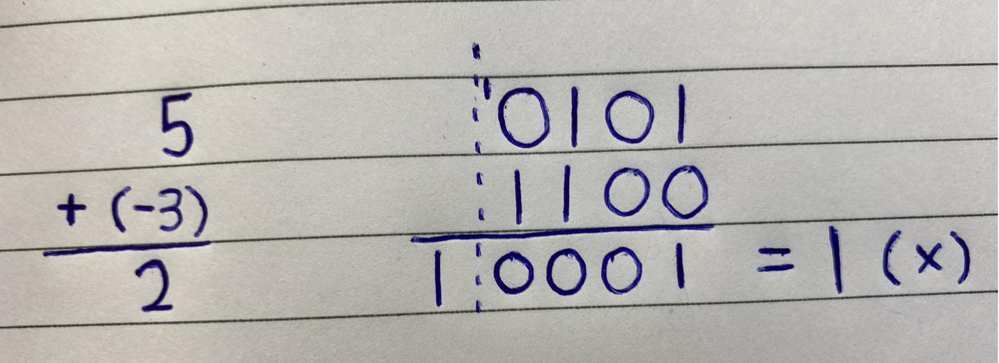
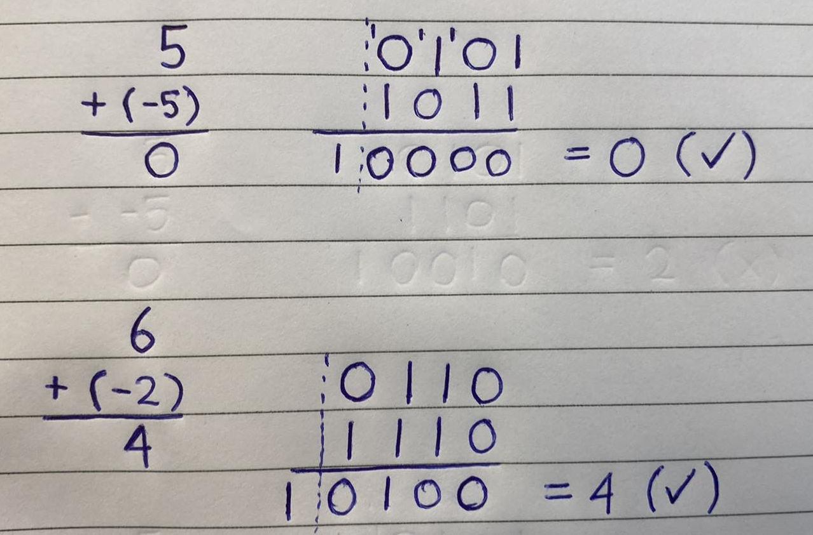

# Two's Complement

Two's complement is a mathematical method used to represent both positive and negative integers in binary form. In this system, the most significant bit (leftmost bit) represents the sign of the number, where 0 represents a positive number and 1 represents a negative number. The remaining bits represent the magnitude of the number, using the standard binary representation.

Here is an example using four bits,

| Decimal | Binary (two's complement) |
|---------|---------------------------|
| 7  | 0111 |
| 6  | 0110 |
| 5  | 0101 |
| 4  | 0100 |
| 3  | 0011 |
| 2  | 0010 |
| 1  | 0001 |
| 0  | 0000 |
| -1 | 1111 |
| -2 | 1110 |
| -3 | 1101 |
| -4 | 1100 |
| -5 | 1011 |
| -6 | 1010 |
| -7 | 1001 |
| -8 | 1000 |

# Why do we use it?

## Sign Bit

Imagine we use the trivial technique of the left most bit is the "sign", we get

`1111` = `-7` \
`1100` = `-4`

Sure...but we also get,

`1000` = `-0` \
`0000` = `+0`

do we want additional "if" statements for positive and negative zeros? NO!

In addition, basic addition does not perform well, for example;

## One's Complement

For one's complement, the inverse for negative will be the number reversed, e.g.

`1000` = `-7` \
`0111` = `7` 

`1111` = `-0` \
`0000` = `0`

Although this may now work for `x + -x = 0`, we still have two forms of zeros AND it still does not add nicely, e.g.

## Two's Complement

Two's complement fixes both problems and represents a larger range (`-8` to `7` instead of `-7` to `-7`).

