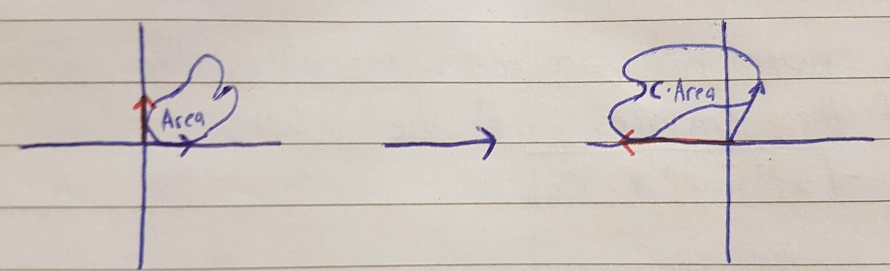

# The Determinant

One thing that turns out to be surprisingly useful for understanding a given transformation is to measure exactly how much a given transformation stretches and squishes things.
More specifically, to measure the factor by which the area of a given region increases or decreases.

