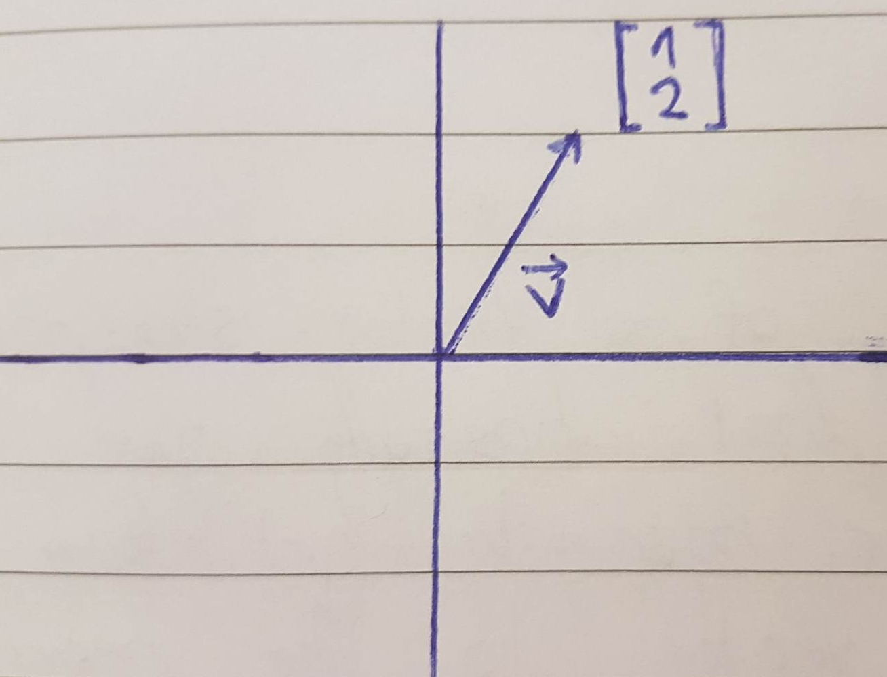
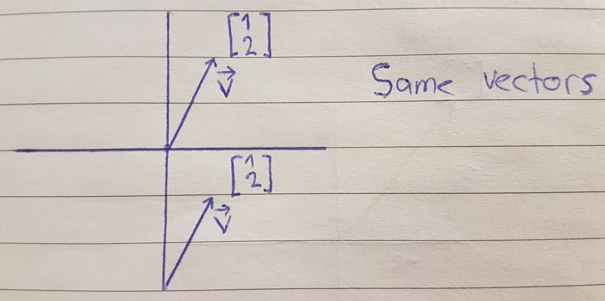
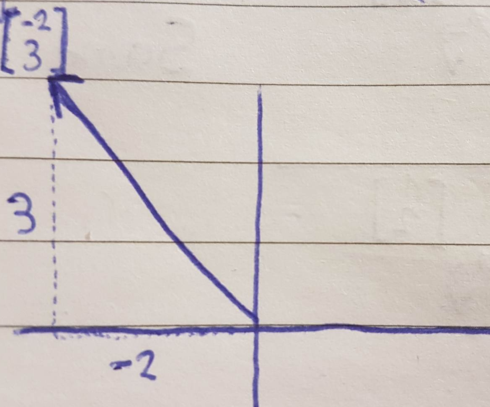

# Linear Algebra fundamentals

The fundamental, root-of-it-all building block for Linear Algebra is the vector.



What defines a given vector is its **length and the direction it is pointing in**, but as long as these two facts are the same you can move it all around and it is still **the same vector**.



In linear algebra, it is **almost always** the case that your vector will be rooted at the **origin**. The coordinates of a vector is a pair of numbers that basically give instructions for how to get from tail of that vector to the head (tip), generally represented as $\begin{bmatrix}X\\Y\end{bmatrix}$.

The first number tells you how far to walk along the x-axis and the second number tells you how far to walk parallel to the y-axis.



To distinguish vectors from points, the convention is to write this pair of numbers vertically with square brackets around them,

$\begin{bmatrix}2\\3\end{bmatrix}$ as vector, (-2, 3) as point.

Every pair of numbers gives you one and only one vector.

# Difference between Point and a Vector

The difference is precisely that between location and displacement.

* Points are **locations** in space
* Vectors are **displacement** in space

An analogy with times works well.

* Times, (Also called instants or datetimes) are locations in time
* Durations are displacements in time

So, in time;

* 4:00pm, noon, midnight, 12:20, etc... are all **times**
* +3 hours, -2.5 hours, +17 seconds, etc... are all **durations**

Notice how durations can be positive or negative; this gives them **direction** in addition to their pure scalar value. Now the best way to mentally distinguish times and durations is by the operations they support.

1. Given a time, you can add a duration to get a new time, e.g. 3:00pm + 2 hours = 5:00pm
2. You can subtract two times to get a duration, e.g. 7:00pm - 1:00pm = 6 hours
3. You can add durations to get another, e.g. 3 hours + 20 minutes + 50 minutes = 4 hours 10 minutes

But you cannot add two times, 3:15am + noon = ??

Let's carry the analogy over to now talk about space: test

(3, 5), (-2.25, 7), (0, -1) are points
```math 
\begin{bmatrix}X\\Y\end{bmatrix}
``` 
is a vector, meaning 4 units east then 5 south (Assuming North is up)