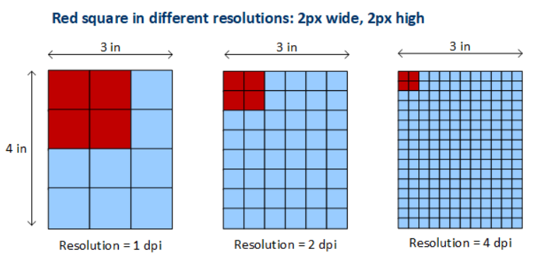
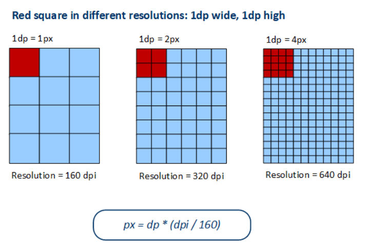
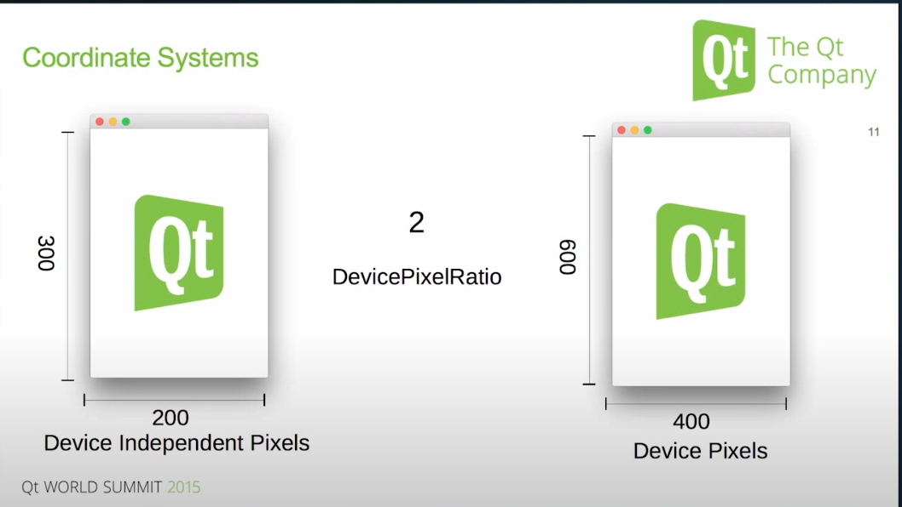

# Pixel

A pixel is the smallest addressable element in a raster image, or the smallest addressable element in an all point addressable display device; so it is the smallest controllable element of a picture represented on the screen. The example below shows an image with a portion greatly enlarged so that individual pixels, rendered as small squares can easily be seen.


Generally, dealing with pixel sizes directly leads to undesireable behaviour when dealing with different size monitors or different DPI configurations due to the image either shrinking or becoming larger rather than staying the same size. For example, if I have a `2px` wide and `2px` high red square (illustrated below) the red block will appear smaller on monitors with higher DPI values, when compared to the original DPI.



# Device Independent Pixel

To resolve the scaling issue described previous, a new type of pixel type was introduced called **device independent pixel** or sometimes referred to also as **logical pixel**.
The goal of the device independent pixel is to  **preserve the physical size for your UI among different devices**. Typically, a device independent pixel has a constant visual size across device types and screen densities. Though this is a generalization, the exact size depends on device configuration. 

Low level graphics such as rasterization and low-level graphics tasks will typically still stick to device pixels, such as when using the OpenGL API. The device pixel coordinate system is often equivalent to the physical coordinate system of the display, but this is not guaranteed. For example, both macOS and Ubuntu may apply additional scaling, depending on display settings.

Amongst popular UI frameworks such as Qt, we define the dimensions of the widgets in "pixels", however, these are generally logical pixel (aka, device independent pixels). This means that the widgets will keep the same size amongst different monitor types and configurations. Device independent pixels are then mapped to physical pixels through a ratio, in Qt this is called the [device pixel ratio](https://doc.qt.io/qt-6/highdpi.html#conceptual-model).

The example below illustrates how device independent pixels solves the previous issues of shrinking the image with a higher resolution monitor. The formula $px = dp * (dpi / 160)$ is used ([For Windows, use 96.](https://learn.microsoft.com/en-us/windows/win32/learnwin32/dpi-and-device-independent-pixels?redirectedfrom=MSDN#converting-physical-pixels-to-dips)). Hence, if we were on a 320dpi monitor, this means that we will draw 2 physical pixels per device independent pixel that was originally defined. A more general formula is written as $Logical Pixels * Device Pixel Ratio = Physical Pixels$.



Another example of device independent pixel to physical pixel using the ratio can be taken from the Qt 2015 summit. In this example the device pixel ratio can be grabbed during runtime or when the widget changes monitor. For example, on a Windows OS if we set the scaling to 125%, the devicePixelRatio will have the value of 1.25. Likewise if we set the scaling to 200%, it will have a value of 2.




## Example

It is important to remember the coordinate system that you're working with. From the examples above, it would be correct to assume that a $devicePixelRatio > 1$ would always result in a larger image, however this is not always the case.

I have created the following code snippet to demonstrate an example where **increasing the device pixel ratio actually decreases the size** of the rendered image. The line that changes the device pixel ratio is `self.image.setDevicePixelRatio(2)`. The device pixel ratio is explicitly being changed on the `QImage`. However, despite what was being said above, doubling the device pixel ratio here actually **decreases** the rendered image size. Why is this?

```python
import sys

from PyQt6.QtCore import Qt
from PyQt6.QtGui import QFont, QImage, QPainter
from PyQt6.QtWidgets import QApplication, QMainWindow, QWidget

DEFAULT_WIDTH = DEFAULT_HEIGHT = 250


class QPainterWidget(QWidget):
    def __init__(self):
        super().__init__()
        self.image = QImage(DEFAULT_WIDTH, DEFAULT_HEIGHT, QImage.Format.Format_RGB32)
        self.image.fill(Qt.GlobalColor.green)
        self.image.setDevicePixelRatio(2)
        painter = QPainter(self.image)
        painter.end()

    def paintEvent(self, event):
        painter = QPainter(self)
        painter.drawImage(0, 0, self.image)
        painter.end()


class MainWindow(QMainWindow):
    def __init__(self):
        super().__init__()
        self.resize(DEFAULT_WIDTH, DEFAULT_HEIGHT)
        self.setCentralWidget(QPainterWidget())


app = QApplication(sys.argv)
window = MainWindow()
window.show()
app.exec()
```

When dealing with widgets, it is easy, we state the logical size and the physical size on screen is derived from the logical size multiplied by the application device pixel ratio, 

$widgetPhysicalSizeOnScreen = widgetLogicalSize * applicationDPR$. 

However, with images (and also icons and pixmaps) we need to distinguish between the image **physical resolution** and the **physical size** on screen, they can differ. We also need to distinguish between the **application device pixel ratio** and the **image device pixel ratio**, these can also differ. The final physical size on screen is calculated using **logical size** as an intermediary step.

So with images we must first specify the **physical resolution** in the constructor `QImage(width, height)`, the parameters `width` and `height` represent **physical pixels** of your image resolution. Then I specified the **image device pixel ratio** (from the code). Then my image logical pixel size is derived from its physical resolution by dividing with the image device pixel ratio. Finally, when the image is displayed in application, it is resized to the **physical size** by multiplying it with the **application DPR (not the image DPR)**.

$imageLogicalSize * imageDPR = physicalImageResolution$

$imageLogicalSize = \frac{physicalImageResolution}{imageDPR}$

$imagePhysicalSizeOnScreen = imageLogicalSize * applicationDPR$

Therefore, if you display an image with a physical dimension of 600 x 400 with a device pixel ratio of 2, it will therefore have a logical size of 300 x 200. Remember `QImage(width, height)` is in physical resolutions. This is because,

$imageLogicalSize = \frac{physicalImageResolution}{imageDPR}$

$300 \ by \ 200 = \frac{600 \ by \ 400}{2}$

In an application with a DPR of 1, we will then have a physical size of 300 x 200 pixels as one logical pixel translates to one physical pixel on screen. If we continue to display the same image but increase the application DPR to 2, then the image will have 600 x 400 physical pixels. This is because one logical pixel translates to 2 physical pixels. The application DPR can be increased by increasing the scaling within the Windows OS or having a high DPI monitor. This final calculation is derived from,

$imagePhysicalSizeOnScreen = imageLogicalSize * applicationDPR$

If we display this image in an application with DPR of 3 (e.g. if you have a really large 8k HighDPI display) then the image will have 900 x 600 pixels. It will scale badly (If we have a closer look, the image will be slightly pixelated) because the original image does not have a big resolution.

## Direct2D and DPI

Direct2D automatically performs scaling to match the DPI setting. In Direct2D, coordinates are measured in units called **device-independent pixels**. A DIP is defined as 1/96th of a **logical inch**. In Direct2D, all drawing operations are specified in DIPs and then scaled to the current DPI setting.

| DPI setting | DIP size      |
| ------------| --------------|
| 96          | 1 pixel       |
| 120         | 1.25 pixels   |
| 144         | 1.5 pixels    |

For example, if the user's DPI setting is 144 DPI and you ask Direct2D to draw a 200 x 100 rectangle, the rectangle will be 300 x 150 physical pixels. In addition, DirectWrite measures font sizes in DIPs, rather than points. To create a 12-point font, specify 16 DIP (12 points = 1/6 logical inch = 96/6 DIPs). When the text is drawn on the screen, Direct2D converts the DIPs to physical pixels. The benefit of this system is that the units of measurement are consistent for both text and drawing, regardbless of the current DPI setting.

**A word of caution:** Mouse and window coordinates are still given in physical pixels, not DIPs. For example, if you process the WM_LBUTTONDOWN message, the mouse-down position is given in physical pixels. To draw a point at that position, you must convert the pixel coordinates to DIPs.