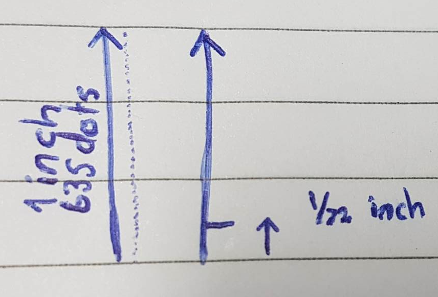

# Typography

To program effectively with Windows graphics, you must understand two related concepts:

1. Dots per inch (DPI)
2. Device-independent pixel (DIPs)

## DPI

Let's start with DPI. This will require a short detour into typography. In typography, the size of type is measured in units called **points**. One point equals 1/72 of an inch, that is **1 pt = 1/72 inch**. This is the desktop publishing definition of a point. Historically, the exact measure of a point has been varied.

## How dpi affects text size

DPI can affect the size of rendered text size, I have created the below code to demonstrate this.

```python
import sys

from PyQt6.QtCore import Qt
from PyQt6.QtGui import QFont, QImage, QPainter
from PyQt6.QtWidgets import QApplication, QMainWindow, QWidget

DEFAULT_WIDTH = DEFAULT_HEIGHT = 250


class QPainterWidget(QWidget):
    def __init__(self):
        super().__init__()
        self.image = QImage(DEFAULT_WIDTH, DEFAULT_HEIGHT, QImage.Format.Format_RGB32)
        self.image.fill(Qt.GlobalColor.green)
        self.image.setDevicePixelRatio(1)
        self.image.setDotsPerMeterX(25000) # 5000, 10000, 15000, 20000
        self.image.setDotsPerMeterY(25000)
        
        painter = QPainter(self.image)
        point_size_font = QFont('arial')
        point_size_font.setPointSizeF(1)
        painter.setFont(point_size_font)
        painter.drawText(0, 0, DEFAULT_WIDTH//2, DEFAULT_HEIGHT//2, Qt.AlignmentFlag.AlignCenter, "point font text")
        painter.end()

    def paintEvent(self, event):
        painter = QPainter(self)
        painter.drawImage(0, 0, self.image)      
        painter.end()


class MainWindow(QMainWindow):
    def __init__(self):
        super().__init__()
        self.resize(DEFAULT_WIDTH, DEFAULT_HEIGHT)
        self.setCentralWidget(QPainterWidget())


app = QApplication(sys.argv)
window = MainWindow()
window.show()
app.exec()
```

The key line here is `self.image.setDotsPerMeterY(25000)`. The key points here to remember during the calculation is,

1. 25,000 dpm is 635 dpi
2. The font is set to 1, from `point_size_font.setPointSizeF(1)`
3. 1 pt is $\frac{1}{72}$ inch



With a dpi of 635, the amount of dots in $\frac{1}{72}$ of an inch is $\frac{635}{72} = 8.8$. This means that the text size with have a height of 8.8 pixels (In the Y axis). Because we set the pt size to 1, the final size will be 8.8. However, if we instead used `point_size_font.setPointSizeF(2)`, the final size would be calculated as,

$635 * \frac{1}{72} * 2 = 17.6$

Hence, a later point size will increase the size of the font. Now, keep in mind, decreasing the DPI actually decreases the size of the text. This is slightly different to the normal behaviour of DPI, where, generally increasing DPI will decrease the size of the item when defined using pixels. Let us perform the same calculation with instead using `self.image.setDotsPerMeterY(5000)`

1. 5000 dpm is 127 dpi
2. The font is set to 1, from `point_size_font.setPointSizeF(1)`
3. 1 pt is $\frac{1}{72}$ inch

Therefore, the height of the rendered text will be,


$127 * \frac{1}{72} = 1.76$

Therefore, the height of the text will be roughly 1.76 pixels, meaning, decreasing the DPI will decrease the size of the text rendered to the screen.

## Pixel size and Text size

For example, a 12-point font is designed to fit within a 1/6" (12/72) line of text. This does not mean that every character in the font is exactly 1/6" tall. In fact, some characters after taller than 1/6". For example, in many fonts the character Å is taller than the normal height of the font. To display correctly, the font needs some additional space between the text. This space is called the *leading*.

The following illustration shows a 72-point font. The solid lines show a 1" bounding box around the text. The dashed line is called the *baseline*. Most of the characters in a font rest on the baseline. The height of the font includes the portion above the baseline (the ascent) and the portion below the baseline (the descent). In the font shown here, the ascent is 56 and the descent is 16 points.


When it comes to a computer display, however, measuring text size is problematic, because pixels are not all the same size. The size of a pixel depends on two factors, the **display resolution (width x height)** and the **physical size of the monitor**. Therefore, physical inches are not a useful measure, because there is no fixed relation between physical inches and pixels. Instead, fonts are measured in **logical units**. A 72-point font is defined to be one logical inch tall. Logical inches are then converted to pixels. For many years, Windows used the following conversion: One logical inch equals 96 pixels. Using this scaling factor, a 72-point font is rendered as 96 pixels tall. A 12-point font is 16 pixels tall. (12 points = 12/72 logical inch = 1/6 logical inch = 96/6 pixels = 16 pixels.)

## Scaling factor

The scaling factor is described as 96 dots per inch (DPI). The term dots derives from printing, where physical dots of ink are put onto paper. For computer displays, it would be **more accurate** to say 96 pixels per logical inch, but the term DPI has stuck.

Because actual pixel sizes vary, text that is readable on one monitor might be too small on another monitor. Also, people have different preferences - some people prefer larger text. For this reason, Windows enables the user to change the DPI settings. For example, if the user sets the display to 144 DPI, a 72-point font is 144 pixels tall. The standard DPI settings are 100% (96 DPI), 125% (120 DPI), and 150% (144 DPI). The user can also apply a custom setting. Starting in Windows 7, DPI is a per-user setting.

## DWM (Desktop Window Manager) scaling

If a program does not for account for DPI, the following defects might be apparent at high-DPI settings:

1. Clipped UI elements.
2. Incorrect layout.
3. Pixelated bitmaps and icons.
4. Incorrect mouse coordinates, which can affect hit testing, drag and drop and so forth.

To ensure that older programs work at high-DPI settings, the DWM implements a useful fallback. If a program is not marked as being DPI aware, the DWM will scale the entire UI to match the DPI settings. For example, at 144 DPI, the UI is scaling by 150%, including text, graphics, controls and window sizes. If the program creates a 500 x 500 window, the window actually appears as 750 x 750 pixels, and the contents of the window are scaled accordingly.

This behaviour means that older programs "just work" at high-DPI settings. However, scaling also results in somewhat blurry appearance, beacuse the scaling is applied after the window is drawn.

## Graphics device interface (GDI) and DPI

GDI drawing is measured in pixels. That means if your program is marked as DPI-aware and you ask GDI to draw a 200 x 100 rectangle, the resulting rectangle will be 200 pixels wide and 100 pixels tall on the screen. However, GDI font sizes are scaled to the current DPI setting. In other words, if you create a 72-point font, the size of the font will be 96 pixels at 96 DPI, but 144 pixels at 144 DPI. Here is a 72 point font rendered at 144 DPI using GDI.


If your application is DPI-aware and you use GDI for drawing, scale all of your drawing coordinates to match the DPI.