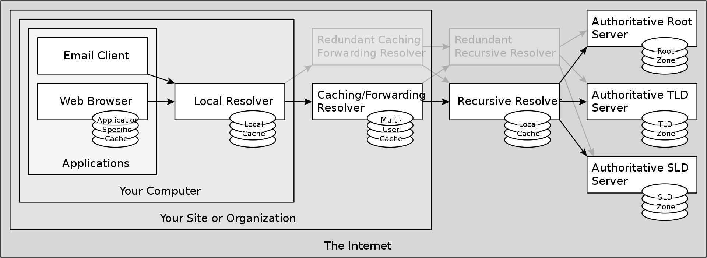

# DNS

The Domain Name System (DNS) is the hierarchical and decentralized naming system used to identify computers reachable through the internet or other Internet Protocol (IP) networks. The resource records contained in the DNS associate domain names with other forms of information. These are commonly used to map human-friendly domain names to the numerical IP addresses computers need to locate services and devices using the underlying network protocols. but have been extended over time to perform many other functions as well. The Domain Name System has been an essential component of the functionality of the Internet since 1985.

## Example

Let us suppose we go into google and type `google.com`, firstly your computer will have a cache of domain names that we have recently visited, but they will last maybe one or two hours for the ones on your computer. So for this example, let us assume we just turned a computer on after a week so it will not know where `google.com` is. It will then have to make a DNS query to find out the IP address.

The first point of contact will usually be a name server that belongs either to your organization that you're in, for example it could be a university name server or your ISP if you live at home. You could have even configured something like `opendns` yourself and you might have one yourself. For this example, we will be assuing your ISP domain name server.

Now, we do not know what IP address of `google.com` is so we're going to have to ask some other computer that might know. What would normally happen here is we would ask a name server that we've either configured ourselves or that is given to us by our ISP. We will then send a request to this server asking if it knows what the IP address of `google.com` is. This server will either know but it has a little cache of domain names that it can look up. For example, if someone else has been to `google.com` recently, it will know what the IP address is and it will give that information back.

Now, let us assume that the name server does not know the address of `google.com` and it is also setup to be a **recursive resolver**. This means it can not only **answer** queries about DNS but it can also **ask** queries about DNS. From here it is going to ask another machine that it thinks might know the answer. Now, this server has no idea because there are a lot of different IP addresses. So, what it is going to do is pick from a list of **root name servers**. **Root name servers** are hard-coded and 13 currently exist and all computers have access to these. The root name server may reply with "I don't know what google.com IP address is this day". The root name server will then reply with "What I do know is that this IP Address of this global top level domain name server could help you".

We will then be sent to the **top level domain server** for `.com`. Now, this `.com` name server may again reply with "I don't know, but I do know that the next place you should ask". Now we are introduced to the second-level domain (SLD). SLD
is directly below a top-level domain (TLD). For example, in `google.com`, `google` is the second-level domain of the `.com` TLD. In a sense, we are essentially working our way back from the domain name (URL).

The final name server will be responsible for this "zone" is, let's say `ns1.google.com`. This will be a name server that is hypothetically run by google, they're going to know what their own IP's are, if they don't then `google.com` is simply not going to work. `ns1.google.com` will finally respond with the IP address, e.g. `1.2.3.4`. Finally, we can send an HTTP GET request and get a response.

This whole transmission is not completed each request due to the caching done over the layers.
