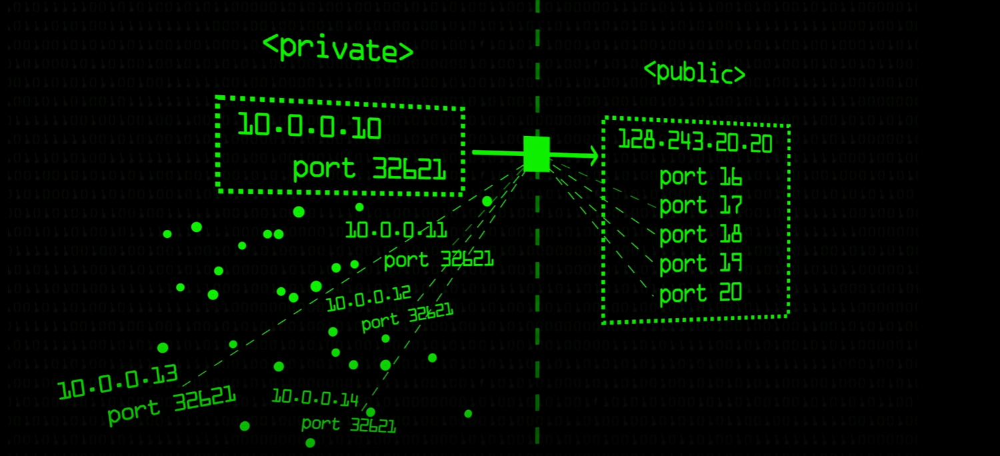

# NAT

To understand NAT (Network address translation) we must first understand the problem that NAT is trying to solve. To do this, we have a take a look back in time all the way back to the 1970s/1980s, which in terms of technology seems like centuries ago. Way back then, IPv4 was created and it was thought of that there would not be more than 4.3billion devices connected to the internet. Now, at the time this made sense because nobody expected the internet to grow to the usage size as it is today.

Decade after decade the usage of the internet grew exponentially and IP addresses were continually being used up for each device connected. It was soon realized that at this rate of growth, all 4.3billion public IP addresses would be used up. Some clever people caught on to this early and devised a plan to help prolong the life of IPv4, until a newer version is created, later known to be IPv6.

## Private addresses

The solution that was constructed to resolve the issue of limited IPv4 addresses was private addresses. What these people did was create three groups of addresses and called them private addresses.

1. `10.0.0.0` to `10.255.255.255`
2. `172.16.0.0` to `172.31.255.255`
3. `192.168.0.0` to `192.168.255.255`

The catch with private addresses is that, **they can only be used inside an internal network**. They are not allowed over the public internet.

## NAT

When we sign up to the internet, our ISP will only provide us with one **public** IP address. The use of NAT is to **convert private addresses to public addresses**. To keep track of this conversion a NAT table is used. The NAT table is built by the router.

Let us take an example where we have a connected device on our network with a public IP address of `222.154.77.121`, suppose our computer. This could have the private address `10.0.0.10` with port `32621`. With Port Address Translation (PAT) we then change the source port to be something unique, this is used to correctly map backwards. If we did not to do, then if two devices had the same port address if we were to change only the IP address then we would have a `1:N` mapping when trying to convert back to a private address and could not uniquely forward the packet back to the correct device. The NAT table will then give my device the new address of `222.154.77.121.16`, notice here it is merely the networks public IP address followed by a new port.

An example NAT table using PAT could be,

| Inside           | Outside       |
| ---------------- |---------------|
| 10.0.0.10:32621  | 222.154.77.121:16  |
| 192.168.0.1:54327| 222.154.77.121:17|

In the future we do not need NAT or private addresses because of IPv6. IPv6 IP addresses are 128 bits (16 bytes). This means we can have $2^{128}$ number of IP addresses in the future. I do believe in this case, we will never have a situation to run out of IP addresses.