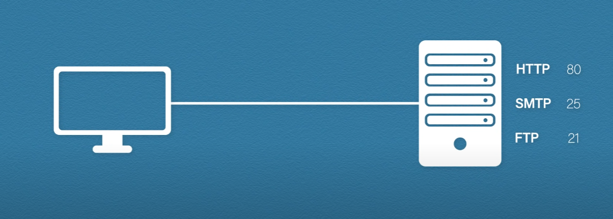
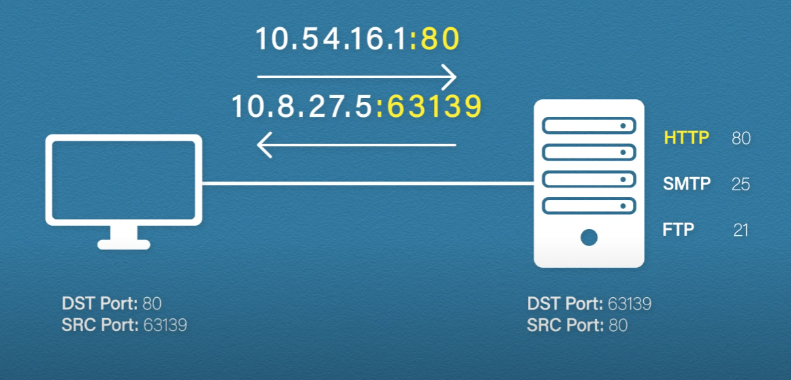
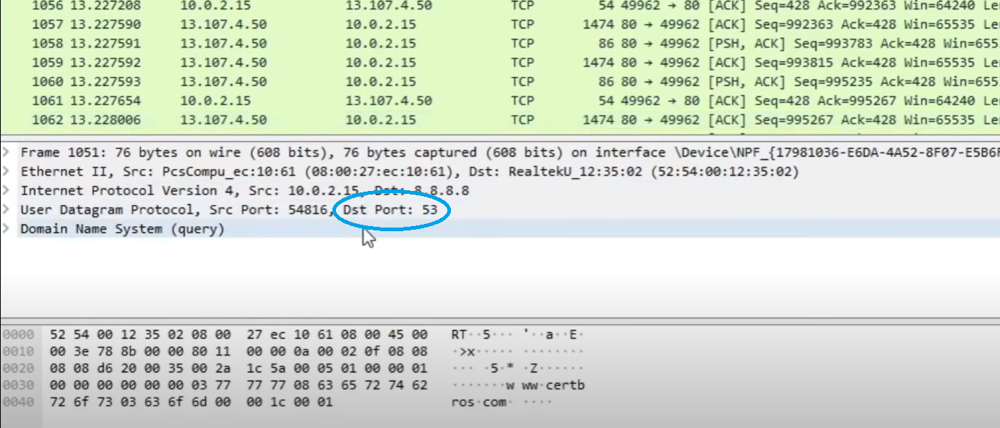
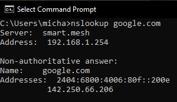
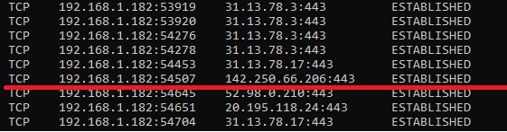

# Port Numbers

In computer networking, a **port**  is a number assigned to **uniquely identify a connection endpoint** and to **direct data to a specific service**. At the software level, within an operating system, a port is a logical construct that identifies a specific process or a type of network service. A port is identified for each transport protocol and address combination by a 16-bit unsigned number, known as the **port number**. The most common transport protocols that use port numbers are the Transmission Control Protocol (TCP) and the User Datagram Protocol (UDP).

A port number is always associated with an IP address of a host and the type of transport protocol used for communication. It completes the destination or origination network address of a message. Specific port numbers are reserved to identify specific services so that an arriving packet can be easily forwarded to a running application. For this purpose, port numbers lower than 1024 identify the historically most commonly used services and are called well-known port numbers. Higher-numbered ports are available for general use by applications and are known as ephemeral ports.

# Analogy

Suppose you live in a house, you will probably want to receive post here. So, what do we do? We install a letterbox. Now when the postman comes your letters can be put through that letterbox. The letterbox gives the postal service access to your house and computers work in the same way. The post in this analogy is the application data and this letterbox is the port number for that application. It gives access to your computer for that service.

Now, instead of a house, it might be a server and this server could be running a mail, web or any other service we want to send data to. Let's say we want to access the web server. We type in the web address or URL of the site we want to visit and the first thing the computer will do is convert the URL into an IP address by DNS. The computer then sends the request to the webserver. But this server might not just be a website using HTTP, it may also, be a mail server using SMTP or even a file server using FTP. So how does the server know which application to send the request to? These applications have something called a well known port number assigned to them. HTTP is assigned port number 80, SMTP is assigned port number 25 and FTP is assigned port number 20 and 21.

Because the port numbers are standard numbers, all computers will know about them. When we made our web request our computer knew we were trying to access a HTTP site, so it added the destination port number of 80 to the TCP header. The computer will also choose a randomly generated source port number to receive a reply. It's sent to the web servers IP address and the well-known port for that service. The IP address and port number are often written as `a.b.c.d:port_number`.

The server will receive this request, look at the destination port number and understand that the request is for the web application and pass it to that application. The server would then respond. This time the port numbers are reversed, the destination port is now the randomly generated one and the source port is our well-known port number 80.

Again, when we receive this response our computer looks at the port number. The port number let's our computer know which application to send it to and in this case our browser and even which tab of that browser to display it on. **So the IP address gets that data to the computer, but it's the port number that gets the data to the right application**.

# Reserved port numbers

There are several port numbers that are called **well-known ports**. These are common protocols that have been assigned port numbers with a few examples shown below.

| Protocol      | Transport Layer Support | Port Number |
| -----------   | ----------------------- | ----------- |
| FTP Data      | TCP                     | 20          |
| FTP Control   | TCP                     | 21          |
| SSH           | 22                      | 22          |
| HTTP          | TCP/UDP                 | 80          |
| SNMP          | UDP                     | 161         |
| HTTPS         | TCP/UDP                 | 443         |

These port numbers can be significantly useful when analyzing a packet capture, for example, if I were using WireShark and inspect a packet I need to know what type of traffic I am looking at.

In this example I see communication using port 53, I will know that this is DNS traffic.

# Registered port numbers

Registered port numbers range from 1024 to 49151. These port numbers are used by companies that they have registered.

# Dynamically assigned port numbers

Dynamically assigned port numbers range from 49,152 to 65535. These are used to randomly generate unique port numbers for that local computer. The assigned port number will then be used as its source port.

## Example 

If we were to go and open a web browser and visit any website you want, for example `www.google.com`. From here let us open the command prompt and use the command `netstat -n`, we will then see our computer's connections. Let's us first see the IP address of `www.google.com` by using the command `nslookup google.com`, as this will be the IP address listed as the foreign address.

Secondly, let us then run `netstat -n` to see a list of the connections and find where the connection is with the foreign address `142.250.66.206`.

The first column we can see the protocol being used, `TCP`. The second column is the local address, which means our computers address. Note that it shows a colon, with the port number 54507. This tells us we are using a dynamically assigned port number. The foreign address here is in the third column, `142.250.66.206` being the IP address of `google.com` with the port number being `433`. The port number is `433`, which tells us we are connecting to `google.com` using HTTPS.

We can also manually change the port we connect to. For example, on the web browser URL we can instead type `google.com:53`, 53 being the port number for DNS, the site now cannot be reached and you will be shown an error and given an `This site can't be reached` page. This is happening because the client is not sending the request to the web application port 80 or 443. In fact we are trying to send the request to a DNS service that isn't running on this web server.