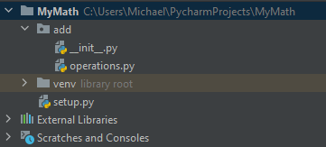
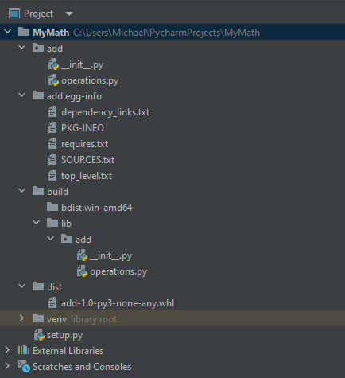
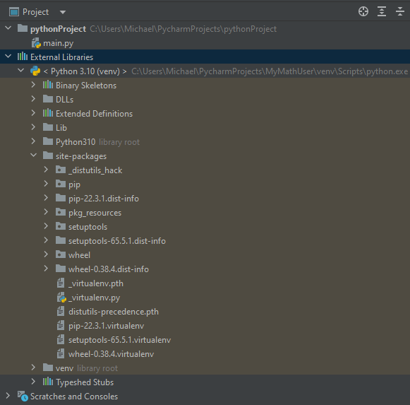
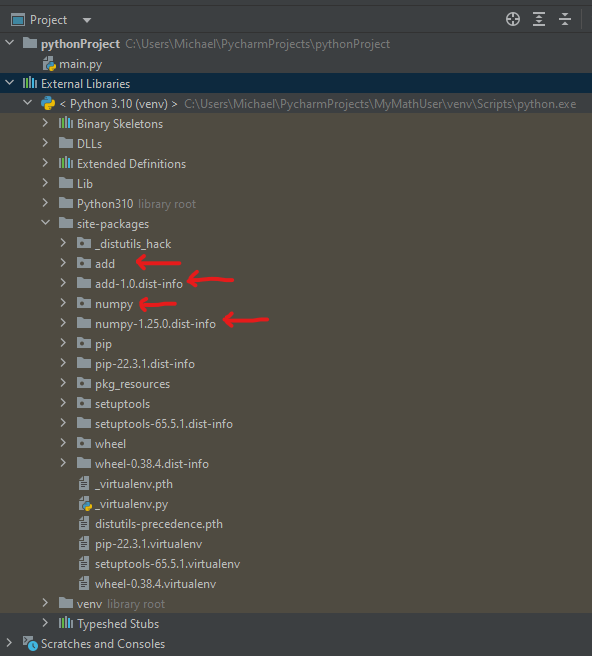
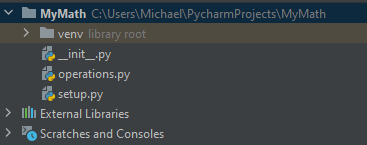
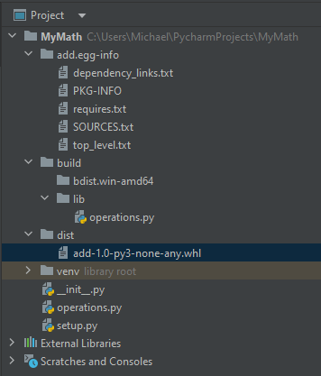
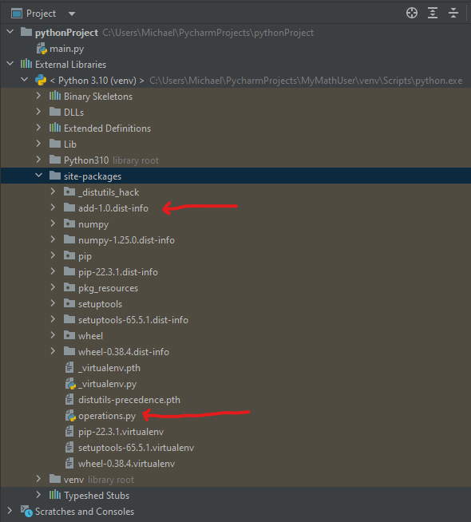

# PyPI

The Python Package Index (PyPI) is a repository of software for the Python programming language. PyPI helps you find and install software developed and shared by the Python community. Package authors use PyPI to distribute their software.

For example, when using the command `pip install numpy`, `pip` searches the Python Package Index. Each package lists download (Including wheels, if there are any) with a direct download link on the page. Package pages have the form of `https://pypi.python.org/pypi/<package_name>(/<version>)`

Some package managers, including `pip`, use PyPI as the default source for packages and their dependencies. Over 235,000 Python packages are available for download.

PyPI primarily hosts Python packages in the form of archieves called sdists (source distributions) or precompiled "wheels"

# PIP

PIP is a package-management system written in Python used to install and manage software packages. It connects to an online repository of public and paid for private packages called the Python Package Index (PyPI).

The packages it downloads will be located inside of `requirements.txt` if not getting an individual package, for example

```
numpy == 1.18.1
pandas == 1.0.4
qt5 == 5.14.2
```

Therefore, running `pip install -r requirements.txt` will get all the requirements and place then into the *site-packages*. Alternatively an individual dependency can be downloaded via `pip install numpy`

It is possible to have a custom PyPi server by modifying `requirements.txt`, for example

```
--trusted-host example.com
--index-url https://example.com/repository/...
```

This means that instead of looking for packages on the public PyPI server, it will search for them on the server specified.

# Python Wheels

## History

Before the wheel, there was the egg. The egg had some issues such as,

1. Organially adopted (no guiding of PIP) and hence there were many ways to do the same thing.
2. No standard -> many incompatible implementations.
3. Designed to be directly importable, could include compiled Python (.pyc) files which might not actually be compatible with the versions of Python you have installed.

## The Solution

The solution of this was the design of the *wheel*. The wheel was designed by the Python community to reinvent Python Packaging. It,

1. Designed/Adopted via PEP 427
2. Follows the PEP 376 standard for distributions and PEP 426 standard for package metadata
3. Designed for distribution, cannot include `.pyc` files (but may include other pre-compiled resources)

There are 3 kind of wheels worth mentioning. "Pure wheels" only contain Python code and may target a specific version such as Python 3.7. "Universal wheels" are Python 2/3 compatible pure wheels.

These two are not much different from bdist_eggs and just have to run the following 2 commands.

```
pip install wheel
python setup.py bdist_wheel
```

**Note:** `setup.py` is a Python file, the presence of which is an indication that the module/package you're about to install has likely been packaged and distributed with `Distutils`, which is the standard for distributing Python modules. This allows you to easily install Python packages. Often it's enough to write `pip install .`. Explicitly, `pip install .` will execute the `setup.py` file in the current directory (which will usually load a requirements.txt file). Avoid calling `setup.py` directly.


## Extension Wheel

The final wheel type is called *Extension wheel*, for Python extensions. Let us first see an Extension **without** binary distributions. The word **Extension** in this context means to *extend* Pythons functionality with non-Python code, e.g. the package `cryptography` contains C code.

Begin by using `pip install cryptography` (source only download). We will then get errors such as, `#include <Python.h>`, `Python.h no such file or directory...`. Now to fix this error we get to get additional requirements. `sudo apt install python-dev` (To get `Python.h`). This now needs to be continued for **all remaining dependencies**.

The solution for this is having a prebuilt extension wheel. Extensions **with** binary distributions. `time pip install cryptography` (With prebuilt binaries).

Now an Extension for Python is short for Python Native Extension. Native meaning it was compiled specifically for the OS/CPU architecture, e.g. trying to use a cryptography wheel you downloaded while on a Linux machine will not work when trying to use it on a Windows machine. To distribute precompiled versions of your Python Native Extension you need to built a version to cover every single OS/CPU type and Python version.

The Python interpreter deals with all the dynamic linking. Our responsibility as the user of the software is to ensure any C dependencies our Python program has are available on our system for the program to use and that our Python extension is compiled to be able to be linked against them. There are two ways to do this.

1. **Old way:** Compilation **after** distribution. In this approach we provide a source only download of the Py Extension and ask the user to compile it from source. However obtaining dependencies is now the user problem.
2. **New way:** Compilation **before distribution**. With an extension wheel pre-built by a package developer we can remove the compilation burden from users, by bundling pre-compiled binary dependencies inside a Python wheel. Now everything the end user needs will be available without them having to install or compile anything outside of there desired package assuming wheels are available for all it's dependencies.

Now, because wheels are Python native we can simply `pip install` them.

Given that the Python wheel contains pre-compiled code, you may ask how does PIP know which wheel to grab because compiled code has certain restrictions such as the OS and CPU instruction set. The filename of a wheel specifies which platforms it is compatible with, and PIP is able to check the platform of the machine it is running on so it uses that information ti figure out which wheels can be used. The filename convention for the wheel is,

```
{distribution}--{version}(-build tag)?-{python tag}-{abi tag}-{platform tag}.whl
```

To ship the Python extensions and make them compatible with as many systems symbol versioning (manylinux) and dependency bundling (auditwheel) is used. PEP 5B and 571 define a set of permitted libraries and their symbol versions for Linux systems, hence "many" Linux systems are compatible with this standard. manylinux is both the name of the policy and a docker image,

```
- manylinux1(PEP 513):CentOS 5, i386/amd64 architectures
- manylinux2010(PEP 571):CentOS 6, i386/amd64 architectures
```

By building your extension wheels inside this docker container you can ensure that you use a build environment that is compatible with the affirmentioned PEPs, making it easier to produce a complient binary. Once a wheel is created, using manylinux or not, you can inspect t using 'auditwheel'. auditwheel is a tool to enforce the symbol policies and determines if the wheel is policy compliant.


## Creating a Wheel

Here, I will create a tiny project called `add` which will utilize the NumPy library to create a function called `add(a, b)`. My following structure is as follows,



`__init__.py`

```Python
from .operations import add
```

---

`operations.py`

```Python
import numpy as np


def add(a, b):
    return np.add(a, b)
```

----

`setup.py`

```Python
from setuptools import setup

setup(
    name='add',
    version='1.0',
    packages=['add'],  # Import the directory 'add'
    author='Michael Cowie',
    description='A simple adder function using NumPy',
    install_requires=['numpy'],
)
```

---

Here, the most important file is `setup.py`. The `setup` method comes from `setuptools` which will create our wheel from the given parameters. The parameter `packages` is used to specify packages (directories containing Python modules) that should be included in the distribution. Here, I am specifying `add`, which is the name of the directory where `operations.py` resides.

`install_requires` tells us that to utilize our code, we require `NumPy`, as I will utilize their API for my functions. Meaning, installing my wheel will implicitly install `NumPy` too.

The command to create the wheel is `python setup.py bdist_wheel`. This will execute the script `setup.py` with the given command line argument `bdist_wheel`. The way this command line argument is used is that inside the `setuptools` function `setup` we can see the usage of it from their source code,

```Python
if 'script_args'  not in attrs:
    attrs['script_args'] = sys.argv[1:]
```

Afer execution of `python setup.py bdist_wheel`, the project structure will change to the following.



Three new folders were created, `add.egg-info`, `build` and `dist`.

#### dist

The `dist` folder is the output directory where the wheel distribution is created, in this example the wheel is called `add-1.0-py3-none-any.whl`. The wheel name can be broken down from the `-` seperation.

1. `add`
    The text `add` is the name and was specified from `name='add'`
2. `1.0`
    This is the version specified from `version='1.0'`
3. `py3`
    This indicates that the wheel distribution is compatible with Python 3.x versions. The number after py represents the specific major version of Python that the wheel is compatible with. In this case, `py3` indicates compatibility with Python 3.
4. `none`
    The `none` tag signifies that the wheel distribution does not contain any platform-specific components or extensions. It is a pure Python package that does not rely on any platform-specific functionality. Pure Python packages can be installed and used on any platform without requiring any platform-specific compilation or dependencies.
5. `any`
    The `any` tag further emphasizes that the wheel distribution is platform-independent and can be installed on any platform that supports the specified Python version.

By including this compatibility tag in the wheel name, it provides information to `pip` and other package management tools about the supported Python version and platform, making it easier for users to identify the appropriate distribution for their environment.

#### build

The `build` folder is generated as a temporary directory during the build process, and its purpose is to hold the intermediate files and artifacts created during the build process. It is not intended to be used directly by end-users or included in the final distribution of your package.

The `lib` subdirectory within the build directory is where the built files and compiled bytecode of your package are stored during the build process.

The `bdist.win-amd64` subdirectory within the build directory is specific to the Windows operating system and contains any additional built files or temporary files generated during the build process for the Windows platform. In this example it is empty because we only have `.py` files, which is not platform specific.

Once the build process is completed, the build artifacts are used to create the final distribution file(s) (e.g., wheel, source distribution). These distribution files, typically located in the `dist` folder, are the ones intended for distribution, installation, or further packaging.

The purpose of providing the `build` folder is to offer insights into the build process and give you a glimpse of the intermediate files created during the build. It can be helpful for troubleshooting build-related issues or understanding the build process in more detail.

However, for most users, the `build` folder itself is not directly used or manipulated. It is automatically handled by build tools (e.g., setuptools) and typically cleaned up after the build process is completed. The `build` folder can be safely deleted once the build is successful and you have obtained the final distribution file(s) from the `dist` folder.

#### add.egg-info

The `add.egg-info` folder is created during the build process and contains metadata about your package, such as its name, version, author, and dependencies. It is generated based on the information provided in your `setup.py` file. The `.egg-info` directory format is used for distributing Python packages.

The `add.egg-info` folder includes files such as `PKG-INFO`, which contains metadata about the package, and `RECORD`, which is a list of installed files and their checksums. These files are used by `pip` for package management and uninstallation.

## Using the wheel

The wheel `add-1.0-py3-none-any.whl` that was created is what is placed onto any of the PyPi servers that end users can install via `pip`. Here, I will create a sample repository that will utilize the wheel I just created. Here, I created a sample repository called `MyMathUser`.



To retrieve the wheel I will run the following command,

```
pip install "C:\Users\Michael\PycharmProjects\MyMath\dist\add-1.0-py3-none-any.whl"
```

The result of this command will have the addition of our wheel `add` placed into `site-packages` with all of its depdendencies, in this case `numpy`.



Finally, we can utilize our original function.

`main.py`

```Python
from add import add

print(add(10, 15))
```

Keep in mind that `site-packages` is added to the PythonPath, hence when we go `import add`, we are importing the folder from `site-packages` which will run the `__init__` and import the `add` function for us.

# Creating a Flat Structure Wheel

In this example I will create a more flat structure. 



We first need to modify the `setup.py` file to become,

```Python
from setuptools import setup

setup(
    name='add',
    version='1.0',
    py_modules=['operations'],
    packages=[],
    author='Michael Cowie',
    description='A simple math package using NumPy',
    install_requires=['numpy'],
)

```

Notice here that we are now using `py_modules` instead of `packages`. These two are slightly different,

The `py_modules` parameter is used to specify individual Python modules (`.py` files) that should be included in the distribution. It expects a list of module names (without the file extension). In our case, we only have one module, `operations.py`, so we specify it using py_modules=['operations']. You provide a list of module names as strings to the py_modules attribute, without specifying any directory information. An example could be `py_modules=['module1', 'module2']`. When using `py_modules`, the module files are typically placed in the root directory of the package.


The `packages` attribute is used to specify directories containing packages (i.e., multiple .py files organized in a directory structure) that should be included in the distribution. You provide a list of package names as strings to the packages attribute, specifying the package hierarchy using dot notation. An example could be `packages=['package1', 'package1.subpackage']`. When using packages, the package directories and their contents are included in the distribution, preserving the directory structure.

When building the wheel this time one difference is noticed inside the `lib` folder. The `add` folder is missing because we now have a flat structure. This has an implication on the user installing the wheel.



Now, if I install my wheel from within a new project the `site-packages` will not appear the same as the previous wheel installation.



It is important to note that when you build and install the wheel distribution, it installs the module directly into the `site-packages` directory **without creating a separate package directory**. Because we did not create a top directory called `add` where all of our code resides, it will place it directly inside `site-packages`. This means we have to change our important to instead be `from operations import add`, as we will not look for the `operations.py` file inside of `site-packages.`