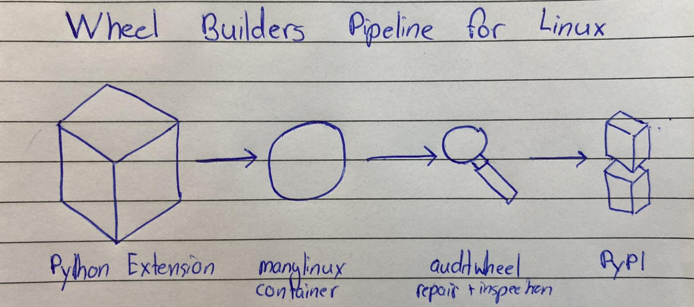

# PyPI

The Python Package Index (PyPI) is a repository of software for the Python programming language. PyPI helps you find and install software developed and shared by the Python community. Package authors use PyPI to distribute their software.

For example, when using the command `pip install numpy`, `pip` searches the Python Package Index. Each package lists download (Including wheels, if there are any) with a direct download link on the page. Package pages have the form of `https://pypi.python.org/pypi/<package_name>(/<version>)`

Some package managers, including `pip`, use PyPI as the default source for packages and their dependencies. Over 235,000 Python packages are available for download.

PyPI primarily hosts Python packages in the form of archieves called sdists (source distributions) or precompiled "wheels"

# PIP

PIP is a package-management system written in Python used to install and manage software packages. It connects to an online repository of public and paid for private packages called the Python Package Index (PyPI).

The packages it downloads will be located inside of `requirements.txt` if not getting an individual package, for example

```
numpy == 1.18.1
pandas == 1.0.4
qt5 == 5.14.2
```

Therefore, running `pip install -r requirements.txt` will get all the requirements and place then into the *site-packages*. Alternatively an individual dependency can be downloaded via `pip install numpy`

It is possible to have a custom PyPi server by modifying `requirements.txt`, for example

```
--trusted-host example.com
--index-url https://example.com/repository/...
```

This means that instead of looking for packages on the public PyPI server, it will search for them on the server specified.

# Python Wheels

## History

Before the wheel, there was the egg. The egg had some issues such as,

1. Organially adopted (no guiding of PIP) and hence there were many ways to do the same thing.
2. No standard -> many incompatible implementations.
3. Designed to be directly importable, could include compiled Python (.pyc) files which might not actually be compatible with the versions of Python you have installed.

## The Solution

The solution of this was the design of the *wheel*. The wheel was designed by the Python community to reinvent Python Packaging. It,

1. Designed/Adopted via PEP 427
2. Follows the PEP 376 standard for distributions and PEP 426 standard for package metadata
3. Designed for distribution, cannot include `.pyc` files (but may include other pre-compiled resources)

There are 3 kind of wheels worth mentioning. "Pure wheels" only contain Python code and may target a specific version such as Python 3.7. "Universal wheels" are Python 2/3 compatible pure wheels.

These two are not much different from bdist_eggs and just have to run the following 2 commands.

```
pip install wheel
python setup.py bdist_wheel
```

**Note:** `setup.py` is a Python file, the presence of which is an indication that the module/package you're about to install has likely been packaged and distributed with `Distutils`, which is the standard for distributing Python modules. This allows you to easily install Python packages. Often it's enough to write `pip install .`. Explicitly, `pip install .` will execute the `setup.py` file in the current directory (which will usually load a requirements.txt file). Avoid calling `setup.py` directly.


## Extension Wheel

The final wheel type is called *Extension wheel*, for Python extensions. Let us first see an Extension **without** binary distributions. The word **Extension** in this context means to *extend* Pythons functionality with non-Python code, e.g. the package `cryptography` contains C code.

Begin by using `pip install cryptography` (source only download). We will then get errors such as, `#include <Python.h>`, `Python.h no such file or directory...`. Now to fix this error we get to get additional requirements. `sudo apt install python-dev` (To get `Python.h`). This now needs to be continued for **all remaining dependencies**.

The solution for this is having a prebuilt extension wheel. Extensions **with** binary distributions. `time pip install cryptography` (With prebuilt binaries).

Now an Extension for Python is short for Python Native Extension. Native meaning it was compiled specifically for the OS/CPU architecture, e.g. trying to use a cryptography wheel you downloaded while on a Linux machine will not work when trying to use it on a Windows machine. To distribute precompiled versions of your Python Native Extension you need to built a version to cover every single OS/CPU type and Python version.

The Python interpreter deals with all the dynamic linking. Our responsibility as the user of the software is to ensure any C dependencies our Python program has are available on our system for the program to use and that our Python extension is compiled to be able to be linked against them. There are two ways to do this.

1. **Old way:** Compilation **after** distribution. In this approach we provide a source only download of the Py Extension and ask the user to compile it from source. However obtaining dependencies is now the user problem.
2. **New way:** Compilation **before distribution**. With an extension wheel pre-built by a package developer we can remove the compilation burden from users, by bundling pre-compiled binary dependencies inside a Python wheel. Now everything the end user needs will be available without them having to install or compile anything outside of there desired package assuming wheels are available for all it's dependencies.

Now, because wheels are Python native we can simply `pip install` them.

Given that the Python wheel contains pre-compiled code, you may ask how does PIP know which wheel to grab because compiled code has certain restrictions such as the OS and CPU instruction set. The filename of a wheel specifies which platforms it is compatible with, and PIP is able to check the platform of the machine it is running on so it uses that information ti figure out which wheels can be used. The filename convention for the wheel is,

```
{distribution}--{version}(-build tag)?-{python tag}-{abi tag}-{platform tag}.whl
```

To ship the Python extensions and make them compatible with as many systems symbol versioning (manylinux) and dependency bundling (auditwheel) is used. PEP 5B and 571 define a set of permitted libraries and their symbol versions for Linux systems, hence "many" Linux systems are compatible with this standard. manylinux is both the name of the policy and a docker image,

```
- manylinux1(PEP 513):CentOS 5, i386/amd64 architectures
- manylinux2010(PEP 571):CentOS 6, i386/amd64 architectures
```

By building your extension wheels inside this docker container you can ensure that you use a build environment that is compatible with the affirmentioned PEPs, making it easier to produce a complient binary. Once a wheel is created, using manylinux or not, you can inspect t using 'auditwheel'. auditwheel is a tool to enforce the symbol policies and determines if the wheel is policy compliant.


