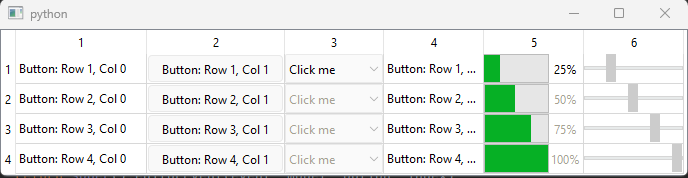

# Qt Delegates

In Qt, delegates are used to customize the appearance and behavior of items in item views such as `QListView`, `QTableView`, and `QTreeView`. They allow you to control how data is displayed and edited within the view. Delegates are particularly useful when you need to display data in a specific format or provide custom editing capabilities.

In PyQt6, delegates are implemented as subclasses of the `QAbstractItemDelegate` class. They provide methods for painting items, editing items, and handling user interactions. In standard views, a delegate renders the items of data. When an item is edited, the delegate communicates with the model directly using model indexes.

One important note here is that the drawing inside `paint` uses the `QApplication.style()`. The object returned here is a `QCommonStyle`. The appearance of UI elements, such as text, is handled by the style system. The painter is responsible for rendering the visual elements on the screen, but the actual drawing of text is typically delegated to the style. The style system in Qt provides a unified way to define and render UI elements across different platforms and themes. It ensures consistent appearance and behavior of UI elements regardless of the underlying platform or visual style. Remember that their is **only one QApplication** object, therefore using this style object to draw will make sure all of our renders are consistent.


To illustrate this with a practical example, I will create the following using a `QTableView`.

```python
from PyQt6.QtCore import Qt
from PyQt6.QtGui import QStandardItem, QStandardItemModel
from PyQt6.QtWidgets import QApplication, QTableView, QStyledItemDelegate, QStyle, QStyleOptionProgressBar, QStyleOptionButton


class MyDelegate(QStyledItemDelegate):

    def paint(self, painter, option, index):
        if index.column() == 1:
            """
            Change the second column to a progress bar.
            """
            value = index.data(Qt.ItemDataRole.DisplayRole)
            progressBarOption = QStyleOptionProgressBar()
            progressBarOption.rect = option.rect
            progressBarOption.minimum = 0
            progressBarOption.maximum = 100
            progressBarOption.progress = value
            progressBarOption.text = f"{value}%"
            progressBarOption.textVisible = True

            QApplication.style().drawControl(QStyle.ControlElement.CE_ProgressBar, progressBarOption, painter)
        elif index.column() == 2:
            """
            Change the third column to a series of buttons.
            """
            buttonOption = QStyleOptionButton()
            buttonOption.rect = option.rect
            buttonOption.text = "A button"
            buttonOption.features |= buttonOption.ButtonFeature.DefaultButton

            QApplication.style().drawControl(QStyle.ControlElement.CE_PushButton, buttonOption, painter)
        else:
            """
            Use the normal QStyleOptionViewItem for the cell appearance.
            """
            super().paint(painter, option, index)


app = QApplication([])

model = QStandardItemModel(4, 3)
tableView = QTableView()
tableView.setModel(model)

# Populate the model with progress values
for row in range(4):
    for column in range(2):
        item = QStandardItem()
        item.setData(25 * (row + 1), Qt.ItemDataRole.DisplayRole)
        model.setItem(row, column, item)

tableView.setItemDelegate(MyDelegate())
tableView.show()

app.exec()
```

The following code will output this table,


Here, the delegates are responsible for the appearance for each cell. The `paint` method is called for each index in the model and we dynamically alter the appearance of each cell by determining which option to use. Here, the first column is a standard cell with normal rendered text. The second column is a progress bar, while the third column being a series of buttons. The initial appearnce of each rendered cell is due to the behaviour inside of `paint` method on our custom delegate, `MyDelegate`.

The `paint` method takes three parameters, `painter`, `option` and `index`. 

#### painter

The `painter` is a `QPainter` and is responsible for the actual drawing of the cell, it contains configurations such as the font and clipping area.

#### option

The `option` parameter that is passed to the `paint` method is a `QStyleOptionViewItem`. It contains information and settings related to the rendering and behavior of graphical elements. The option object is an instance of a class derived from `QStyleOption`, which provides a standardized way to pass visual and behavioral properties to various painting and styling operations.

Without changing the option, the default behaviour for the `QStyleOptionViewItem` is a simple cell that renders the data. In this example it will be the first column that simply calls `super().paint(painter, option, index)`. Therefore the option for the first column is a simple cell that displays the data that is set by the `Qt.ItemDataRole.DisplayRole`.

To change the display of the cells we need the change the option. For example, in the second column we have a progress bar being being rendered. This is achieved by modifying the option object, here we will be using the `QStyleOptionProgressBar()`. We then change all of the attributes we want to customize ourselves such as the percentage of the progress. However, the one attribute that we want to copy from the originally passed option is the `rect`,

```python
progressBarOption.rect = option.rect
```

This line will assure us that size and location of the cell we will be rendering is correct. Without setting it, the default `QRect` of our newly created option is `QRect(0, 0, 0, 0)`. This means it will not be rendered as it is essentially a zero size render. We can experiment with this behaviour by settings the values ourselves. Instead if I change it to,

```python
progressBarOption.rect = QRect(50, 0, 50, 15)
```

Each cell will then be rendered smaller and in the exact same location. The output will instead be,


Therefore, the crucial understanding here is that the option is responsibility for the appearence of a cell.

#### index

Here, the index is a `QModelIndex` and is responsible for holding the data for each row/column combination.

# Different Available Options

When different delegates are utilized in a single View, it is useful to create new delegate classes isntead of nesting `if` statements for each column to return a different option. In this example I will create the following table,



The following columns require different options for their appearance,

1. The first column is a "normal" cell. This uses the default option `QStyleOptionViewItem` and displays the data set from,
```python
    item = QStandardItem()
    item.setData(f"Button: Row {row + 1}, Col {column}", Qt.ItemDataRole.DisplayRole)
    model.setItem(row, column, item)
```
2. The second column is a cell which gives off the appearance of a button. This is achieved by utilizing the option `QStyleOptionButton`.
3. The third column is a cell which gives off the appearance of a combobox. This is achieved by utilizing the option `QStyleOptionComboBox`. Keep in mind, the `paint` method **only draws the cell**. To achieve the desired behaviour of clicking the arrow key and seeing a dropdown menu such as,


we will need to implement the `createEditor` method to create a `QComboBox` for us.
4. The fourth cell utilizes the `QStyleOptionViewItem` and simply implements the default behaviour done in the first column.
5. The fifth cell is a progress bar, this will therefore utilize the `QStyleOptionProgressBar` with the properties set to change the progress of the bar.
6. The final column is the slider, this is achieved using the option `QStyleOptionSlider`.

From here we will set each column for a specified column, this means each `QModelIndex` passed to us will always have the same column and only different row values. We therefore no longer need `if` checks as our previous example.

The final solution is,

```python
from PyQt6.QtCore import Qt, QEvent
from PyQt6.QtGui import QStandardItem, QStandardItemModel
from PyQt6.QtWidgets import QApplication, QTableView, QStyledItemDelegate, QStyle, QStyleOptionButton, QStyleOptionComboBox, \
    QStyleOptionViewItem, QStyleOptionProgressBar, QStyleOptionSlider, QComboBox


class ButtonDelegate(QStyledItemDelegate):
    def paint(self, painter, option, index):
        buttonOption = QStyleOptionButton()
        buttonOption.rect = option.rect
        buttonOption.text = index.data(Qt.ItemDataRole.DisplayRole)

        """
        This is how we modify the drawing of the button, by bitwise |=
        """
        buttonOption.features |= buttonOption.ButtonFeature.DefaultButton

        QApplication.style().drawControl(QStyle.ControlElement.CE_PushButton, buttonOption, painter)

    def editorEvent(self, event, model, option, index):
        if event.type() == QEvent.Type.MouseButtonDblClick:
            # Prevent the user the ability to double-click the button
            return True
        return super().editorEvent(event, model, option, index)


class ComboBoxDelegate(QStyledItemDelegate):

    def __init__(self):
        super().__init__()
        self.items = ["item 1", "item 2", "item 3"]

    def paint(self, painter, option, index):
        """
        Handle the appearance of the cell, this gives the cell the appearance of the ComboBox.
        """
        comboOption = QStyleOptionComboBox()
        comboOption.rect = option.rect
        comboOption.currentText = index.data(Qt.ItemDataRole.DisplayRole)

        QApplication.style().drawComplexControl(QStyle.ComplexControl.CC_ComboBox, comboOption, painter)

        # We need to force Qt to draw combo box label for currentText
        QApplication.style().drawControl(QStyle.ControlElement.CE_ComboBoxLabel, comboOption, painter)

    def createEditor(self, parent, option, index):
        """
        When we double-click to "edit" the data, this will make a combo box appear with the 3 populated
        items.
        """
        editor = QComboBox(parent)
        editor.addItems(self.items)
        return editor


class ItemDelegate(QStyledItemDelegate):

    def paint(self, painter, option, index):
        itemOption = QStyleOptionViewItem(option)
        itemOption.text = index.data(Qt.ItemDataRole.DisplayRole)

        QApplication.style().drawControl(QStyle.ControlElement.CE_ItemViewItem, itemOption, painter)


class ProgressBarDelegate(QStyledItemDelegate):

    def paint(self, painter, option, index):
        progressBarOption = QStyleOptionProgressBar()
        progressBarOption.rect = option.rect
        progressBarOption.minimum = 0
        progressBarOption.maximum = 100
        progressBarOption.progress = index.data(Qt.ItemDataRole.DisplayRole)
        progressBarOption.text = f"{progressBarOption.progress}%"
        progressBarOption.textVisible = True

        QApplication.style().drawControl(QStyle.ControlElement.CE_ProgressBar, progressBarOption, painter)


class SliderDelegate(QStyledItemDelegate):
    def paint(self, painter, option, index):
        sliderOption = QStyleOptionSlider()
        sliderOption.rect = option.rect
        sliderOption.minimum = 0
        sliderOption.maximum = 100
        sliderOption.sliderPosition = index.data(Qt.ItemDataRole.DisplayRole)
        sliderOption.sliderValue = sliderOption.sliderPosition

        QApplication.style().drawComplexControl(QStyle.ComplexControl.CC_Slider, sliderOption, painter)


app = QApplication([])

model = QStandardItemModel(4, 6)
tableView = QTableView()
tableView.setModel(model)

for row in range(4):
    column = 0
    item = QStandardItem()
    item.setData(f"Button: Row {row + 1}, Col {column}", Qt.ItemDataRole.DisplayRole)
    model.setItem(row, column, item)

buttonDelegate = ButtonDelegate()
for row in range(4):
    column = 1
    item = QStandardItem()
    item.setData(f"Button: Row {row + 1}, Col {column}", Qt.ItemDataRole.DisplayRole)
    model.setItem(row, column, item)

comboBoxDelegate = ComboBoxDelegate()
for row in range(4):
    column = 2
    item = QStandardItem()
    item.setData(f"Click me", Qt.ItemDataRole.DisplayRole)
    model.setItem(row, column, item)

itemDelegate = ItemDelegate()
for row in range(4):
    column = 3
    item = QStandardItem()
    item.setData(f"Button: Row {row + 1}, Col {column}", Qt.ItemDataRole.DisplayRole)
    model.setItem(row, column, item)


progressBarDelegate = ProgressBarDelegate()
itemDelegate = ItemDelegate()
for row in range(4):
    column = 4
    item = QStandardItem()
    item.setData(25 * (row + 1), Qt.ItemDataRole.DisplayRole)
    model.setItem(row, column, item)

sliderDelegate = SliderDelegate()
for row in range(4):
    column = 5
    item = QStandardItem()
    item.setData(25 * (row + 1), Qt.ItemDataRole.DisplayRole)
    model.setItem(row, column, item)

tableView.setItemDelegateForColumn(1, buttonDelegate)
tableView.setItemDelegateForColumn(2, comboBoxDelegate)
tableView.setItemDelegateForColumn(3, itemDelegate)
tableView.setItemDelegateForColumn(4, progressBarDelegate)
tableView.setItemDelegateForColumn(5, sliderDelegate)

tableView.show()

app.exec()
```

# Modifying the Model

The examples previously showed how delegates are used to customize the appearence of each cell. They also have additional available virtual functions to add additional behaviour. Here, I will demonstrate an example using a spin-box that will alter the model data. 


For a spin-box, the `paint` method will look similar to this,

```Python
def paint(self, painter, option, index):
    spinBoxOption = QStyleOptionSpinBox()
    spinBoxOption.palette = option.palette
    spinBoxOption.state = option.state
    spinBoxOption.rect = option.rect
    QApplication.style().drawComplexControl(QStyle.ComplexControl.CC_SpinBox, spinBoxOption, painter)

    v = str(index.data(Qt.ItemDataRole.DisplayRole))
    QApplication.style().drawItemText(painter, option.rect, Qt.AlignmentFlag.AlignCenter, option.palette, True, v)
```


However, in this example I will instead be using the function [openPersistentEditor](https://doc.qt.io/qt-6/qabstractitemview.html#openPersistentEditor). A persistent editor means that the widget returned from `createEditor` will always appear and not only appear when attempting to edit the value. Key parts to know is that the method `setEditorData` will initialize the value, this is more impactful when not using `openPersistentEditor` as it will reiniialize each time we edit, however here it will only be called once. When we complete editing, `setModelData` will be called with the edited `index`. This is where we can update the model to keep the edits.

The final code will be,


```Python
from PyQt6.QtGui import QStandardItem, QStandardItemModel
from PyQt6.QtWidgets import QApplication, QTableView, QStyledItemDelegate, QSpinBox
from PyQt6.QtCore import Qt


class SpinBoxDelegate(QStyledItemDelegate):

    def createEditor(self, parent, option, index):
        editor = QSpinBox(parent)
        editor.setMinimum(-100)
        editor.setMaximum(100)
        return editor

    def setEditorData(self, editor, index):
        value = index.model().data(index, Qt.ItemDataRole.EditRole)
        editor.setValue(int(value))

    def setModelData(self, editor, model, index):
        model.setData(index, 2, Qt.ItemDataRole.EditRole)


app = QApplication([])

model = QStandardItemModel(4, 1)
tableView = QTableView()
tableView.setModel(model)

for row in range(4):
    item = QStandardItem()
    item.setData((row + 1) * 25, Qt.ItemDataRole.DisplayRole)
    model.setItem(row, 0, item)


tableView.setItemDelegateForColumn(0, SpinBoxDelegate())
for row in range(4):
    index = model.index(row, 0)
    tableView.openPersistentEditor(index)  # Make the editors always appear

tableView.show()

app.exec()
```

The final appearance will be,

