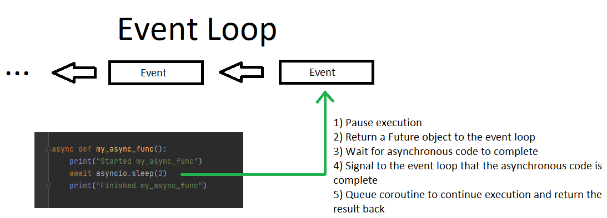

# Asynchronous Event Loop

In Python, the event loop is a mechanism that manages the execution of asynchronous code. The event loop is a central component of the `asyncio` library, which is a built-in library for asynchronous programming in Python.

The event loop is responsible for scheduling the execution of asynchronous tasks and managing the flow of control between them. It uses a non-blocking I/O model, which means that it can handle multiple tasks concurrently without waiting for any of them to complete.

When an asynchronous function is called, it returns an asynchronous task, which is represented by a special type of object called a `coroutine`. The event loop schedules the coroutine for execution and **continues running other tasks**.

The `await` keyword is used inside an asynchronous function to suspend its execution until an asynchronous operation completes. When an asynchronous function encounters an `await` expression, **it returns control to the event loop, allowing it to schedule other tasks**. Once the awaited operation completes, the event loop resumes the execution of the asynchronous function where it left off.

The `await` keyword is used to pause the execution of an asynchronous function and return control to the event loop. It does this by creating a suspension point in the function, where the function's execution can be resumed later on.

When an asynchronous function encounters an `await` expression, it creates a special object called a "future" that represents the result of the awaited operation. The function then returns control to the event loop, which schedules the future to be executed by a separate execution context, such as a thread or a process. For example, `await asyncio.sleep(2)` will be run in a seperate process, outside of `python.exe` as it will make system calls to the OS (Of course, the python GIL is freed used at this time). Recall that `asyncio` and asynchronous programming is primarily used for I/O Bound problems.



The event loop continues running other tasks while the future is being executed. When the future completes, it signals the event loop that the result is available. The event loop then resumes the execution of the asynchronous function where it left off, passing the result of the future to the `await` expression, back to the coroutine using the `send()` method.

# Code Example

Let us analyze a small piece of code to understand this more,

```Python
import asyncio

async def my_async_func():
    print("Started my_async_func")
    await asyncio.sleep(2)
    print("Finished my_async_func")

async def main():
    print("Started main")
    await my_async_func()
    print("Finished main")

asyncio.run(main())

```

When the `main` function is called, it creates a coroutine object and returns it to the event loop. The event loop schedules the execution of the `main` coroutine.

When the `main` coroutine encounters the `await my_async_func()` expression, it creates a future that represents the execution of `my_async_func()` coroutine. The `main` coroutine then returns control to the event loop, which schedules the execution of the `my_async_func` coroutine, which then encounters the `await asyncio.sleep(2)` expression. This creates a future that represents the 2 second sleep operation. The `my_async_func` coroutine then returns control to the event loop.

The event loop continues running other tasks, such as scheduling other coroutines and monitoring for I/O events. Meanwhile, the `asyncio.sleep` functions uses the underlying systems capabilities to put the thread to sleep for 2 seconds.

After 2 seconds, the sleep operation is completed and the associated future signals the event loop that the result is available. The event loop then resumes execution of the `my_async_func` coroutine, passing the result of the future (in this case `None`) to the `await asyncio.sleep(2)` expression. The `my_async_func` coroutine then continues its execution and prints "Finished my_async_func".

Once `my_async_func` is completed, the control is passed back to `main` function, which the prints "Finished main" and the event loop completes its execution.

# System Calls for Non-Blocking I/O

The event loop uses a single thread to schedule the execution of multiple coroutines concurrently and manage the flow between them.

However, the `asyncio` library uses a technique called "asynchronous I/O" to avoid blocking the event loop while waitin for I/O to complete. This is achieved by using non-blocking I/O primitives provided by the operationg system and the Python standard library, such as the `select` and `poll` modules for sockets, and the `threading` and `multiprocessing` modules for running code in seperate threads of processes.

When the `asyncio.sleep` function is called, it schedules the **sleep operation to be executed by the operating system and not by the Python interpreter**. This allows the event loop to continue running and scheduling other tasks while the sleep is in progress. When the sleep operation is complete, then operating system will signal back and signal to the future that is can be continued.

In this way, the `asyncio.sleep` function is able to release the control of the thread while it waits for the sleep operation to complete, which allows for other tasks to be executed. Keep in mind this is still **all executed in a single thread**. By release the control of the thread, I mean `asyncio.sleep` function releases the control of the execution of flow to the event loop, allowing it to schedule other coroutines for the execution, even though all the tasks are running in a single thread.

It is important to note that the non-blocking behaviour is achieved by the usage of the underlying system capabilities, like the `select` or `poll` system calls to wait for I/O events, **which are provided by the operating system and are not specific to the Python interpreter**.

