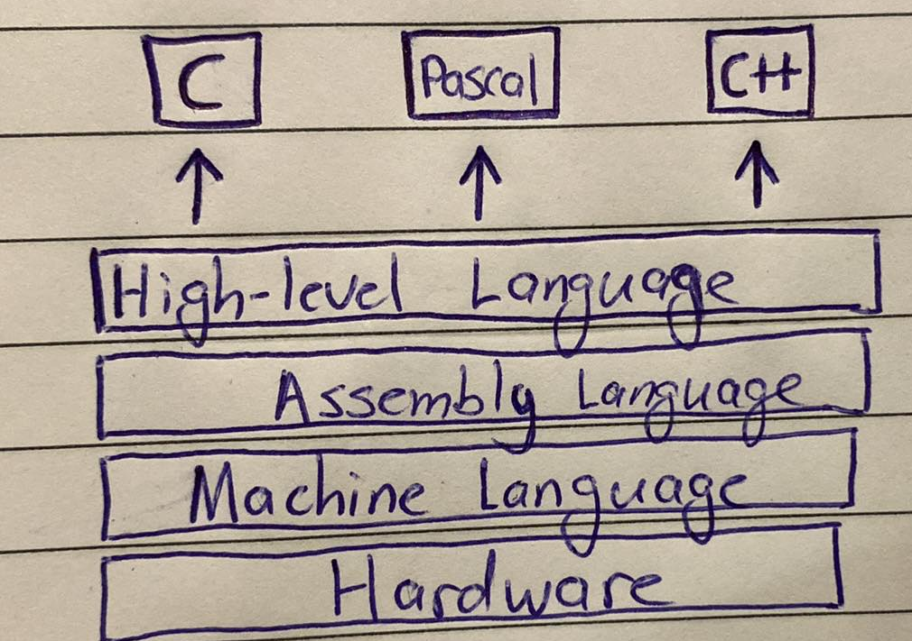
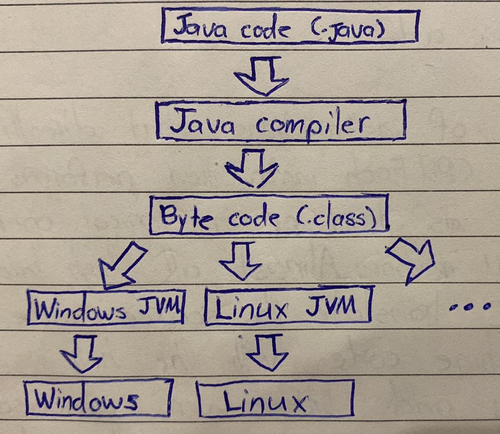
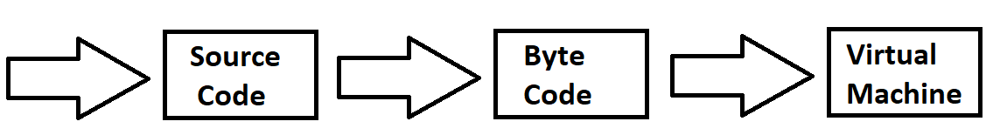

# Executing the Python Script

When we speak of Python we often mean not just the language but also the implementation. Python is actually a specification for a language that can be implemented in different ways.

#### Machine Code (aka , native code)

Machine code is a set of instructions that gets directly **gets executed by the CPU**. Each instruction performs a very unique task, such as load or a logical operation on data in the CPU memory. Almost all high level languages such as C translate the source code into executable machine code with the help of compilers, loaders and linkers. **Every processor or processor family has its own machine code instruction set**.



#### Bytecode

Bytecode is also binary representation **executed by a virtual machine** (NOT by the CPU directly, unlike machine code). The virtual machine (which is different for different machines) converts binary instruction into a specific machine instruction. One of the languages that use the concept of bytecode is Java.

Machine code is much faster as compared to bytecode, but bytecode is portable and secure as compared to machine code.



# Implementations of Python

#### CPython

The default implementation of the Python programming language is CPython. As the name suggests, CPython is written in the C programming language. CPython compiles the Python source code into intermediate bytecode, which is executed by the CPython virtual machine. CPython is distributed with a large standard library written in a mixture of C and Python. CPython provides the highest level of compatability with Python packages and C extension modules.

CPython has a GIL(Global Interpreter Lock), which is a mutex that allows only one thread to execute Python bytecode at a time. This design simplifies memory management but can limit multi-core concurrency, potentially affecting performance in multi-threaded programs.


#### Jython

Jython is an implementation of the Python programming language that can run on a Java Platform. Jython programs use Java classes instead of Python modules. Jython compiles into Java bytecode, which can then be run by a Java virtual machine. Jython enables the use of Java class library functions from the Python program. Jython is slow as compraded to CPython and lacks compatibility with CPython libraries.

# Python uses the interpreter and compiler?



In Python, the source code is compiled into a much simpler form called bytecode. These are instructions similar in spirit to CPU instructions, but instead of being executed by the CPU, they are by a software called a virtual machine. These are not virtual machines that emulate entire operating systems, just a simplified CPU execution environment. This is a similar approach to the one taken by Java.

The `dis` module in Python standard library is the disassembler that can show you Python bytecode.

```Python
import dis

def f():
    print("Hello World")

dis.dis(f)
```

Will output,

```
  1           0 RESUME                   0

  2           2 LOAD_GLOBAL              1 (NULL + print)
             14 LOAD_CONST               1 ('Hello World')
             16 PRECALL                  1
             20 CALL                     1
             30 POP_TOP
             32 LOAD_CONST               0 (None)
             34 RETURN_VALUE
```

Another way to compile this is as follows,

```Python
python -m py_compile resource_file.py
```

This will generate a compiled file name `resource_file.cpython-36.pyc` inside the `__pycache__` folder in the current directory. You can also automatically compile all Python files using the compileall module.

```Python
python -m compileall
```

If Python has write-access for all the directory where the Python program resides, it will store the compiled bytecode in a file that ends in a `.pyc` suffix. If Python has no write access, the program will work anyway. The bytecode will be produced but discarded when the program exits.

Whenever a Python program is called, Python will check if a compiled version with the `.pyc` suffix exists. This file has to be newer than the file with the `.py` suffix. If such a file exists, Python will load the bytecode, which will speed up the start-up time of the script. If their exists no bytecode version, Python will create the bytecode before it starts execution of the program. Execution of a Python program means execution of the bytecode on the Python virtual machine (PVM).

Another important Python feature is its interactive prompt. You can type Python statements and have them immediately executed. This interactivity is usually missing in compiled languages, but even at the Python interactive prompt, your Python is compiled to bytecode and then the bytecode is executed. This immediate execution and Python's lacked of an explicit compile step are why people call the Python exeuctable "The Python interpreter", it is like a real life interpreter, interpreting language `X` to machine code.

This shows just how flimsy the words "interpreted" and "compiled" can be. Like most adjectives applied to programming languages, they are thrown around as if they were black and white distinctions, but the reality is much more complex. Python needs a compiler and interpreter for speed. Strict interpretation is slow. Virtually every "interpreted" language actually compiles the source code into internal representation so that it doesn't have to repeatadly parse the code. In Python's case it saves this, internal representation to disk so that it can skip the parsing and compiling process next time it needs the code.

# Is a `.pyc` file (compiled bytecode) platform independent?

Compiled Python bytecode files are architecture independent, but VM-dependent. A `.pyc` file will only work on a specific set of Python versions determined by the magic number stored in the file.

# Conclusion

Is Python compiled? **YES**
Is Python interpreted? **YES**

Python as a programming language has no saying about if it's compiled or an interpreted programming language, **only the implementation of it**. The terms interpreted or compiled is not a property of the language but a property of the implementation. Python runs directly from the source code, so, Python will fall under bytecode interpreted. The `.py` source code is first compiled to bytecode as `.pyc`, this bytecode can be interpreted and ran.

# Why isn't there a Python compiler to native machine code?

One can write Python-to-native compilers. They just aren't very interesting because they don't actually improve performance by any significant margin, unless they implement a language that looks like Python but is far more restricted.

The reason why their are speed differences between languages like Python and C++ is because statically typed languages gives the compilers a lot of information about the structure of the program and its data which allows it to optimize both computations and memory access. Because C++ knows that variable is of type `int`, it can determine the optimal way to manipulate that variable even before the program is run. In Python on the other hand, the runtime doesn't know what value is in the variable right until the line is reached by the interpreter. This is extremely important for structures, where in C++, the compiler can easily tell the size of the structure and every location of its field within memory during compilation. This gives a huge power in predicting how the data might be used and lets it optimize it according to those predictions. No such thing is possible for languages for Python.