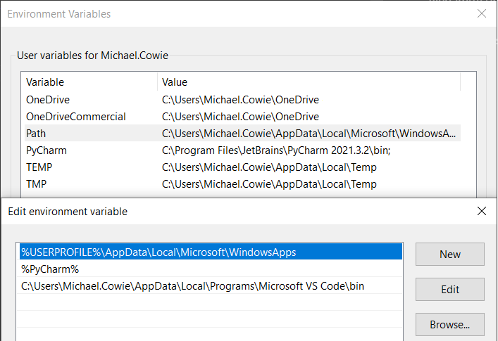

# Executing Python using a CLI

Let us begin from the beginning. When we type inside the console `python hello_world.py`, where is the `python` executeable found to run `hello_world.py`? Well, your "default" version is the **first one appearing in your path**. The so-called path is a list of directories your system searches for executeables. When you type a command, like `python`, this list is traversed from the first directory to the last, searching for a filename that matches the command you typed. If the filename/command is found, the matched file gets executed **without** taking into account potential later matches. This behaviour is by design. On UNIX systems the path environment variable is called `$PATH`, while on Windows system it's referred to as `%PATH%`

To find the *path* search for "environment variables" in Windows and click "Edit environment variables". The *path* variable will contain a list of directories, here we can add rows, where each row is a directory location. In my example, I have a `python.exe` inside of `%USERPROFILE\AppData\Local\Microsoft\WindowsApps`, this means when I run `python hello_world.py`, I am using the `python.exe` found in that directory.

# File locations using Windows CLI

The alternative approach (and much easier) to find where the interpreter is you're using is to use the Windows CLI command `where` and simply type `where python`. This will return the path to the `python.exe` that you're using.

When we install packages using `pip` it is also very helpful to find the locations of where we are placing the packages, i.e. the location of `site-packages`. This is also done using the command `pip list -v`. If multiple versions of Python are installed to the machine make sure the `pip` you're using is fetching packages and placing them inside the correct location, i.e. `where pip` is in the same zone a `where python`.

# Removing ambiguity when using multiple Python versions

It is not uncommon to have multiple Python versions installed on a single machine. For example, I have had *Python 2.7*, *Python 3.6*, *Python 3.9* and *Python 3.10* installed on a single machine and have had to switch versions to run older software source code. Now, this can become confusing when running from the CLI and typing `python hello_world.py`, we will almost certainly enter a scenario where we are executing mismatched versions and running into problems.

Suppose we then start a new project, where we want to use Python 3.9. We create a virtual environment called `.env` and activiate it. Typing `python` in a shell starts the 3.9 interpreter, **BUT** if you type `pip install <some-package>`, then, what version of `pip` is used? Is it the pip for the default version, i.e. the one in my `WindowsApps` directory from before, or the Python version within the virtual environment?

An easy way to get around that ambiguity is simply to use `python -m pip install <some-package>`. The `-m` flag makes sure that you are using the `pip` **that is tied to the active Python executeable**. It is good practice to **always** use `-m`, even if you have just one global version of Python installed from which you create virtual environments.

# Site-packages

`site-packages` is the *target directory* of manually built Python packages. When you build and install Python packages from source, you will find the installed modules in `site-packages` by default. It is frequently a child directory of `Lib`. Packages are retrieved from the default PyPi server unless a custom PyPi server has been configured.

`site-packages` is by default part of the Python *search path*, so modules installed there can be imported easily afterwards. For example, if I were to perform `pip install numpy`, it will place `numpy` into the `site-packages` directory and because it is inside the Python *path* it can be imported as `import numpy`. The installed location can be shown using `pip list -v`.

If multiple Python versions are installed on the computer, to remove any ambiguity when executing commands from the CLI, it is worth finding the location of `python.exe` for the Python version you want to fetch the package for, open the CLI in that target directory and execute the command `python.exe -m pip install <some-package>` as stated above.
