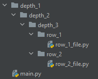
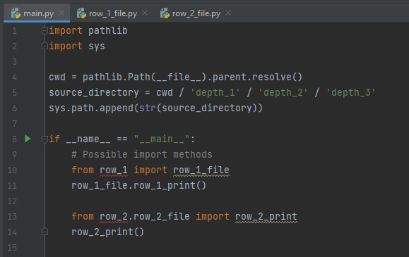
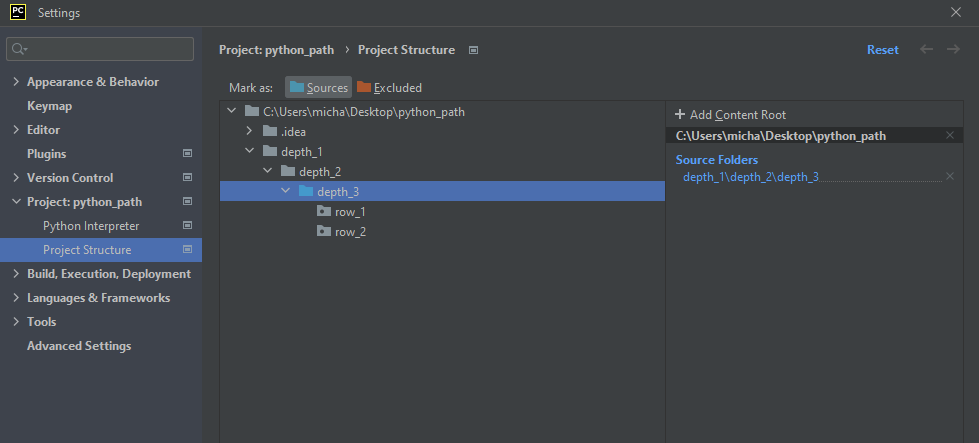
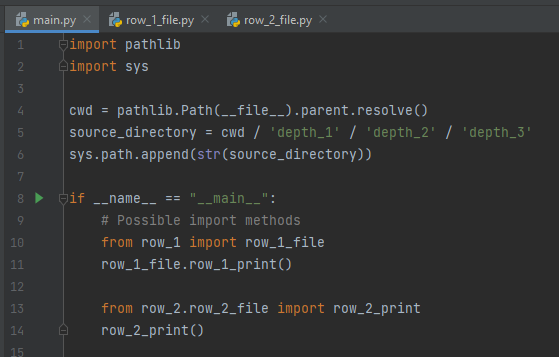
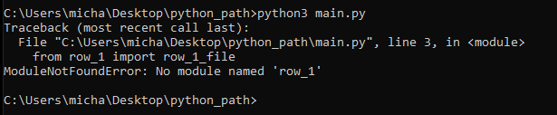
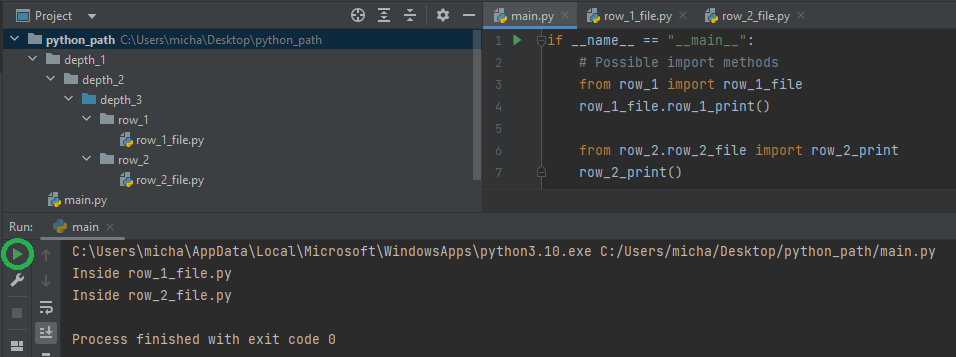

# PYTHONPATH

To first explain the PYTHONPATH I first need to explain how Python handles importing. Python imports work by searching the directories listed in `sys.path`.
To show your current directories inside of `sys.path`, the following Python code can run,

```Python
>>> import sys
>>> print('\n'.join(sys.path))
...
```

Therefore, Python will find any packages that have been installed to these locations. Meaning, when we type Python importing code such as `import math`, the math module needs to be inside a directory that is inside the `PYTHONPATH` or we will receive a module not found error, the `PYTHONPATH` is where the Python interpreter looks for imports, very similar to the Window PATH.

`sys.path` is populated using the **current working directory**, followed by directories listed in your **PYTHONPATH environment variable**, followed by installation-dependent default paths, which are controlled by the site module.

# Modifying `sys.path`

We can modify the `sys.path` to make importing out own directories easier.
For example I have created the following Python project with the following structure.



`row_1_file.py` and `row_2_file.py` contains the following code,
```Python
def row_x_print():
    print("Inside row_x_file.py")
```

Now, `main.py` looks like this,

```Python
import pathlib
import sys

cwd = pathlib.Path(__file__).parent.resolve()
source_directory = cwd / 'depth_1' / 'depth_2' / 'depth_3'
sys.path.append(str(source_directory))

if __name__ == "__main__":
    # Possible import styles
    from row_1 import row_1_file
    row_1_file.row_1_print()

    from row_2.row_2_file import row_2_print
    row_2_print()
```

The script executes from `main.py`, but by adding `cwd / 'depth_1' / 'depth_2' / 'depth_3'` to the `sys.path`, this means we can now type `import row_1` and it will correctly find the directory because it is now located inside the directory where the Path was added. This is useful because it now prevents us from typing `from .depth_1.depth_2.depth_3 import row_1`, in larger code bases with deep directories this will dramatically increase code readability.

# PyCharm

When adding to `sys.path` during runtime, PyCharm will incorrectly underline imports as red, indicating to the developer that an import error will occur when executing the script. We do know that this script will execute fine, however this can be annoying.



To resolve this issue we need to tell PyCharm which directories are in our `sys.path` prior to runtime execution. This is achieved by editing the project structure. Selecting a directory and marking it as a **Source** will add the directory to the `PYTHONPATH`.




Infact, it is actually possible to not add `...\depth3` to the `sys.path` within the Python code runtime by deleting,

```Python
cwd = pathlib.Path(__file__).parent.resolve()
source_directory = cwd / 'depth_1' / 'depth_2' / 'depth_3'
sys.path.append(str(source_directory))
```

Aslong as it is added to the `PYTHONPATH` from editing the project structure from within PyCharm, when executing via PyCharm it will find `row_1` without error. However, this will result in an import error **when executing from outside of PyCharm!**


