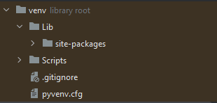
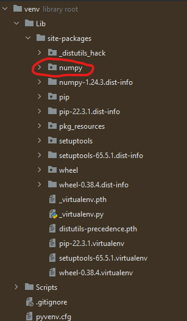
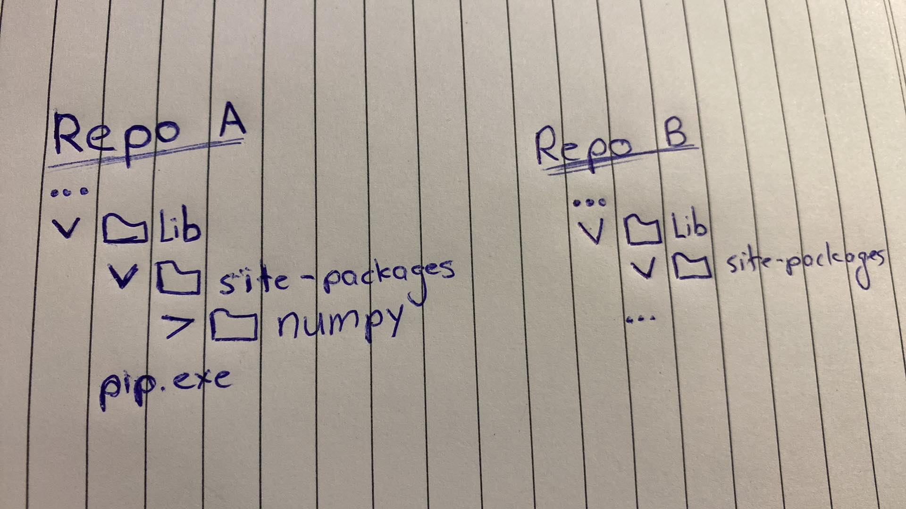
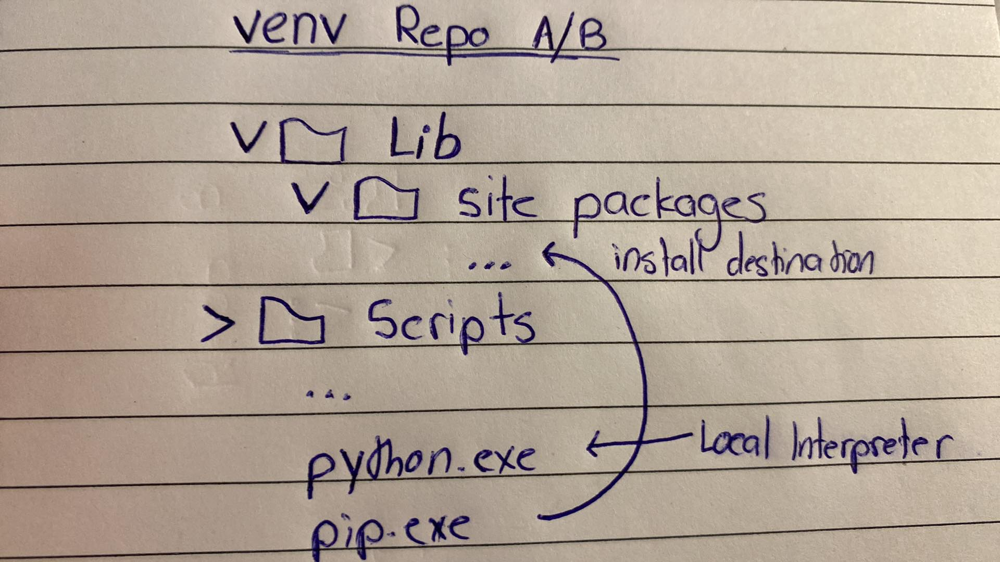

# Python Virtual Environment

A Python Virtual Environment creates an isolated environment where it contains its own interpreter, pip, packages etc... **seperate** from the global system libraries.

For example, creating a new virtual environment called `env` will have the following,



Inside Scripts will contain `activiate.bat` and `deactiviate.bat` that can turn your mode on/off.

```
$ C:\...\venv\Scripts> activiate.bat
$ (venv) C:\...\venv\Scripts>
    ^
    |
```

Also pressing `Alt + F12` to open up the shell will have the following, without requiring to run `activiate.bat`


Now, `where pip` and `where python` from cmd will both point to `pip.exe` and `python.exe` **inside of the scripts folder**. This now means that `$ (venv) C:\...\pythonProject1> pip install numpy` will install numpy to this local environment inside of `site-packages`.



# Primary usages

Virtual Environments aid significantly when using multiple projects and easily keeping tracks of dependencies and not accidentally use a different one due to global usages.



Now, in the given scenario where a developer is working on Repo B and trying to get the dependency `numpy`, they will not actually get the package. This is because when the developer types `$ where pip` it will tell you that it is located in Repo A. This means, despite working on Repo B and being in that area when opening cmd, typing `$ pip install numpy`, it will place `numpy` on Repo A, **not Repo B*, all due to the location of where `pip.exe` was when executing it via `pip install numpy`.

This is where virtual environments are used, reducing conflicts with system libraries. Now change the scenario to the following,



Now, this time if I wanted `numpy` in Repo B, I would first call `$ activate.bat` which means `where pip` would point to the `pip.exe` in the virtual environment. This means, `$ pip install numpy` will correctly place it into the `site-packages` of the working repository.