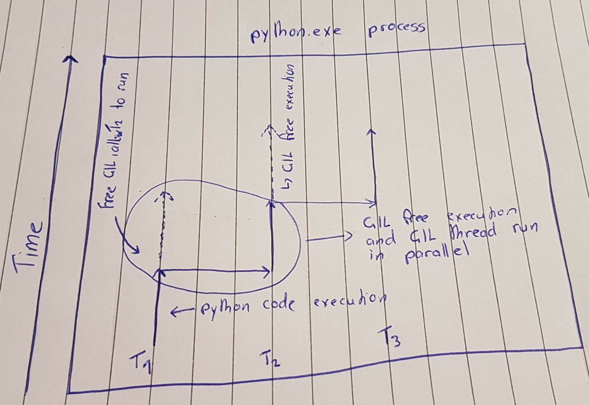

# Using Threads to resolve IO bound issues

The discussions on this topic has been done in reference to the code written in `isort_demo.py` and my experience using the `isort`. `isort` is [Python utility package](https://github.com/PyCQA/isort) to sort import order. This is increasing useful to standardize code style when working on large projects with multiple developers. Feeding a industry size codebase with millions of lines of code can be quite time consuming to check and sort all of the imports. `isort_demo.py` contains 9 sample files where I have chained them together to treat them as being multiple thousands of copies, emulating a much larger codebase.


After synchronous execution of running `isort.check_file` on every file, the result time was `32.1199(s)`. When a time is taking long to execute it needs to be investigated whether it could be improved from either IO Bound time constraint of CPU Bound time constraint. IO Bound operations could be improved by using using threads or asynchronous programming. CPU Bound software needs to be improved by multi-processing due to the Python GIL. 

We know that `isort.check_file` needs to perform reading and writing to files. When reading/writing to a file the Python GIL is released. This allows other threads to take the lock and execute code, however, when running synchronously it will instead simply wait for the reading/writing to complete and not allow other threads to take the lock and execute code, this is because it is all done on a single thread. The time waiting for the file to be read/written to is wasted as it is possible to allow for other code execution to occur during this time.

The code snippet to perform the synchronous file reading is,

```python
def isort_synchronous(path_iter):
    """Synchronous usual isort use-case"""
    
    return [isort.check_file(file) for file in path_iter]
```

# Utilization of Threads for performance improvement

To rewrite the synchronous code to use threads, it can be written as;

```python
def isort_thread(path_iter):
    """Threading isort"""

    with ThreadPoolExecutor(max_workers=4) as executor:
        futures = [executor.submit(isort.check_file, file) for file in path_iter]

        return [fut.result() for fut in futures]
```

The code above utilizes a thread pool. This means a maximum of 4 threads are created but are reutilized to execute other functions. This saves time that would have been used to continually created new threads for each function execution. Creating threads is an expensive task. When executed the time to perform `isort.check_file` on all files is `22.7277 (s)`, a noticeable improvement. It is important to not forget about Windows caching the files, which means multiple execution can result in different times.

# Why are Threads faster?

The above threading code demonstrated an overall improvement in time, which indicates an IO Bound time constraint when utilizing `isort.check_file` on thousands of files. 

The core time improvement from the usage of threads comes down solely to the Python GIL (Global Interpreter Lock). Any thread that requires interaction with PyObjects (Used in the C code) has a hard requirement of holding onto the "lock". Certain operations do not require interaction with PyObjects and therefore do not require holding onto the GIL, these could include library calls that are written entirely in C, such as `numpy`. In our example we are reading/writing to files, however, inside of CPython these are actually made using system calls to the Operating System and therefore do not require the GIL to perform these actions as we are not interacting with any PyObjects to perform these actions.

By utilizing threads, when we get to the stage of reading/writing to files we can free ourselves of holding the GIL. This means other threads can grab the lock and perform code execution within Python, while still allowing for the other thread to continue to read/write the given file.




It is **crucial** to understand that it is possible for threads in Python to run in **parallel** if the threads **do not require the GIL**. Illustrated above T1 is performing the GIL free code execution, in this instance it would be the system call for reading/writing a file while T2 has grabbed the lock and performed Python code execution. Both T1 and T2 are within the `python.exe` process and because T1 is performing GIL free code execution it is running **in parallel** to T2. Without the multithreading approach when T1 is reading/writing to a file, their is no other thread to give the lock and continue performing tasks in parallel, therefore taking longer to complete.

# Task manager analysis

It is important to know that **each thread that only run on a single CPU core**. Therefore if we open up task manager we can determine if we are IO Bound but analyzing CPU usage when executing multi-threading code. If the CPU usage is much higher than running synchronous code, it means that multiple threads are working in parallel. Meaning it is spending a lot of time reading/writing files in some threads while the GIL thread is still executing, leading to a much higher CPU usage.

