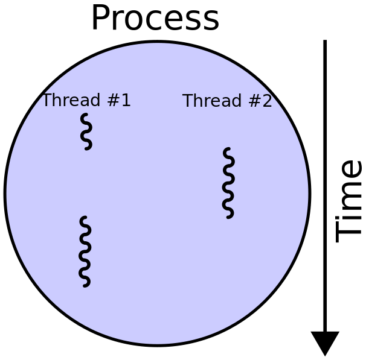

# Threads

 A thread is the smallest unit of execution within a process. A process can have multiple threads, and each thread represents an independent flow of control within that process. Threads within the same process share the same memory space, allowing them to efficiently communicate and share data.

 

Threads are used to achieve concurrency, which allows multiple tasks to be executed simultaneously and overlap in time, even though they may not truly run in parallel on multiple CPU cores.

The purpose of using threads is to improve the performance and responsiveness of applications by enabling them to handle multiple tasks concurrently. This is particularly useful when dealing with tasks that may block, such as I/O operations, as threads allow the application to make progress on other tasks while waiting.

However, it's crucial to note that in certain programming environments, like the default implementation of Python (CPython), there is a Global Interpreter Lock (GIL). The GIL prevents true parallelism within a single Python process, meaning multiple threads cannot execute Python bytecode simultaneously, limiting the potential performance gains for CPU-bound tasks.

The GIL in CPython prevents multiple native threads from executing Python bytecodes in parallel. While threads can still be useful for I/O-bound tasks or tasks that involve waiting for external resources (e.g., network requests), they won't fully utilize multi-core processors for CPU-bound tasks. This limitation is inherent in CPython, the reference implementation of Python, and is mainly a consideration when designing and implementing CPU-bound applications.

It's essential to be aware of the GIL's implications when choosing Python as the language for specific use cases. For applications that require extensive parallel processing on multi-core systems, other Python implementations like PyPy or using a different language like C++ may be more appropriate. In C++, threads can be run in parallel, and they are not subject to the same limitations as the GIL in CPython. In C++, you have more control over managing threads and can fully leverage multi-core systems to achieve true parallelism.

It's important to note that while threads offer advantages for concurrent execution and I/O-bound tasks, they also come with challenges, such as the need for proper synchronization to avoid race conditions and potential performance bottlenecks when dealing with CPU-bound tasks. When designing threaded applications, careful consideration should be given to data safety and thread coordination.

# Concurrency and Parallelism

 When discussing theads and processes it is important to understand the distinction between concurrency and parallelism.

 **Concurrency** refers to the ability of an application to handle multiple tasks simultaneously, allowing progress on multiple tasks to overlap in time. In a concurrent system, multiple tasks can be in progress, but they don't necessarily execute simultaneously on multiple CPU cores. Concurrency is typically achieved through multitasking and context switching, where the operating system rapidly switches between tasks, giving the illusion of simultaneous execution. Concurrency is useful when dealing with tasks that may block, such as I/O operations, as it allows the application to make progress on other tasks while waiting.

 **Parallelism**, on the other hand, involves executing multiple tasks simultaneously on multiple CPU cores. It allows tasks to truly run concurrently in separate threads or processes, leveraging the full potential of multi-core processors to speed up computation-intensive operations. Parallelism is suitable for tasks that can be divided into smaller, independent units that can be processed concurrently.

 

 # When to use Threads

 **Concurrency**: Threads are suitable for applications that need to perform multiple tasks simultaneously, especially when tasks involve waiting for external resources like I/O operations, network requests, or user interactions.

 **I/O-Bound Tasks**: Threads are particularly useful for I/O-bound tasks where the application spends a lot of time waiting for input or output operations. The GIL is released during I/O operations, allowing other threads to execute Python code during these periods, providing significant concurrency benefits.

 

 It is **crucial** to understand that it is possible for threads in Python to run in **parallel** if the threads **do not require the GIL**. Illustrated above T1 is performing the GIL free code execution, in this instance it would be the waiting for a network request, while T2 has grabbed the lock and performed Python code execution. Both T1 and T2 are within the `python.exe` process and because T1 is performing GIL free code execution it is running **in parallel** to T2. Without the multithreading approach when T1 is waiting for a network response, their is no other thread to give the lock and continue performing tasks in parallel, therefore taking longer to complete.

 **Simplified Communication and Data Sharing**: Threads within the same process share the same memory space, which makes communication and data sharing between threads more straightforward compared to inter-process communication used by separate processes.

 **Legacy Libraries and Dependencies**: If you are working with third-party libraries or modules that are not designed to support asynchronous operations, using threads can be an effective way to introduce concurrency into your application.

 **User Interface Responsiveness**: In graphical user interfaces (GUIs), threads can be used to offload time-consuming tasks from the main thread (often called the UI thread) to ensure the responsiveness of the UI and prevent it from freezing during long-running operations. For example, if we were to run a computationally expensive operation that took 3 seconds inside a UI thread, it will freeze it over the duration. However, using threads, context switching will allow the UI thread to occassionally run paint and event operations to aid in responsiveness.

 # Threads vs Asynchronous code

 
The choice between using threads or asynchronous code (often based on asynchronous I/O, like `asyncio` in Python) for handling I/O-bound problems like network requests depends on the specific characteristics of your application and your performance requirements. Both approaches have their strengths and can be effective for different scenarios.

##### Threads

- Use threads when you have many I/O-bound tasks to perform, and you want to execute them concurrently to reduce the overall waiting time.

- Threads are useful when you are working with libraries or modules that are not natively designed to support asynchronous operations. For example, when working with traditional blocking I/O libraries that do not provide asynchronous interfaces.

- Threads are also suitable when the external resources you are interacting with (e.g., web servers, APIs) have a relatively long response time, and the overhead of thread creation and management is not a significant concern.

- It is very difficult to write code that is thread safe. With asyncronous code, you know exactly where the code will shift from one task to the next and race conditions are therefore much harder to come by. The I/O part of threaded code is relatively easy but managing the shared state between threads (using locks/queues/etc) without race conditions is what makes it tricky. Using an async model means you have less going on at the same time so races are easily avoided. 

- Threads consume a fair amount of data since each thread needs to have its own stack. With async code, all the code shares the same stack and the stack is kept small due to continuously unwinding the stack between tasks.

- Threads are OS structures and are therefore more memory for the platform to support. There is no such problem with asynchronous tasks.

Here we will create an example of using Threads for network requests. In this example We use `concurrent.futures.ThreadPoolExecutor` to create a pool of threads to download the web pages concurrently. The `executor.map` method distributes the tasks across the available threads.

```Python
import requests
import concurrent.futures


def download_page(url):
    response = requests.get(url)
    print(f"Downloaded {url}, status code: {response.status_code}")


def main():
    urls = [
        "https://www.example.com",
        "https://www.google.com",
        "https://www.python.org",
    ]

    with concurrent.futures.ThreadPoolExecutor() as executor:
        executor.map(download_page, urls)

    print("All downloads completed.")


main()
```

In this example, the network requests were so quick we may not see the effectiveness of threads here. Instead I will modify this code to emulate a network request of 2 seconds by introducing a `time.sleep(2)`.

```Python
def download_page(url):
    response = requests.get(url)
    time.sleep(2)
    print(f"Downloaded {url}, status code: {response.status_code}")
```

The full code execution still takes just over 2 seconds, this is happening because `time.sleep` frees the GIL and allows other tasks to run. However if we did not write this code using threads and instead wrote it in a synchronous matter such as,

```Python
import requests
import time


def download_page(url):
    response = requests.get(url)
    time.sleep(2)
    print(f"Downloaded {url}, status code: {response.status_code}")


def main():
    urls = [
        "https://www.example.com",
        "https://www.google.com",
        "https://www.python.org",
    ]

    for url in urls:
        download_page(url)

    print("All downloads completed.")


main()
```

The newer code will take over 6 seconds to execute. This happens because we are waiting on the network response, we do not allow other tasks to execute when we are waiting. Using threads, we allow other tasks to take the GIL from us when we are waiting on the GIL free task (Waiting on the network response) and run other tasks while we wait.

#### Asynchronous Code

- Use asynchronous code when you have a large number of I/O-bound tasks that spend a considerable amount of time waiting for responses (e.g., network requests, file I/O).

- Asynchronous code is more efficient than threads when dealing with many small I/O-bound tasks because it allows a **single thread to manage multiple asynchronous tasks** without the overhead of creating and switching between multiple threads.

- Asynchronous programming is particularly useful when the responsiveness and scalability of the application are crucial factors.

- Asynchronous frameworks, like Python's `asyncio`, are specifically designed for handling I/O-bound tasks efficiently and can provide excellent performance in such scenarios.

Asynchronous code utilizes an [event loop](https://github.com/Michael-Cowie/Notes/blob/main/Python/Notes/async_await/event_loop.md) **on a single thread** which differs the internal representation of concurrent behaviour to threads.

The choice between threads and asynchronous code often comes down to whether the libraries and external resources you are using have good support for asynchronous operations. If the libraries are asynchronous-friendly and you have many small I/O-bound tasks, `asyncio` or other asynchronous frameworks can offer significant advantages in terms of performance and scalability.

For further asynchronous code examples, [check out my tutorials](https://github.com/Michael-Cowie/Notes/tree/main/Python/Notes/async_await).